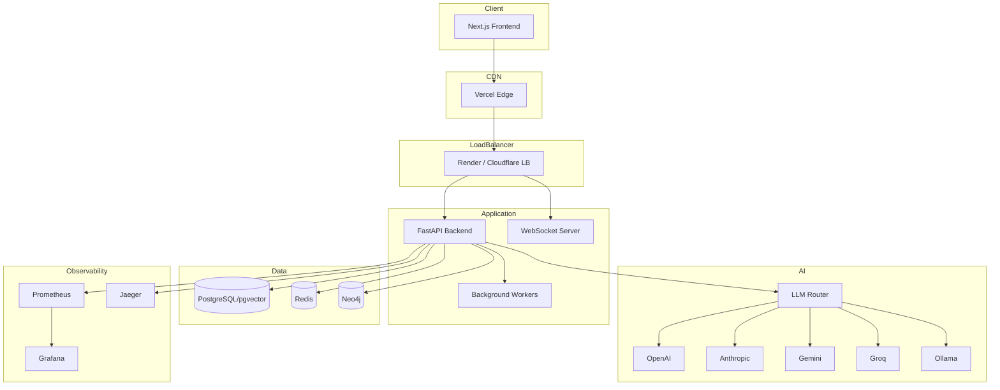
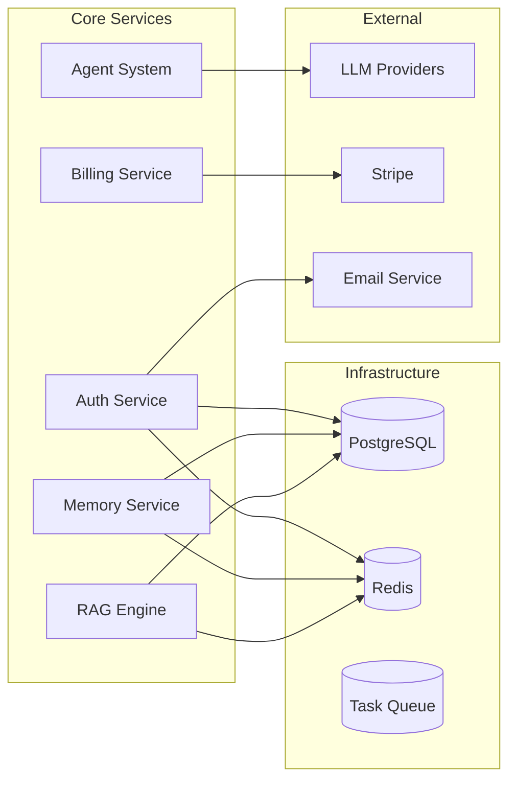
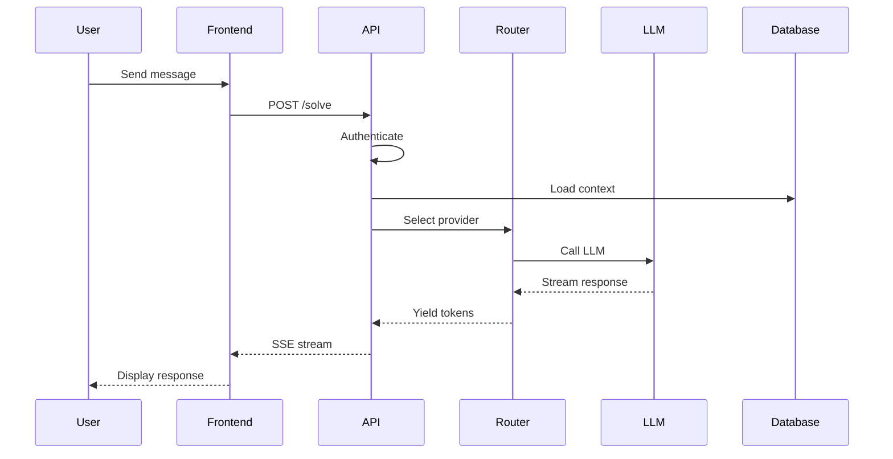

# Architecture

## System Overview

AstrovoxAI is a full-stack AI chat platform built with modern cloud-native technologies.

## Component Architecture

## Data Flow

## Technology Stack

### Frontend
- **Framework:** Next.js 14 (App Router)
- **Language:** TypeScript
- **Styling:** Tailwind CSS
- **State:** React Query + Zustand
- **Real-time:** SSE / WebSocket

### Backend
- **Framework:** FastAPI 0.104+
- **Language:** Python 3.12
- **ORM:** Supabase client (PostgreSQL)
- **Queue:** ARQ (async Redis queue)
- **LLM Router:** Custom multi-provider router

### Data
- **Primary DB:** PostgreSQL 16 + pgvector
- **Cache:** Redis 7
- **Graph:** Neo4j (optional)
- **Search:** pgvector + BM25

### Infrastructure
- **Container:** Docker
- **Orchestration:** Kubernetes (EKS)
- **CI/CD:** GitHub Actions
- **Monitoring:** Prometheus + Grafana
- **Tracing:** Jaeger
- **CDN:** Vercel Edge

## Key Design Decisions

### 1. FastAPI over Flask
- Native async support
- Automatic OpenAPI docs
- Pydantic validation
- Better performance for I/O-bound workloads

### 2. PostgreSQL over NoSQL
- Strong consistency for user data
- pgvector for semantic search
- ACID transactions for billing

### 3. Supabase Client over Raw SQL
- Type safety
- Built-in auth integration
- Real-time subscriptions

### 4. Multi-provider LLM Routing
- Avoid vendor lock-in
- Cost optimization
- Fallback on provider failures

### 5. Redis for Caching and Sessions
- Low latency for session data
- Rate limiting backend
- Pub/Sub for WebSocket scaling

## Scaling Strategy

### Horizontal Scaling
- Backend pods scale via HPA (CPU/memory)
- WebSocket connections distributed via Redis Pub/Sub
- Database read replicas for query load

### Caching Strategy
- L1: In-process LRU (hot data)
- L2: Redis (session, rate limit, API responses)
- L3: CDN (static assets)

### Database Scaling
- Read replicas for analytics queries
- Connection pooling via PgBouncer
- Partitioned audit logs by month

## Security Architecture

See [SECURITY_MODEL.md](./SECURITY_MODEL.md) for details.

Key principles:
- Defense in depth
- Least privilege
- Fail secure
- Audit everything

## Observability

### Metrics
- HTTP request rate, latency, errors (RED method)
- Business metrics: DAU, message count, token usage
- Infrastructure: CPU, memory, disk, network

### Tracing
- Distributed traces for every request
- LLM call tracing with prompt/response
- Database query profiling

### Logging
- Structured JSON logs
- Request ID propagation
- Sensitive data redaction

## Future Architecture

### Planned Improvements
- Event sourcing for audit logs
- CQRS for read model optimization
- Service mesh (Istio) for mTLS
- GraphQL gateway for flexible APIs
- Edge functions for low-latency inference
