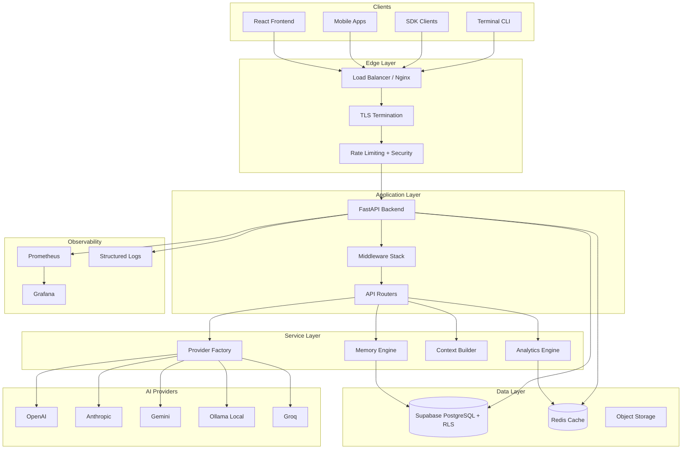
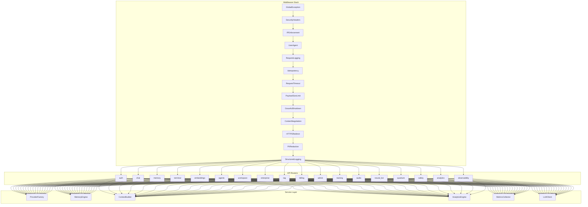
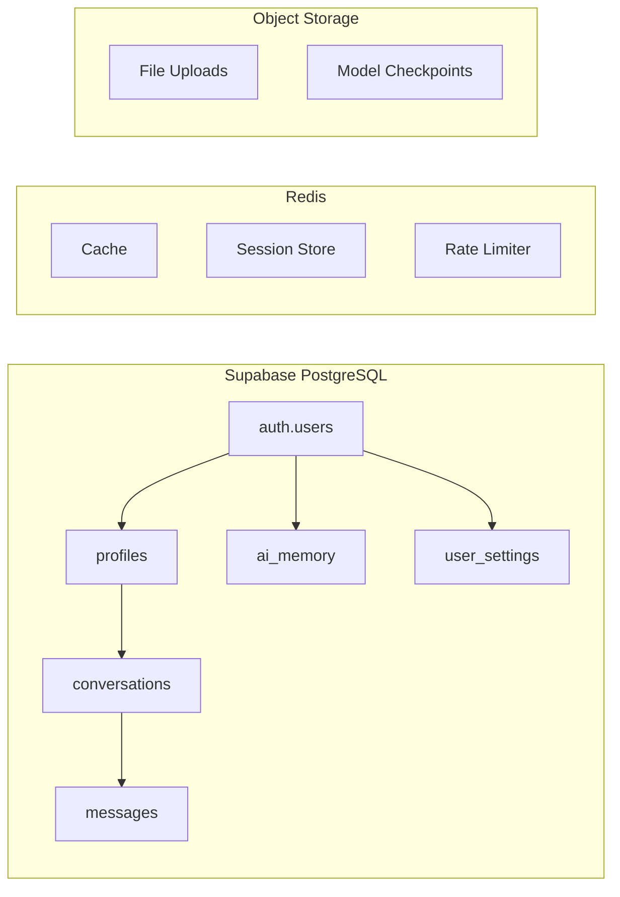
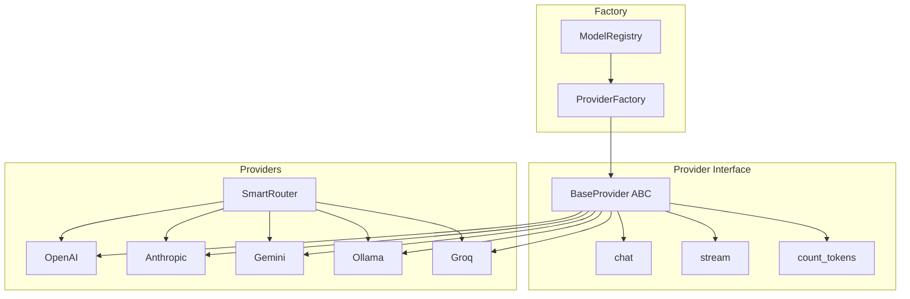
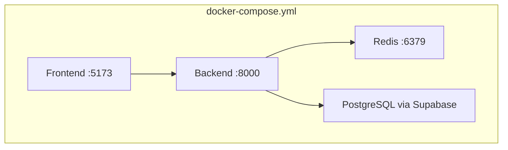
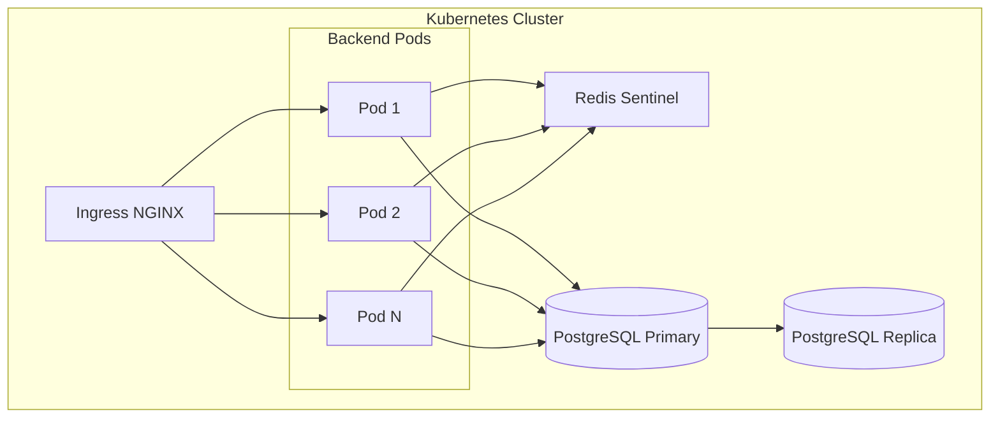
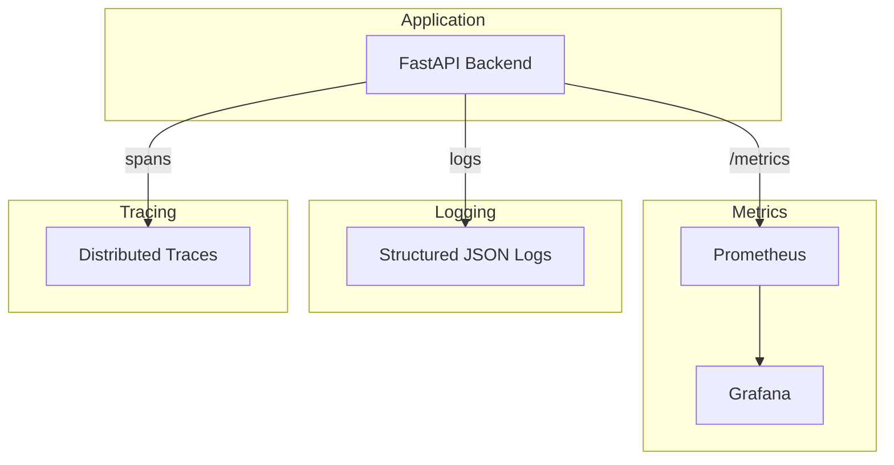

# Architecture Overview

AstrovoxAI is a production-ready AI chat platform with multi-provider LLM support, persistent memory, agent systems, RAG, enterprise features, and a complete model training and inference toolkit.

## High-Level Architecture



## System Components

### Frontend Layer

```
┌─────────────────────────────────────────────────────────────┐
│                     FRONTEND ARCHITECTURE                    │
├─────────────────────────────────────────────────────────────┤
│                                                              │
│  ┌─────────────┐  ┌──────────────┐  ┌───────────────────┐  │
│  │   App.jsx   │  │   Chat.jsx   │  │   Sidebar.jsx     │  │
│  │  Shell &    │  │  Message UI  │  │  Conversation     │  │
│  │  Routing    │  │  Streaming   │  │  Navigation       │  │
│  └─────────────┘  └──────────────┘  └───────────────────┘  │
│                                                              │
│  ┌─────────────┐  ┌──────────────┐  ┌───────────────────┐  │
│  │ MemoryPanel │  │ Terminal     │  │ SettingsPanel     │  │
│  │ Memory UI   │  │ CLI Console  │  │ User Prefs        │  │
│  └─────────────┘  └──────────────┘  └───────────────────┘  │
│                                                              │
│  State: Zustand | Server: React Query | HTTP: Axios         │
└─────────────────────────────────────────────────────────────┘
```

**Key Technologies:**

| Component | Technology | Purpose |
|-----------|-----------|---------|
| Framework | React 18 | UI components |
| Build Tool | Vite 6 | Fast HMR and bundling |
| Language | TypeScript | Type safety |
| Styling | Tailwind CSS | Utility-first CSS |
| Components | Radix UI | Accessible primitives |
| Animation | Framer Motion | Motion library |
| State | Zustand | Global client state |
| Server State | React Query | Caching and mutations |
| Routing | React Router | Navigation |
| Editor | Monaco Editor | Code editing in chat |

### Backend Layer



**Middleware stack (order matters):**

1. `GlobalExceptionMiddleware` — Catches unhandled exceptions
2. `SecurityHeadersMiddleware` — CSP, HSTS, X-Frame-Options
3. `IPEnforcementMiddleware` — IP allowlisting/blocklisting
4. `UserAgentMiddleware` — User-Agent validation
5. `RequestLoggingMiddleware` — Structured logging with correlation IDs
6. `IdempotencyMiddleware` — Prevents duplicate writes
7. `RequestTimeoutMiddleware` — 30s request timeout
8. `PayloadSizeLimitMiddleware` — 10MB payload limit
9. `GracefulShutdownMiddleware` — Drain in-flight requests
10. `ContentNegotiationMiddleware` — JSON/MessagePack negotiation
11. `HTTPSRedirectMiddleware` — Force HTTPS in production
12. `PIIRedactionMiddleware` — Redact sensitive data from logs
13. `StructuredLoggingMiddleware` — JSON-formatted structured logs

### Data Layer



**Database schema:**

```sql
-- Core tables (simplified)
auth.users (Supabase managed)
    │
    ├── profiles
    │     ├── id (FK → auth.users)
    │     ├── username, full_name, avatar_url
    │     ├── role, tier
    │     └── metadata (JSONB)
    │
    ├── conversations
    │     ├── id, user_id (FK)
    │     ├── title, summary, model
    │     ├── metadata (JSONB)
    │     ├── is_archived, is_deleted
    │     └── timestamps
    │
    ├── messages
    │     ├── id, conversation_id (FK)
    │     ├── user_id (FK)
    │     ├── role (user/assistant/system/tool)
    │     ├── content, model_used, tokens_used
    │     └── metadata (JSONB)
    │
    ├── ai_memory
    │     ├── id, user_id (FK)
    │     ├── content, importance (1-5)
    │     ├── metadata (JSONB)
    │     └── timestamps
    │
    └── user_settings
          ├── user_id (FK, PK)
          ├── theme, ai_preferences (JSONB)
          ├── notifications_enabled
          └── updated_at
```

### AI Provider Abstraction



All AI providers implement a common interface:

```python
class BaseProvider(ABC):
    @abstractmethod
    async def chat(self, messages, model, **kwargs) -> str: ...
    @abstractmethod
    async def stream(self, messages, model, **kwargs) -> AsyncGenerator[str, None]: ...
    @abstractmethod
    def count_tokens(self, text) -> int: ...
```

## Deployment Topology

### Development (Docker Compose)



### Production (Kubernetes)



## Security Architecture

### Authentication Flow

```
┌────────┐     ┌──────────┐     ┌──────────────┐     ┌─────────────┐
│ Client │────►│ Supabase │────►│   Auth       │────►│   JWT       │
│        │     │   Auth   │     │   Service    │     │   Token     │
└────────┘     └──────────┘     └──────────────┘     └─────────────┘
                                                               │
                                                               ▼
                                                    ┌──────────────────┐
                                                    │   Backend        │
                                                    │   Validates JWT  │
                                                    │   on every req   │
                                                    └──────────────────┘
```

### Authorization Model

| Role | Level | Permissions |
|------|-------|-------------|
| `user` | 1 | Own data, chat, memory |
| `developer` | 2 | User + API access, tool creation |
| `admin` | 3 | Full platform access, user management |

### Network Security

- CORS restricted to configured origins
- Security headers: CSP, HSTS, X-Frame-Options
- IP allowlisting/blocklisting support
- Request payload size limits (10MB)
- Request timeouts (30s)
- HTTPS redirect in production
- PII redaction from logs

## Observability



**Health check endpoints:**

| Endpoint | Purpose |
|----------|---------|
| `GET /healthz` | Simple liveness check |
| `GET /health/live` | Container liveness probe |
| `GET /health/ready` | Dependency health check |
| `GET /health/detailed` | Full service status |

## Scalability Considerations

- **Stateless backend** — Scale horizontally behind load balancer
- **Redis caching** — Reduce database load for frequent queries
- **Connection pooling** — PostgreSQL connection limits managed
- **Async I/O** — All I/O operations use async/await
- **Lazy loading** — Optional heavy modules loaded on demand
- **CDN** — Static assets served via CDN in production
- **Database replication** — Read replicas for reporting queries

## Extension Points

- **Custom tools** — Register tools via `app/api/custom_tools.py`
- **Custom providers** — Implement `BaseProvider` interface
- **Webhooks** — Configure event subscriptions
- **Plugins** — Extend via plugin framework
- **SDK generation** — OpenAPI specs auto-generate clients
- **Extensions** — IDE and browser extensions via extension SDK
- **Middleware** — Custom middleware injection points
