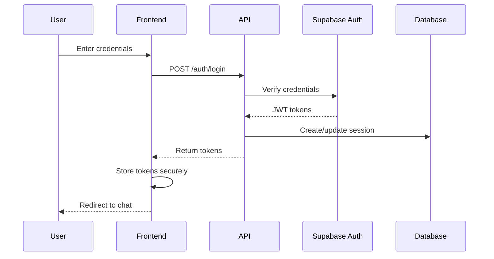
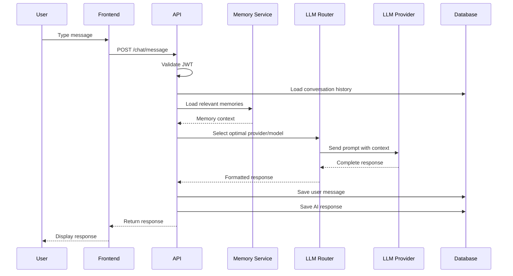
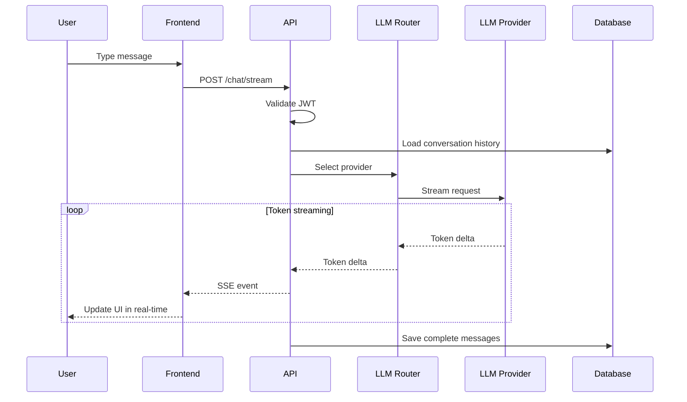
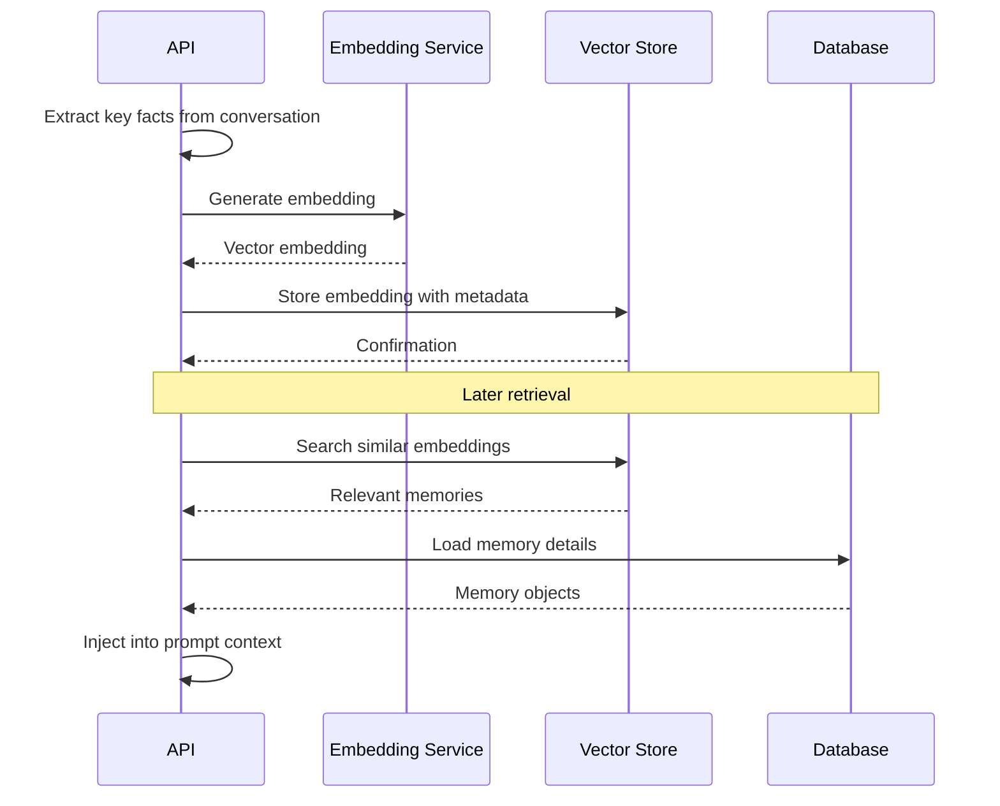
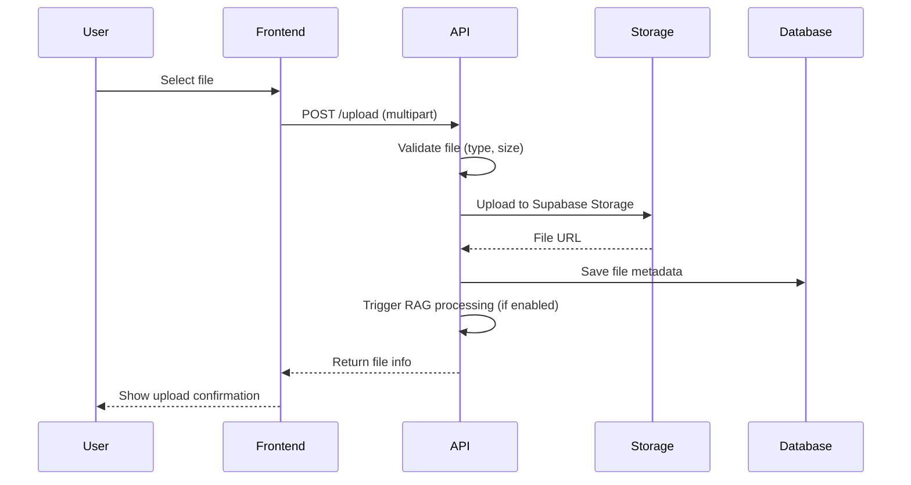
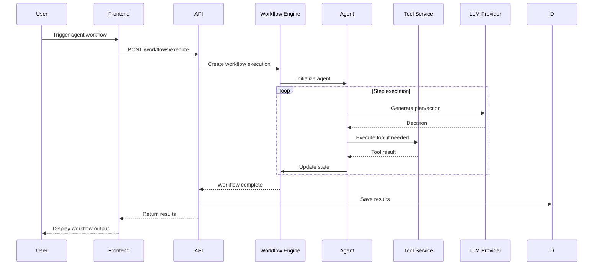
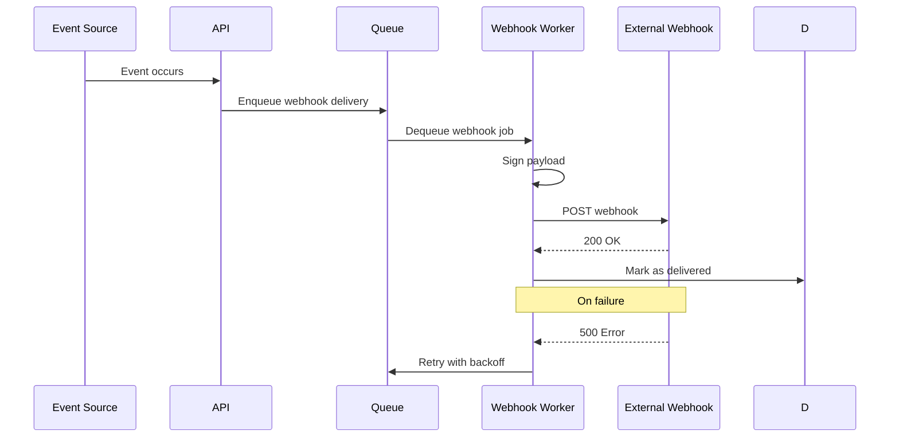
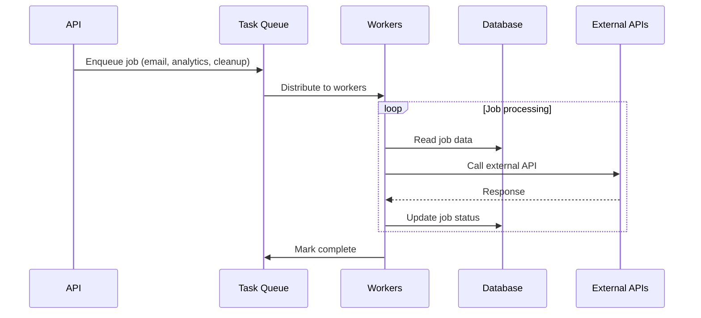
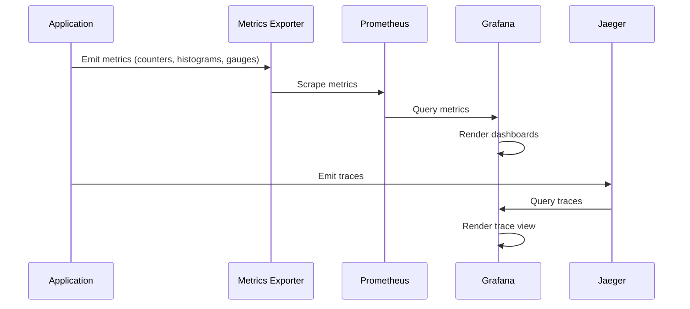
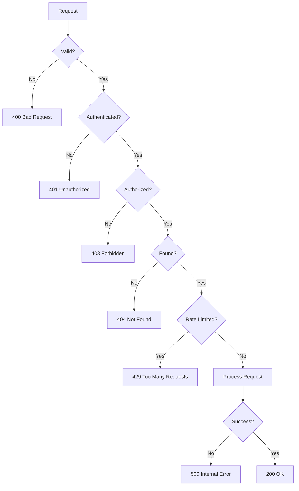

# Data Flow Diagrams

Detailed data flows through the Astrovox AI system.

## Overview

Data flows through Astrovox AI in several distinct paths: user authentication, chat messages, streaming responses, memory operations, and background processing.

## 1. User Authentication Flow

### Flow Details

1. User enters email and password
2. Frontend sends POST to `/auth/login`
3. API validates against Supabase Auth
4. Supabase returns JWT access and refresh tokens
5. API stores session in database
6. Frontend stores tokens in secure HTTP-only cookies or localStorage
7. User is redirected to the chat interface

## 2. Chat Message Flow (Non-Streaming)

### Flow Details

1. User types message and sends
2. Frontend sends authenticated POST to `/chat/message`
3. API validates JWT and loads conversation history from database
4. Memory service retrieves relevant long-term memories
5. LLM Router selects best provider/model based on cost, speed, and capability
6. Provider generates response with full context
7. Response is saved to database with user message
8. Frontend displays the response to the user

## 3. Chat Message Flow (Streaming)

### Flow Details

1. User types message and sends
2. Frontend sends authenticated POST to `/chat/stream`
3. API sets up Server-Sent Events (SSE) connection
4. LLM provider streams tokens as they are generated
5. Each token is forwarded to frontend via SSE
6. Frontend updates UI incrementally
7. Once complete, full messages are persisted to database

## 4. Memory Operations Flow

### Flow Details

1. After conversation, system extracts key facts
2. Facts are embedded using embedding model (OpenAI/Gemini)
3. Embeddings are stored in vector database (pgvector)
4. On next conversation, system searches for relevant memories
5. Retrieved memories are injected into the prompt context

## 5. File Upload Flow

### Flow Details

1. User selects file via drag-drop or file picker
2. Frontend uploads file as multipart form data
3. API validates file type and size
4. File is uploaded to Supabase Storage
5. Metadata (name, size, type, URL) is saved to database
6. If RAG is enabled, file is processed for embeddings

## 6. Agent Workflow Flow

### Flow Details

1. User triggers an agent workflow
2. API creates a workflow execution instance
3. Workflow engine initializes the agent with tools and goals
4. Agent iteratively decides actions and executes tools
5. Each step updates workflow state
6. On completion, results are saved to database
7. Frontend displays the workflow output

## 7. Webhook Delivery Flow

### Flow Details

1. Event occurs in the system (message created, conversation updated, etc.)
2. Webhook delivery job is enqueued
3. Worker picks up job and signs payload with webhook secret
4. Worker POSTs to external webhook URL
5. On success, delivery is marked complete
6. On failure, retry with exponential backoff (max 3 retries)

## 8. Background Job Processing

### Flow Details

1. API enqueues background jobs (emails, analytics, cleanup)
2. Task queue distributes jobs to available workers
3. Workers process jobs independently
4. Job status is updated in database
5. Completed jobs are archived or deleted

## 9. Monitoring Data Flow

### Flow Details

1. Application instruments code with metrics and traces
2. Prometheus scrapes metrics endpoint periodically
3. Grafana queries Prometheus for dashboard rendering
4. Jaeger collects distributed traces
5. Grafana queries Jaeger for trace visualization

## 10. Error Handling Flow

### Flow Details

1. Request enters the system
2. Validation layer checks request format
3. Authentication layer verifies JWT
4. Authorization layer checks permissions
5. Resource existence is verified
6. Rate limiting is applied
7. Request is processed
8. Response is returned or error is thrown
