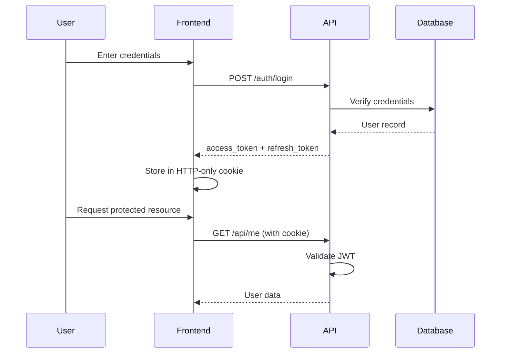
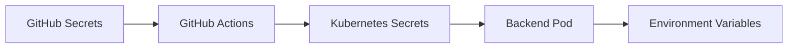

# Security Model

## Authentication

AstrovoxAI uses JWT-based authentication with HTTP-only cookies for web clients.

### Flow



### Token Lifecycle

| Token | Lifetime | Storage | Rotation |
|-------|----------|---------|----------|
| Access | 30 min | HTTP-only cookie | Via refresh |
| Refresh | 7 days | HTTP-only cookie | Auto-rotate on use |

### Email Verification

- Registration sets `email_verified = false`
- Login returns 403 until verified
- Verification link expires in 24 hours

## Authorization

### RBAC Roles

| Role | Permissions |
|------|-------------|
| user | Own data access |
| admin | All users, system config |
| super_admin | Full access + billing |

### Resource Access

```python
# Example: Conversation ownership check
@router.get("/{conversation_id}")
async def get_conversation(
    conversation_id: str,
    user_id: str = Depends(require_verified_email)
):
    conversation = get_conversation(conversation_id)
    if conversation["user_id"] != user_id:
        raise HTTPException(status_code=403, detail="Forbidden")
    return conversation
```

## Encryption

### At Rest

- AES-256 for sensitive fields
- PostgreSQL TDE (Transparent Data Encryption)
- S3/R2 server-side encryption

### In Transit

- TLS 1.3 for all external traffic
- mTLS for internal service communication (production)

## Secrets Management



### Best Practices

- Never commit secrets to git
- Rotate secrets quarterly
- Use short-lived tokens where possible
- Audit secret access via Kubernetes audit logs

## Rate Limiting

```python
# SlowAPI configuration
limiter = Limiter(key_func=get_remote_address)

@router.post("/auth/login")
@limiter.limit("5/minute")
async def login(request: Request, ...):
    ...
```

### Endpoint Limits

| Endpoint | Limit | Window |
|----------|-------|--------|
| `/auth/register` | 5 | per hour per email |
| `/auth/forgot-password` | 5 | per hour per email |
| `/auth/reset-password` | 5 | per hour per token |
| `/auth/refresh` | 100 | per hour per token |
| `/auth/login` | 5 | per 15 min per IP |

## Audit Logging

All sensitive actions are logged immutably:

- Authentication (login, logout, password change)
- Authorization (role changes, permission grants)
- Data access (export, deletion)
- Billing (payment, subscription changes)

```sql
CREATE TABLE audit_logs (
    id UUID PRIMARY KEY,
    user_id UUID NOT NULL,
    action VARCHAR(100) NOT NULL,
    resource_type VARCHAR(50) NOT NULL,
    resource_id UUID,
    metadata JSONB,
    ip_address INET,
    user_agent TEXT,
    created_at TIMESTAMP DEFAULT now()
) PARTITION BY RANGE (created_at);
```

## Session Management

- Sessions stored in Redis with 24h TTL
- Concurrent session limit: 5 per user
- Invalidate all sessions on password change
- IP binding for sensitive operations

## CORS

```python
app.add_middleware(
    CORSMiddleware,
    allow_origins=settings.ALLOWED_ORIGINS.split(","),
    allow_credentials=True,
    allow_methods=["GET", "POST", "PUT", "DELETE", "OPTIONS"],
    allow_headers=["*"],
    max_age=600,
)
```

## Security Headers

```python
class SecurityHeadersMiddleware:
    async def __call__(self, request, call_next):
        response = await call_next(request)
        response.headers["X-Content-Type-Options"] = "nosniff"
        response.headers["X-Frame-Options"] = "DENY"
        response.headers["X-XSS-Protection"] = "1; mode=block"
        response.headers["Strict-Transport-Security"] = "max-age=31536000; includeSubDomains"
        response.headers["Content-Security-Policy"] = "default-src 'self'"
        return response
```

## Incident Response

1. **Detection:** Automated alerts + manual reports
2. **Containment:** Isolate affected systems
3. **Eradication:** Remove threat, patch vulnerability
4. **Recovery:** Restore services, verify integrity
5. **Lessons Learned:** Post-mortem and preventive measures

## Security Contacts

- **Security Team:** security@astrovox.ai
- **PGP Key:** https://astrovox.ai/pgp-key.asc
- **Bug Bounty:** Coming soon
