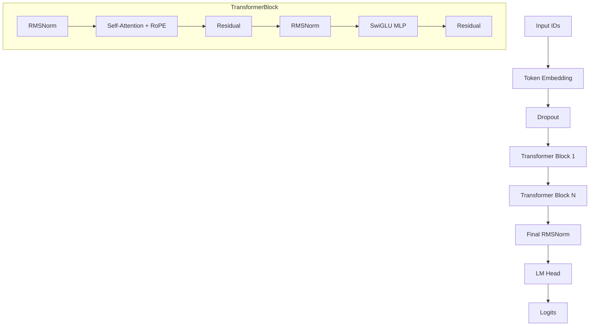
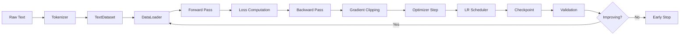
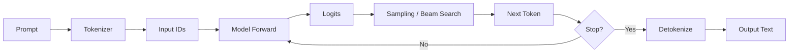
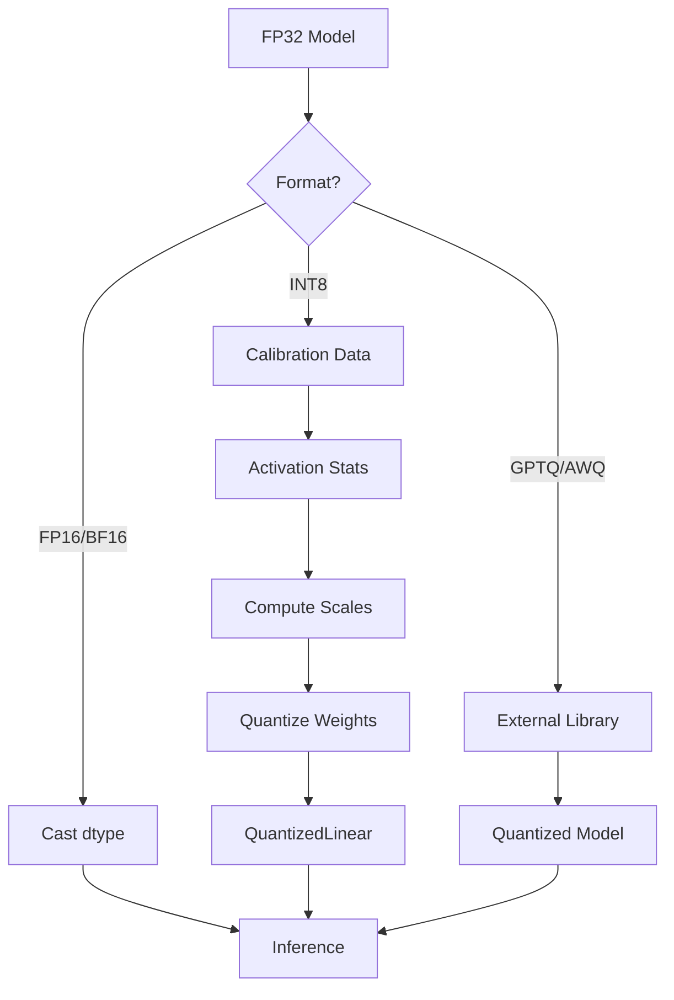
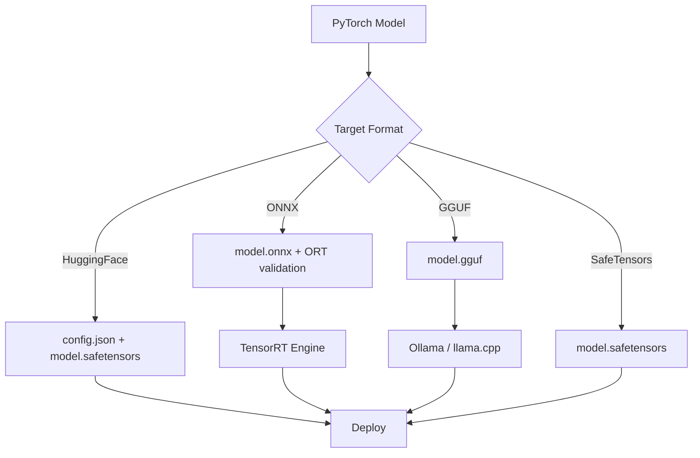
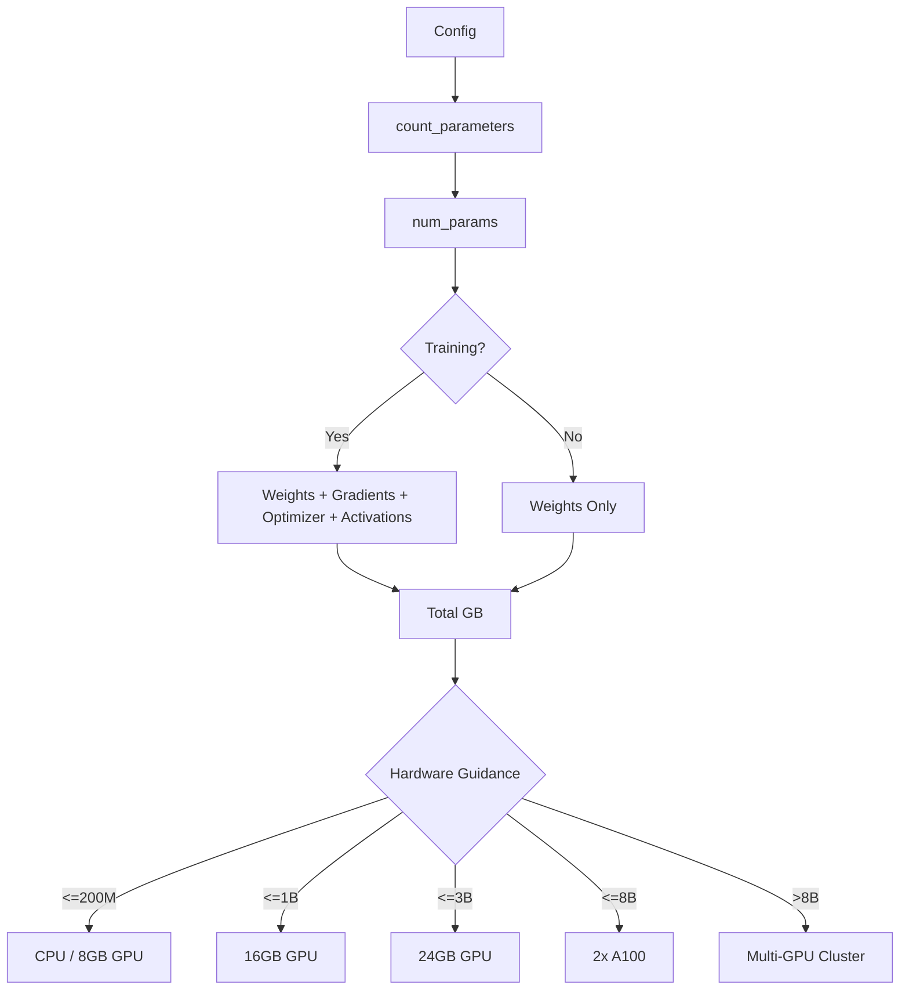

# Architecture Diagrams

This section contains Mermaid diagrams for the AstrovoxAI model training and inference architecture.

## Model Architecture

## Training Pipeline

## Inference Pipeline

## Quantization Flow

## Export Formats

## Memory Estimation

