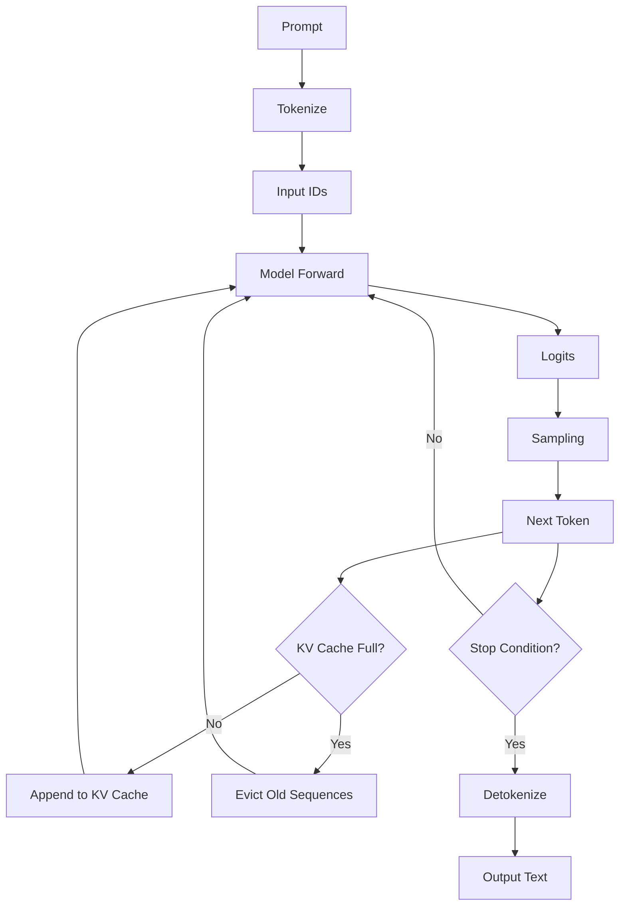
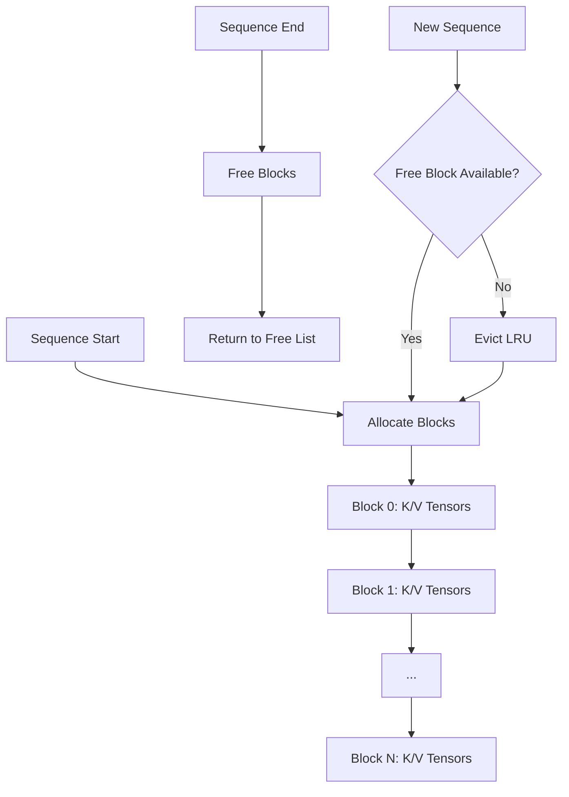
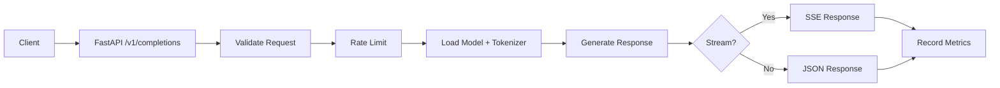
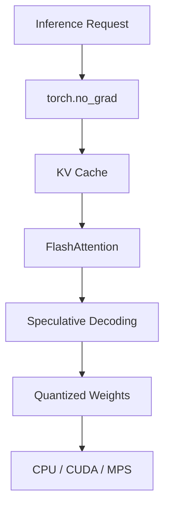

# Inference Pipeline Architecture

## Generation Loop

```mermaid
graph TD
    A[Prompt] --> B[Tokenize]
    B --> C[Input IDs]
    C --> D[Model Forward]
    D --> E[Logits]
    E --> F[Sampling]
    F --> G[Next Token]
    G --> H{KV Cache Full?}
    H -->|No| I[Append to KV Cache]
    I --> D
    H -->|Yes| J[Evict Old Sequences]
    J --> D
    G --> K{Stop Condition?}
    K -->|No| D
    K -->|Yes| L[Detokenize]
    L --> M[Output Text]
```

## Paged KV Cache

```mermaid
graph TD
    A[Sequence Start] --> B[Allocate Blocks]
    B --> C[Block 0: K/V Tensors]
    C --> D[Block 1: K/V Tensors]
    D --> E[...]
    E --> F[Block N: K/V Tensors]

    G[Sequence End] --> H[Free Blocks]
    H --> I[Return to Free List]

    J[New Sequence] --> K{Free Block Available?}
    K -->|Yes| B
    K -->|No| L[Evict LRU]
    L --> B
```

## Server Request Flow

```mermaid
graph LR
    A[Client] --> B[FastAPI /v1/completions]
    B --> C[Validate Request]
    C --> D[Rate Limit]
    D --> E[Load Model + Tokenizer]
    E --> F[Generate Response]
    F --> G{Stream?}
    G -->|Yes| H[SSE Response]
    G -->|No| I[JSON Response]
    H --> J[Record Metrics]
    I --> J
```

## Optimization Stack

```mermaid
graph TD
    A[Inference Request] --> B[torch.no_grad]
    B --> C[KV Cache]
    C --> D[FlashAttention]
    D --> E[Speculative Decoding]
    E --> F[Quantized Weights]
    F --> G[CPU / CUDA / MPS]
```
