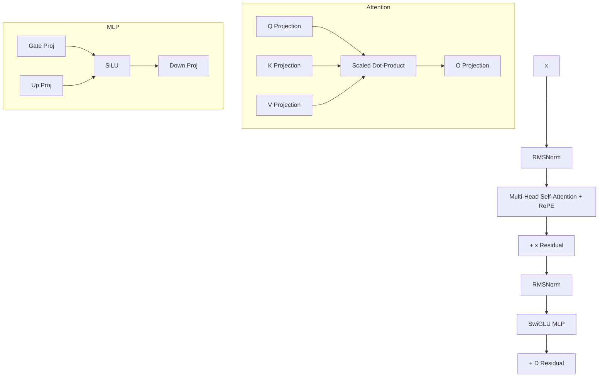
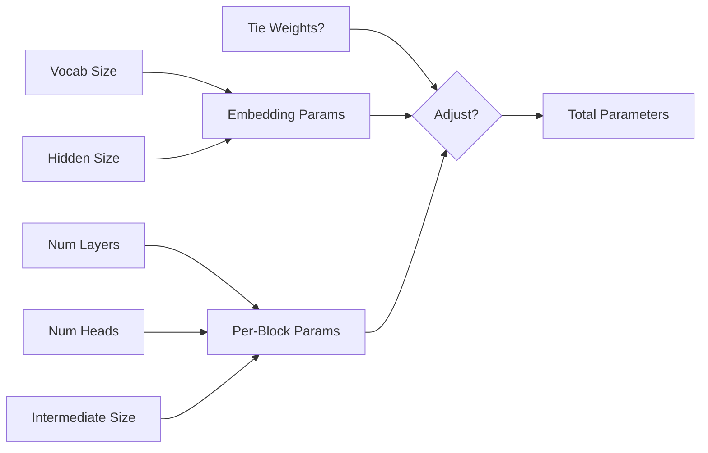
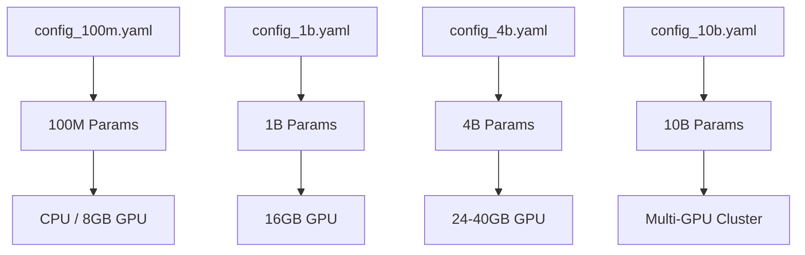

# Model Architecture

## Transformer Block

```mermaid
graph TD
    A[x] --> B[RMSNorm]
    B --> C[Multi-Head Self-Attention + RoPE]
    C --> D[+ x Residual]
    D --> E[RMSNorm]
    E --> F[SwiGLU MLP]
    F --> G[+ D Residual]

    subgraph Attention
        C1[Q Projection]
        C2[K Projection]
        C3[V Projection]
        C4[Scaled Dot-Product]
        C5[O Projection]
        C1 --> C4
        C2 --> C4
        C3 --> C4
        C4 --> C5
    end

    subgraph MLP
        F1[Gate Proj]
        F2[Up Proj]
        F3[SiLU]
        F4[Down Proj]
        F1 --> F3
        F2 --> F3
        F3 --> F4
    end
```

## Parameter Count Formula

```mermaid
graph LR
    A[Vocab Size] --> B[Embedding Params]
    C[Hidden Size] --> B
    D[Num Layers] --> E[Per-Block Params]
    F[Num Heads] --> E
    G[Intermediate Size] --> E
    H[Tie Weights?] --> I{Adjust?}
    B --> I
    E --> I
    I --> J[Total Parameters]
```

## Configuration Hierarchy

```mermaid
graph TD
    A[config_100m.yaml] --> B[100M Params]
    C[config_1b.yaml] --> D[1B Params]
    E[config_4b.yaml] --> F[4B Params]
    G[config_10b.yaml] --> H[10B Params]

    B --> I[CPU / 8GB GPU]
    D --> J[16GB GPU]
    F --> K[24-40GB GPU]
    H --> L[Multi-GPU Cluster]
```
