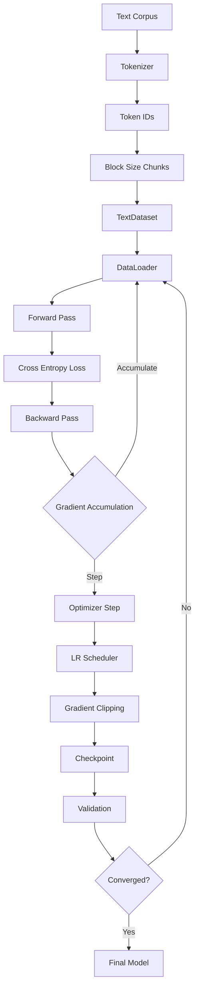
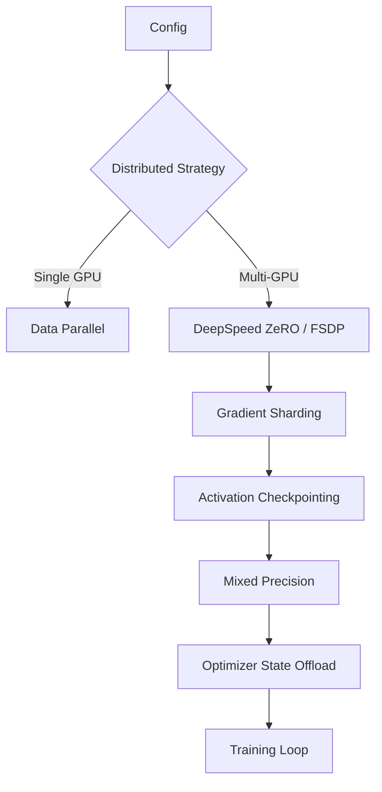
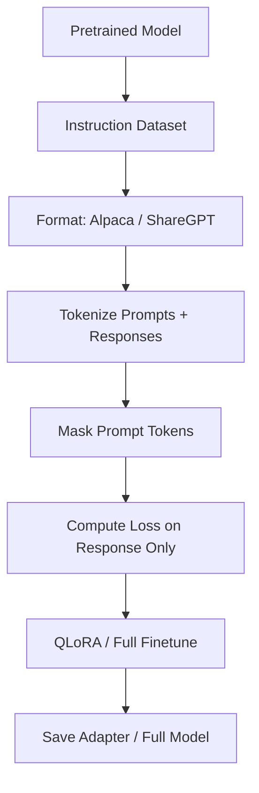
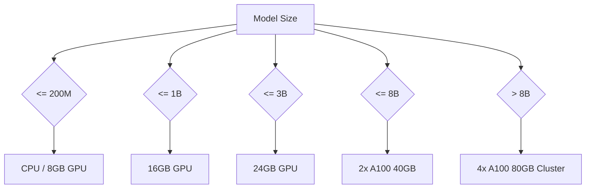

# Training Pipeline Architecture

## Pre-training Flow

```mermaid
graph TD
    A[Text Corpus] --> B[Tokenizer]
    B --> C[Token IDs]
    C --> D[Block Size Chunks]
    D --> E[TextDataset]
    E --> F[DataLoader]
    F --> G[Forward Pass]
    G --> H[Cross Entropy Loss]
    H --> I[Backward Pass]
    I --> J{Gradient Accumulation}
    J -->|Accumulate| F
    J -->|Step| K[Optimizer Step]
    K --> L[LR Scheduler]
    L --> M[Gradient Clipping]
    M --> N[Checkpoint]
    N --> O[Validation]
    O --> P{Converged?}
    P -->|No| F
    P -->|Yes| Q[Final Model]
```

## Distributed Training

```mermaid
graph TD
    A[Config] --> B{Distributed Strategy}
    B -->|Single GPU| C[Data Parallel]
    B -->|Multi-GPU| D[DeepSpeed ZeRO / FSDP]
    D --> E[Gradient Sharding]
    E --> F[Activation Checkpointing]
    F --> G[Mixed Precision]
    G --> H[Optimizer State Offload]
    H --> I[Training Loop]
```

## Fine-tuning Flow

```mermaid
graph TD
    A[Pretrained Model] --> B[Instruction Dataset]
    B --> C[Format: Alpaca / ShareGPT]
    C --> D[Tokenize Prompts + Responses]
    D --> E[Mask Prompt Tokens]
    E --> F[Compute Loss on Response Only]
    F --> G[QLoRA / Full Finetune]
    G --> H[Save Adapter / Full Model]
```

## Hardware Requirements

```mermaid
graph TD
    A[Model Size] --> B{<= 200M}
    A --> C{<= 1B}
    A --> D{<= 3B}
    A --> E{<= 8B}
    A --> F{> 8B}

    B --> B1[CPU / 8GB GPU]
    C --> C1[16GB GPU]
    D --> D1[24GB GPU]
    E --> E1[2x A100 40GB]
    F --> F1[4x A100 80GB Cluster]
```
