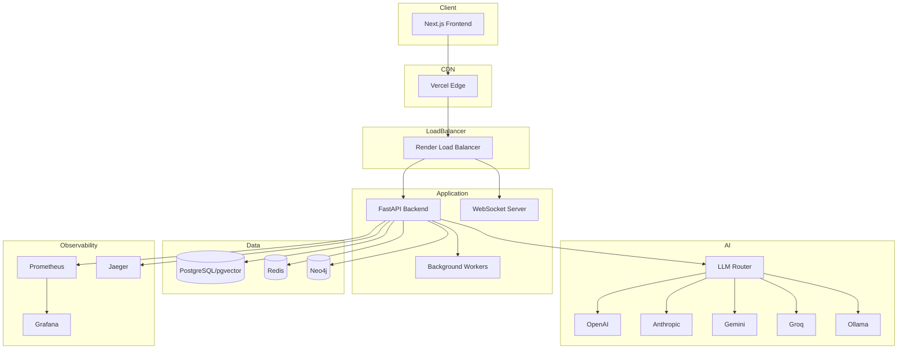
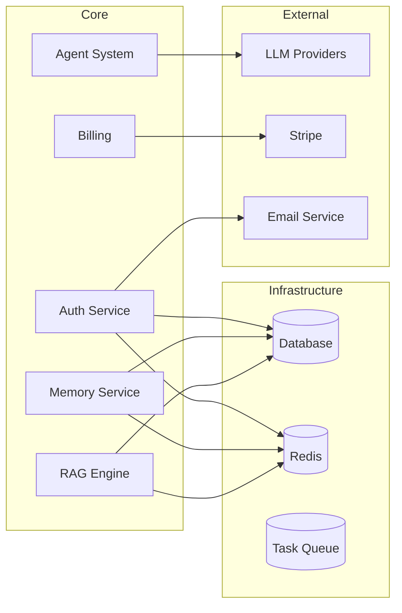
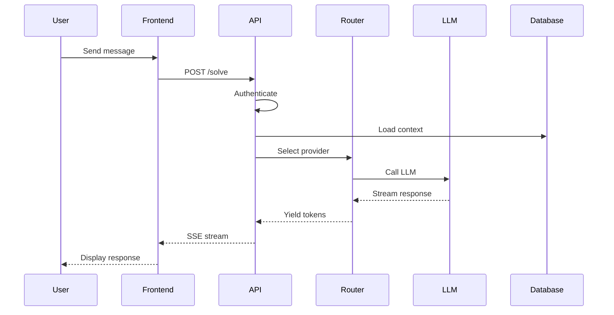
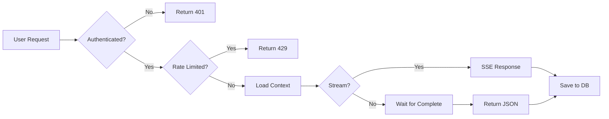
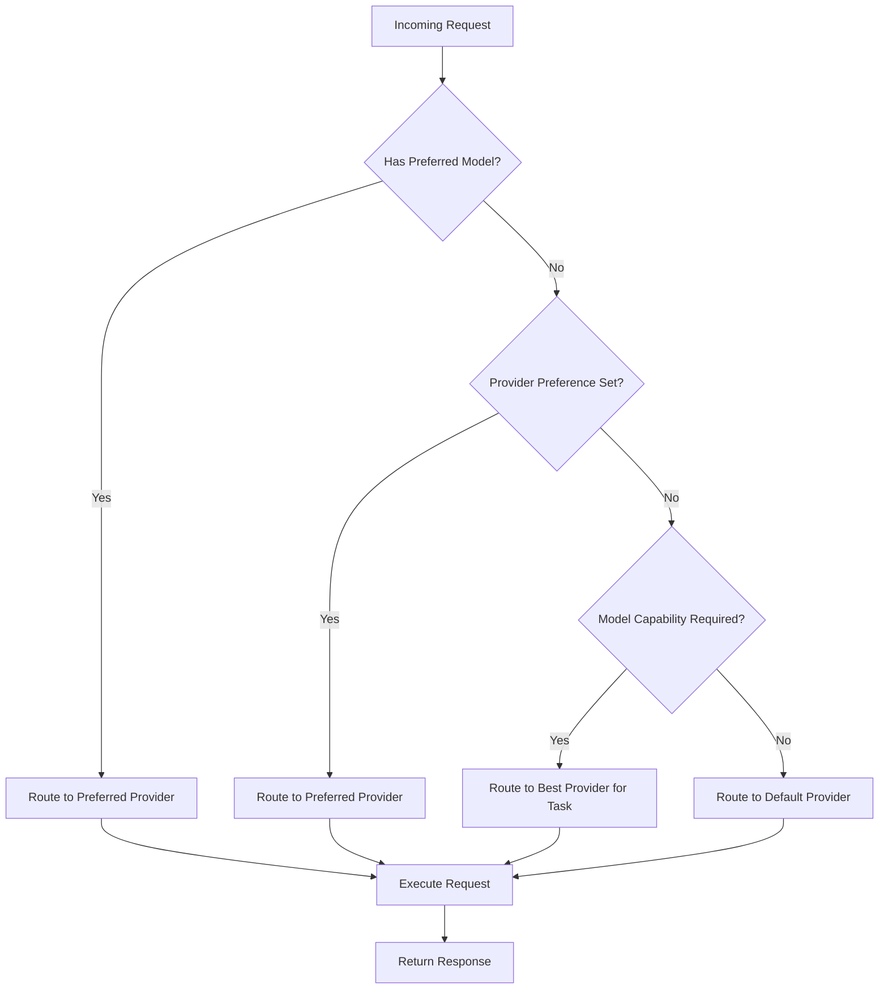
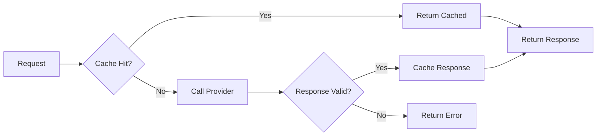
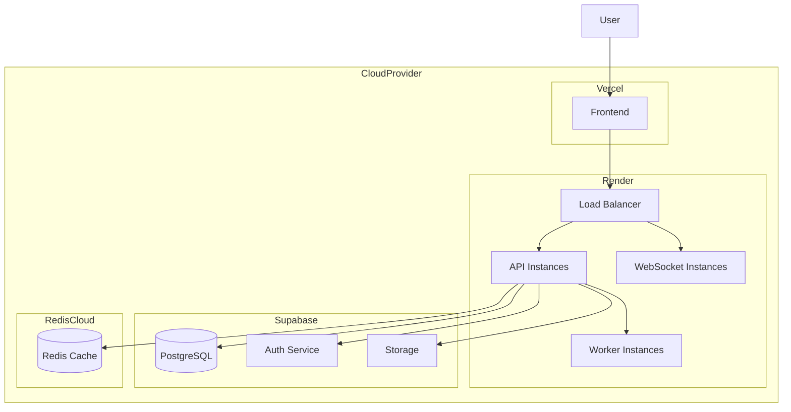
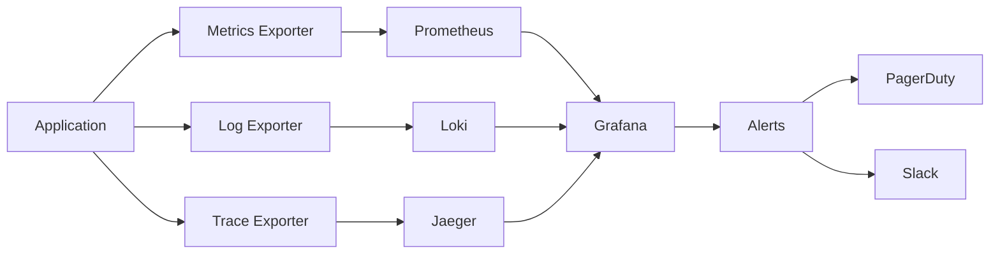
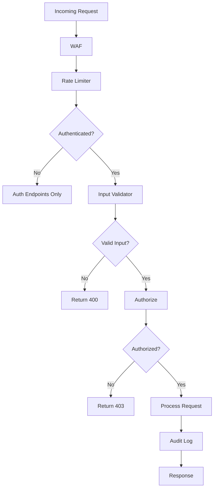

# Architecture Diagrams

Visual representations of the Astrovox AI system architecture.

For prose architecture details, see [ARCHITECTURE.md](./ARCHITECTURE.md).
For data-flow narratives, see [DATA_FLOW.md](./DATA_FLOW.md).

## System Architecture



## Component Diagram



## Data Flow



## Request Flow



## Provider Selection



## Caching Strategy



## Deployment Architecture



## Monitoring Architecture



## Security Architecture



## Directory Structure

```
astrovox/
├── 02-Backend/
│   ├── app/
│   │   ├── api/           # API routers
│   │   ├── core/          # Core configuration
│   │   ├── models/        # Data models
│   │   ├── services/      # Business logic
│   │   ├── providers/     # AI provider integrations
│   │   └── middleware/     # HTTP middleware
│   ├── tests/             # Backend tests
│   └── requirements.txt
├── src/
│   ├── components/        # React components
│   ├── hooks/             # Custom hooks
│   ├── stores/            # State management
│   ├── utils/             # Utilities
│   └── styles/            # Styles
├── docs/                  # Documentation
├── database/              # Database schemas and migrations
├── sdk/                   # Official SDKs
│   ├── python/
│   ├── typescript/
│   ├── go/
│   └── rust/
├── k8s/                   # Kubernetes configs
├── helm/                  # Helm charts
└── charts/                # Monitoring dashboards
```

## Technology Stack

### Frontend
- **Framework**: React 18 + Vite 6
- **Language**: TypeScript
- **Styling**: Tailwind CSS
- **State**: Zustand + React Query
- **UI Components**: Radix UI
- **Animations**: Framer Motion

### Backend
- **Framework**: FastAPI
- **Language**: Python 3.9+
- **ORM**: SQLAlchemy
- **Validation**: Pydantic
- **Task Queue**: Celery + Redis

### Data
- **Primary DB**: Supabase (PostgreSQL + pgvector)
- **Cache**: Redis
- **Search**: Neo4j (knowledge graph)

### AI/ML
- **Providers**: OpenAI, Anthropic, Gemini, Groq, Ollama
- **Embeddings**: OpenAI, Gemini
- **Vector DB**: pgvector

### Infrastructure
- **Frontend Hosting**: Vercel
- **Backend Hosting**: Render
- **Monitoring**: Prometheus + Grafana
- **Tracing**: Jaeger
- **CI/CD**: GitHub Actions

