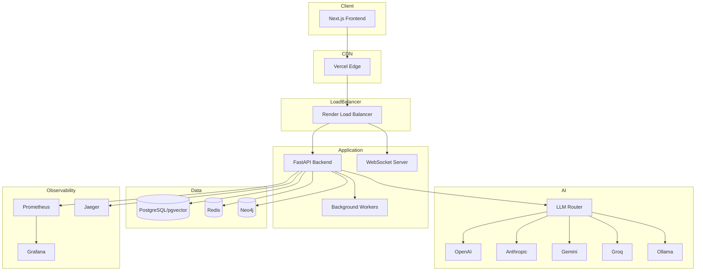
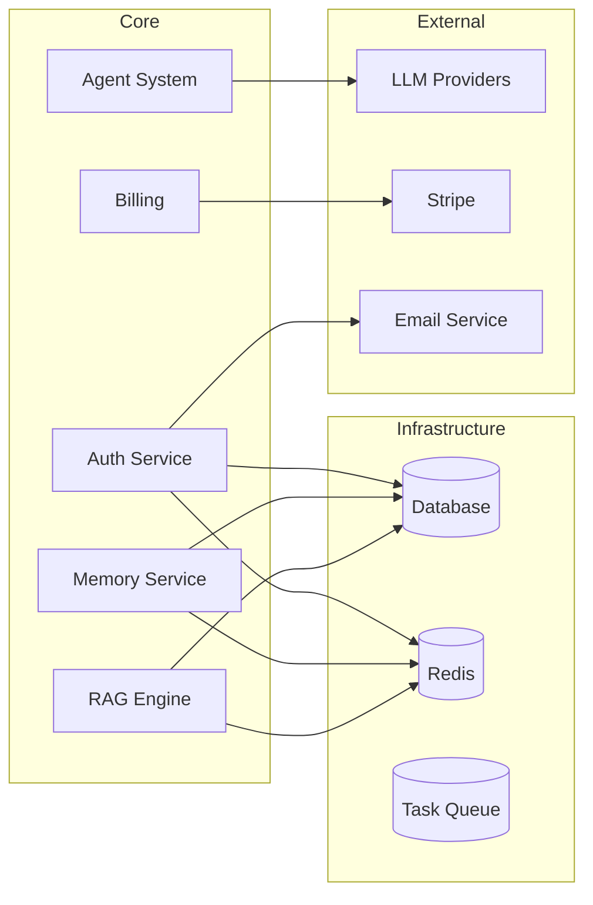
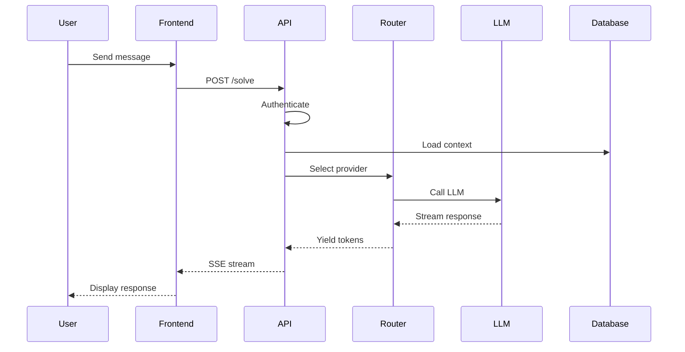

# Architecture Diagrams

## System Architecture

```mermaid
graph TB
    subgraph Client
        Web[Next.js Frontend]
    end

    subgraph CDN
        Vercel[Vercel Edge]
    end

    subgraph LoadBalancer
        LB[Render Load Balancer]
    end

    subgraph Application
        API[FastAPI Backend]
        WS[WebSocket Server]
        Workers[Background Workers]
    end

    subgraph Data
        PG[(PostgreSQL/pgvector)]
        R[(Redis)]
        N4[(Neo4j)]
    end

    subgraph AI
        Router[LLM Router]
        OpenAI[OpenAI]
        Anthropic[Anthropic]
        Gemini[Gemini]
        Groq[Groq]
        Ollama[Ollama]
    end

    subgraph Observability
        Prom[Prometheus]
        Graf[Grafana]
        Jaeg[Jaeger]
    end

    Web --> Vercel
    Vercel --> LB
    LB --> API
    LB --> WS
    API --> Workers
    API --> PG
    API --> R
    API --> N4
    API --> Router
    Router --> OpenAI
    Router --> Anthropic
    Router --> Gemini
    Router --> Groq
    Router --> Ollama
    API --> Prom
    Prom --> Graf
    API --> Jaeg
```

## Component Diagram

```mermaid
graph LR
    subgraph Core
        Auth[Auth Service]
        Memory[Memory Service]
        RAG[RAG Engine]
        Agents[Agent System]
        Billing[Billing]
    end

    subgraph Infrastructure
        DB[(Database)]
        Cache[(Redis)]
        Queue[(Task Queue)]
    end

    subgraph External
        LLM[LLM Providers]
        Stripe[Stripe]
        Email[Email Service]
    end

    Auth --> DB
    Auth --> Cache
    Memory --> DB
    Memory --> Cache
    RAG --> DB
    RAG --> Cache
    Agents --> LLM
    Billing --> Stripe
    Auth --> Email
```

## Data Flow

```mermaid
sequenceDiagram
    participant U as User
    participant F as Frontend
    participant A as API
    participant R as Router
    participant L as LLM
    participant D as Database

    U->>F: Send message
    F->>A: POST /solve
    A->>A: Authenticate
    A->>D: Load context
    A->>R: Select provider
    R->>L: Call LLM
    L-->>R: Stream response
    R-->>A: Yield tokens
    A-->>F: SSE stream
    F-->>U: Display response
```
