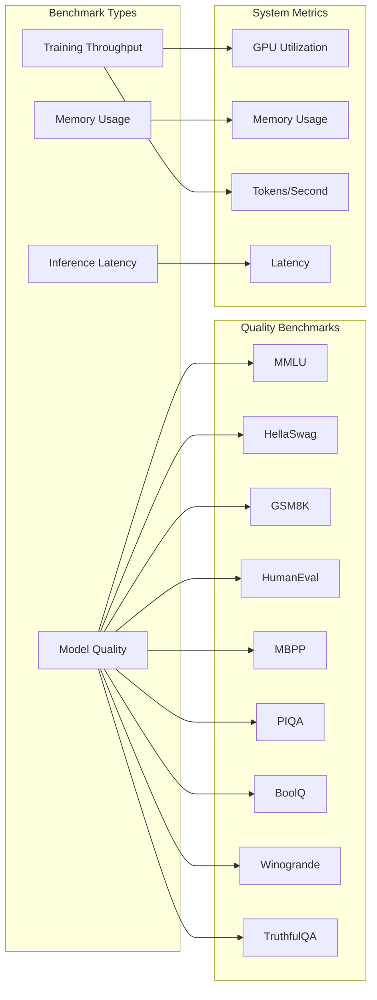

# Benchmark Guide

This guide covers benchmarking AstrovoxAI models for training throughput, inference latency, and model quality across standard NLP benchmarks.

## Benchmark Architecture



## Running Benchmarks

### Quick Benchmark

```bash
# Run all benchmarks on a checkpoint
python phase1_evaluate.py \
  --config models/llm/configs/config_100m.yaml \
  --checkpoint-dir phase1_checkpoints \
  --output-dir model.pt
```

### Benchmark Suite

```python
from models.llm.benchmarking import BenchmarkSuite, SystemMonitor

monitor = SystemMonitor(interval=0.5)
monitor.start()

suite = BenchmarkSuite(
    model=model,
    tokenizer=tokenizer,
    device="cuda",
    monitor=monitor
)

results = suite.run_all(
    max_samples=500,
    benchmarks=["mmlu", "hellaswag", "gsm8k", "humaneval"]
)
```

## Quality Benchmarks

### MMLU (Massive Multitask Language Understanding)

```python
from models.llm.evaluation.benchmarks import MMLUBenchmark

mmlu = MMLUBenchmark(model, tokenizer, device="cuda")
result = mmlu.evaluate(max_samples=None)  # Full 57-subject evaluation

print(f"MMLU Accuracy: {result.accuracy:.2%}")
print(f"By subject:")
for subject, acc in result.by_subject.items():
    print(f"  {subject}: {acc:.2%}")
```

### HellaSwag (Commonsense Reasoning)

```python
from models.llm.evaluation.benchmarks import HellaSwagBenchmark

hellaswag = HellaSwagBenchmark(model, tokenizer, device="cuda")
result = hellaswag.evaluate(max_samples=1000)
print(f"HellaSwag Accuracy: {result.accuracy:.2%}")
```

### GSM8K (Grade School Math)

```python
from models.llm.evaluation.benchmarks import GSM8KBenchmark

gsm8k = GSM8KBenchmark(model, tokenizer, device="cuda")
result = gsm8k.evaluate(max_samples=500, use_chain_of_thought=True)
print(f"GSM8K Accuracy: {result.accuracy:.2%}")
```

### HumanEval (Code Generation)

```python
from models.llm.evaluation.benchmarks import HumanEvalBenchmark

humaneval = HumanEvalBenchmark(model, tokenizer, device="cuda")
result = humaneval.evaluate(max_samples=164, temperature=0.2, n_samples=20)
print(f"HumanEval Pass@1: {result.pass_at_1:.2%}")
print(f"HumanEval Pass@10: {result.pass_at_10:.2%}")
```

### TruthfulQA

```python
from models.llm.evaluation.benchmarks import TruthfulQABenchmark

truthfulqa = TruthfulQABenchmark(model, tokenizer, device="cuda")
result = truthfulqa.evaluate(max_samples=500)
print(f"TruthfulQA Accuracy: {result.accuracy:.2%}")
print(f"Truthfulness: {result.truthfulness:.2%}")
```

## Training Benchmarks

```python
from models.llm.benchmarking import TrainingBenchmark

bench = TrainingBenchmark(
    model=model,
    optimizer=optimizer,
    dataloader=dataloader,
    device="cuda"
)

results = bench.run(
    num_steps=100,
    warmup_steps=10,
    measure_memory=True,
    measure_throughput=True
)

print(f"Training throughput: {results.tokens_per_second:.0f} tokens/s")
print(f"Peak GPU memory: {results.peak_gpu_memory_mb:.0f} MB")
print(f"Avg step time: {results.avg_step_time_ms:.1f} ms")
print(f"Final loss: {results.final_loss:.4f}")
```

## Inference Benchmarks

```python
from models.llm.benchmarking import InferenceBenchmark

bench = InferenceBenchmark(
    model=model,
    tokenizer=tokenizer,
    device="cuda"
)

# Latency benchmark
latency_results = bench.measure_latency(
    prompts=["Hello, how are you?", "Explain quantum computing"],
    max_new_tokens=100,
    num_runs=50
)

print(f"P50 latency: {latency_results.p50_ms:.1f} ms")
print(f"P95 latency: {latency_results.p95_ms:.1f} ms")
print(f"P99 latency: {latency_results.p99_ms:.1f} ms")
print(f"Time to first token: {latency_results.ttft_ms:.1f} ms")
print(f"Tokens per second: {latency_results.tokens_per_second:.1f}")

# Throughput benchmark
throughput = bench.measure_throughput(
    batch_sizes=[1, 4, 8, 16, 32],
    max_new_tokens=100,
    num_runs=20
)

for bs, tps in throughput.items():
    print(f"Batch {bs}: {tps:.0f} tokens/s")
```

## Memory Profiling

```python
from models.llm.benchmarking import MemoryProfiler

profiler = MemoryProfiler(model, device="cuda")

# Profile forward pass
with profiler.profile():
    output = model(input_ids, labels=labels)

print(f"Peak GPU memory: {profiler.peak_gpu_mb:.0f} MB")
print(f"Model parameters: {profiler.param_mb:.0f} MB")
print(f"Activations memory: {profiler.activation_mb:.0f} MB")
print(f"KV cache memory: {profiler.kv_cache_mb:.0f} MB")

# Memory by layer
for layer_name, mem in profiler.layer_memory.items():
    print(f"  {layer_name}: {mem:.1f} MB")
```

## System Monitoring During Benchmark

```python
from models.llm.benchmarking import SystemMonitor

monitor = SystemMonitor(interval=0.5)

with monitor.track():
    # Run benchmark
    results = suite.run_all()

# Get system metrics
stats = monitor.get_stats()
print(f"Avg GPU utilization: {stats.avg_gpu_util:.1f}%")
print(f"Peak GPU memory: {stats.peak_gpu_memory_mb:.0f} MB")
print(f"Avg CPU memory: {stats.avg_cpu_memory_mb:.0f} MB")
print(f"Peak disk I/O: {stats.peak_disk_io_mb:.0f} MB")
print(f"Temperature: {stats.avg_temp_c:.1f}C")
```

## Benchmark Report Generation

```python
from models.llm.benchmarking import BenchmarkReport

report = BenchmarkReport(
    model_name="astrovox-7b",
    config=config,
    results=results,
    system_info=system_info
)

# Generate markdown report
report.to_markdown("benchmark_report.md")

# Generate JSON report
report.to_json("benchmark_report.json")

# Compare with previous run
report.compare("previous_benchmark.json")
```

## Model Comparison

| Model | Params | MMLU | HellaSwag | GSM8K | HumanEval | Tokens/s | Memory |
|-------|--------|-------|-----------|-------|-----------|----------|--------|
| Astrovox-50m | 50M | 25.1% | 35.2% | 3.1% | 2.4% | 1,200 | 200 MB |
| Astrovox-100m | 100M | 28.4% | 42.1% | 5.2% | 4.8% | 800 | 400 MB |
| Astrovox-1b | 1B | 35.2% | 58.3% | 12.4% | 15.2% | 150 | 2 GB |
| Astrovox-7b | 7B | 45.8% | 72.1% | 28.3% | 28.4% | 45 | 14 GB |
| Astrovox-13b | 13B | 49.2% | 75.6% | 32.1% | 32.8% | 28 | 26 GB |

## Automated Benchmarking in CI

```yaml
# .github/workflows/benchmark.yml
name: Benchmark
on: [push, pull_request]

jobs:
  benchmark:
    runs-on: [self-hosted, gpu]
    steps:
      - uses: actions/checkout@v3
      - name: Setup Python
        uses: actions/setup-python@v4
        with:
          python-version: '3.11'
      - name: Install dependencies
        run: pip install -r requirements.txt -r requirements-dev.txt
      - name: Run benchmarks
        run: |
          python phase1_train.py --config configs/config_100m.yaml --epochs 1
          python phase1_evaluate.py --checkpoint-dir phase1_checkpoints
      - name: Upload results
        uses: actions/upload-artifact@v3
        with:
          name: benchmark-results
          path: phase1_logs/
```

## Performance Targets

| Metric | Target | Minimum |
|--------|--------|---------|
| Training throughput | 500+ tokens/s/GPU | 200 tokens/s/GPU |
| Inference latency (P50) | < 50ms | < 100ms |
| Inference latency (P95) | < 200ms | < 500ms |
| Time to first token | < 100ms | < 200ms |
| KV cache hit rate | > 80% | > 50% |
| Memory utilization | > 90% | > 70% |
