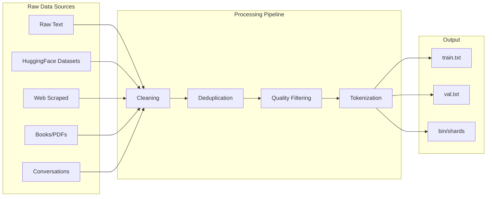

# Dataset Guide

This guide covers dataset preparation, validation, cleaning, and pipeline configuration for AstrovoxAI model training.

## Dataset Overview



## Supported Formats

| Format | Extension | Description |
|--------|-----------|-------------|
| Plain text | `.txt` | One document per line or newline-separated |
| JSON Lines | `.jsonl` | One JSON object per line |
| JSON | `.json` | Array of documents |
| CSV | `.csv` | Documents in a column |
| HuggingFace | — | `datasets.load_dataset()` compatible |

## Plain Text Format

```txt
# data/train.txt
Astrovox is an artificial intelligence platform designed for learning.
The Astrovox model uses transformers to process text sequences.
Training helps the model understand language patterns and structure.
The model generates text based on learned patterns from data.
Natural language processing enables computers to understand text.
Deep learning models require careful tuning and validation.
Gradient descent optimizes model parameters during training.
Loss functions measure prediction errors in model outputs.
Backpropagation updates neural network weights efficiently.
Transformers use attention mechanisms to process sequences.
Tokenization converts raw text into numerical token ids.
Embeddings represent words as dense continuous vectors.
Position encodings add sequence order information to embeddings.
Feed forward networks process hidden states between layers.
Layer normalization stabilizes training dynamics and speed.
Dropout prevents overfitting by randomly zeroing activations.
Learning rates control optimization step sizes carefully.
Checkpoints save model state for later resumption.
Validation loss indicates how well the model generalizes.
Perplexity measures model uncertainty on held out data.
```

## JSONL Format (Instruction Tuning)

```jsonl
{"instruction": "Explain quantum computing", "input": "", "output": "Quantum computing uses quantum bits (qubits) instead of classical bits..."}
{"instruction": "Translate to French", "input": "Hello, how are you?", "output": "Bonjour, comment allez-vous?"}
{"instruction": "Write a Python function", "input": "Calculate factorial", "output": "def factorial(n):\n    if n == 0:\n        return 1\n    return n * factorial(n-1)"}
{"instruction": "Summarize", "input": "The quick brown fox jumps over the lazy dog. It was a sunny day in the forest.", "output": "A fox jumped over a dog on a sunny day."}
```

## Data Pipeline

```python
from models.llm.training_data.pipeline import (
    DataPipeline,
    StreamingDataset,
    Preprocessor,
    DatasetValidator,
    QualityReport
)

# Configure pipeline
pipeline = DataPipeline(
    source="data/train.txt",
    format="txt",
    batch_size=32
)

# Preprocessing
preprocessor = Preprocessor(
    tokenizer=tokenizer,
    max_length=2048,
    truncation=True,
    add_special_tokens=True
)

# Create dataset
dataset = StreamingDataset(
    pipeline=pipeline,
    preprocessor=preprocessor
)

# Validate dataset
validator = DatasetValidator()
report = validator.validate(dataset)
print(f"Valid samples: {report.valid_count}")
print(f"Invalid samples: {report.invalid_count}")
print(f"Avg length: {report.avg_length:.1f} tokens")
```

## Data Cleaning

```python
from models.llm.training_data.clean import (
    TextCleaner,
    remove_html,
    remove_urls,
    remove_emails,
    normalize_whitespace,
    remove_special_chars,
    filter_by_length,
    filter_by_language
)

cleaner = TextCleaner()

# Apply cleaning pipeline
cleaner.add_step(remove_html)
cleaner.add_step(remove_urls)
cleaner.add_step(remove_emails)
cleaner.add_step(normalize_whitespace)
cleaner.add_step(remove_special_chars)

cleaned_text = cleaner.clean(raw_text)

# Filter dataset
filtered = filter_by_length(dataset, min_length=50, max_length=200000)
filtered = filter_by_language(filtered, languages=["en", "fr", "de"])
```

## Data Validation

```python
from models.llm.dataset_validation import DatasetValidator, ValidationReport

validator = DatasetValidator()

report = validator.validate_directory("training_data/")

print(f"Total files: {report.total_files}")
print(f"Total samples: {report.total_samples}")
print(f"Valid samples: {report.valid_samples}")
print(f"Avg tokens per sample: {report.avg_tokens:.1f}")
print(f"Quality score: {report.quality_score:.2f}")
print(f"Warnings: {report.warnings}")
```

## Curriculum Weighting

```yaml
# Configure domain weights for training
curriculum_weights:
  instructions: 1.4
  math: 1.3
  conversations: 1.2
  docs: 1.1
  research: 1.0
  wikipedia: 1.0
  books: 0.9
  github: 0.9
  stackoverflow: 0.85
  common_crawl: 0.7
```

```python
from models.llm.training_data.pipeline import CurriculumSampler

sampler = CurriculumSampler(
    datasets={
        "instructions": "data/instructions.jsonl",
        "math": "data/math.jsonl",
        "conversations": "data/conversations.jsonl",
    },
    weights={
        "instructions": 1.4,
        "math": 1.3,
        "conversations": 1.2,
    }
)

# Sample batch with curriculum weighting
batch = sampler.sample(batch_size=32)
```

## Data Deduplication

```python
from models.llm.training_data.pipeline import MinHashDeduplicator

deduplicator = MinHashDeduplicator(
    threshold=0.8,  # Jaccard similarity threshold
    num_hashes=128
)

# Deduplicate dataset
unique_docs = deduplicator.deduplicate(dataset)
print(f"Removed {len(dataset) - len(unique_docs)} duplicates")
```

## Tokenization

```python
from models.llm.tokenizer.train_tokenizer import (
    load_tokenizer,
    create_dummy_tokenizer,
    TextDataset,
    collate_fn
)

# Load existing tokenizer
tokenizer = load_tokenizer("tokenizer.json")

# Create dummy tokenizer for testing
tokenizer = create_dummy_tokenizer(
    save_dir=".",
    vocab_size=32000
)

# Create dataset
dataset = TextDataset(
    file_path="data/train.txt",
    tokenizer=tokenizer,
    block_size=1024  # Max sequence length
)

# Collate function for DataLoader
def collate_fn(batch, pad_token_id=0):
    max_len = max(len(item["input_ids"]) for item in batch)
    input_ids = []
    labels = []
    for item in batch:
        pad_len = max_len - len(item["input_ids"])
        input_ids.append(item["input_ids"] + [pad_token_id] * pad_len)
        labels.append(item["labels"] + [-100] * pad_len)
    return {
        "input_ids": torch.tensor(input_ids),
        "labels": torch.tensor(labels)
    }
```

## Dataset Preparation Script

```python
# prepare_dataset.py
import argparse
from pathlib import Path
from models.llm.training_data.pipeline import DataPipeline
from models.llm.training_data.clean import TextCleaner
from models.llm.dataset_validation import DatasetValidator

def prepare(input_path: str, output_path: str, format: str = "txt"):
    pipeline = DataPipeline(source=input_path, format=format)
    cleaner = TextCleaner()
    validator = DatasetValidator()

    # Process and clean
    cleaned = cleaner.clean_dataset(pipeline)

    # Validate
    report = validator.validate(cleaned)
    print(f"Quality report: {report.summary()}")

    # Write output
    Path(output_path).parent.mkdir(parents=True, exist_ok=True)
    with open(output_path, "w", encoding="utf-8") as f:
        for doc in cleaned:
            f.write(doc + "\n")

    # Split into train/val
    split_dataset(output_path, train_ratio=0.9)

if __name__ == "__main__":
    parser = argparse.ArgumentParser()
    parser.add_argument("--input", required=True)
    parser.add_argument("--output", required=True)
    parser.add_argument("--format", default="txt")
    args = parser.parse_args()
    prepare(args.input, args.output, args.format)
```

## Data Quality Standards

| Metric | Minimum | Target |
|--------|---------|--------|
| Avg tokens per sample | 50 | 200+ |
| Valid/Total ratio | 80% | 95%+ |
| Duplicate rate | < 5% | < 1% |
| Language consistency | 90%+ | 98%+ |
| Quality score | 0.6+ | 0.8+ |

## HuggingFace Datasets

```python
from datasets import load_dataset

# Load from HuggingFace Hub
dataset = load_dataset("wikitext", "wikitext-2-raw-v1")
dataset = load_dataset("OpenAssistant/oasst1")
dataset = load_dataset("togethercomputer/RedPajama-Data-1T", split="train", streaming=True)

# Convert to AstrovoxAI format
for split in dataset:
    with open(f"data/{split}.txt", "w", encoding="utf-8") as f:
        for item in dataset[split]:
            text = item.get("text", "") or item.get("content", "")
            if text.strip():
                f.write(text.strip() + "\n")
```

## Synthetic Data Generation

```python
from models.llm.training_data.pipeline import SyntheticDataGenerator

generator = SyntheticDataGenerator(
    template_file="templates/instructions.json",
    num_samples=10000,
    domains=["math", "code", "reasoning", "creative"]
)

samples = generator.generate()
with open("data/synthetic_instructions.jsonl", "w") as f:
    for sample in samples:
        f.write(json.dumps(sample) + "\n")
```

## Dataset Report

```python
from models.llm.dataset_report import generate_dataset_report

report = generate_dataset_report(
    data_dir="training_data/",
    output_file="dataset_report.md",
    tokenizer=tokenizer
)

# Generates markdown report with:
# - Total samples and tokens
# - Domain distribution
# - Length statistics
# - Quality metrics
# - Vocabulary coverage
```

## Data Split Strategy

```python
from torch.utils.data import random_split

# 90/5/5 train/val/test split
dataset = TextDataset("data/train.txt", tokenizer, block_size=1024)
total = len(dataset)
train_size = int(0.9 * total)
val_size = int(0.05 * total)
test_size = total - train_size - val_size

train_ds, val_ds, test_ds = random_split(
    dataset,
    [train_size, val_size, test_size],
    generator=torch.Generator().manual_seed(42)
)
```
