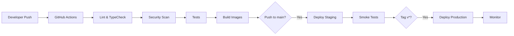
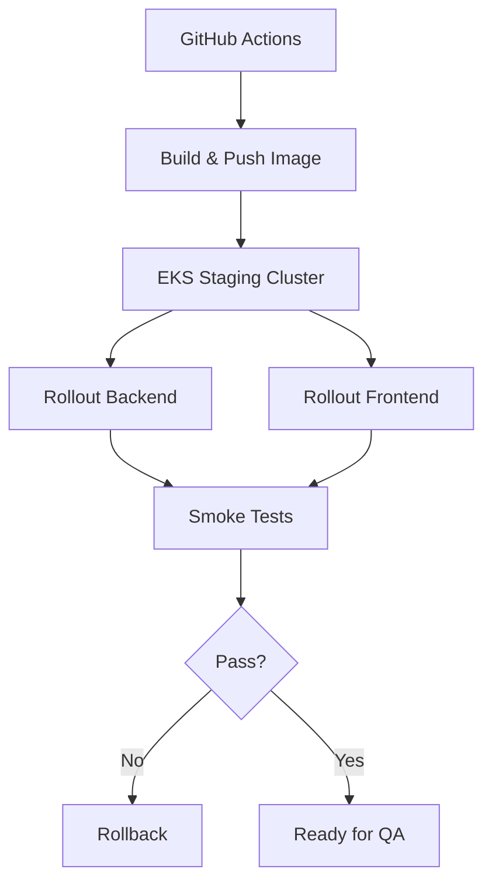
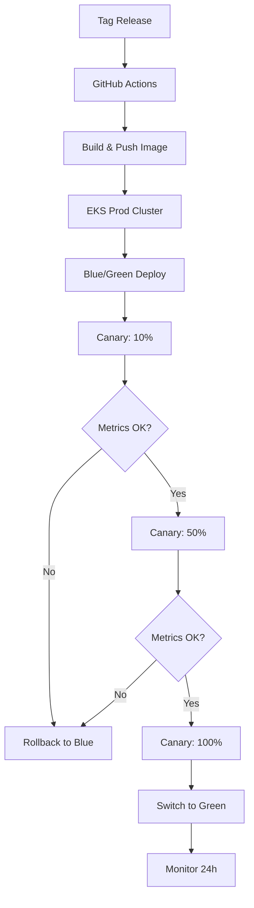
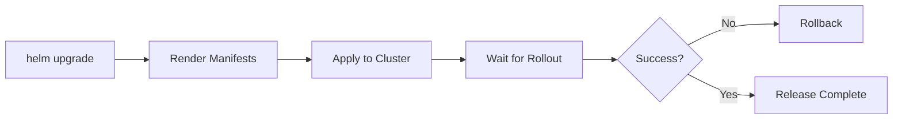
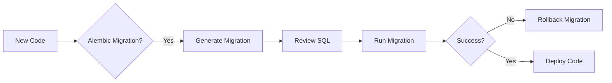
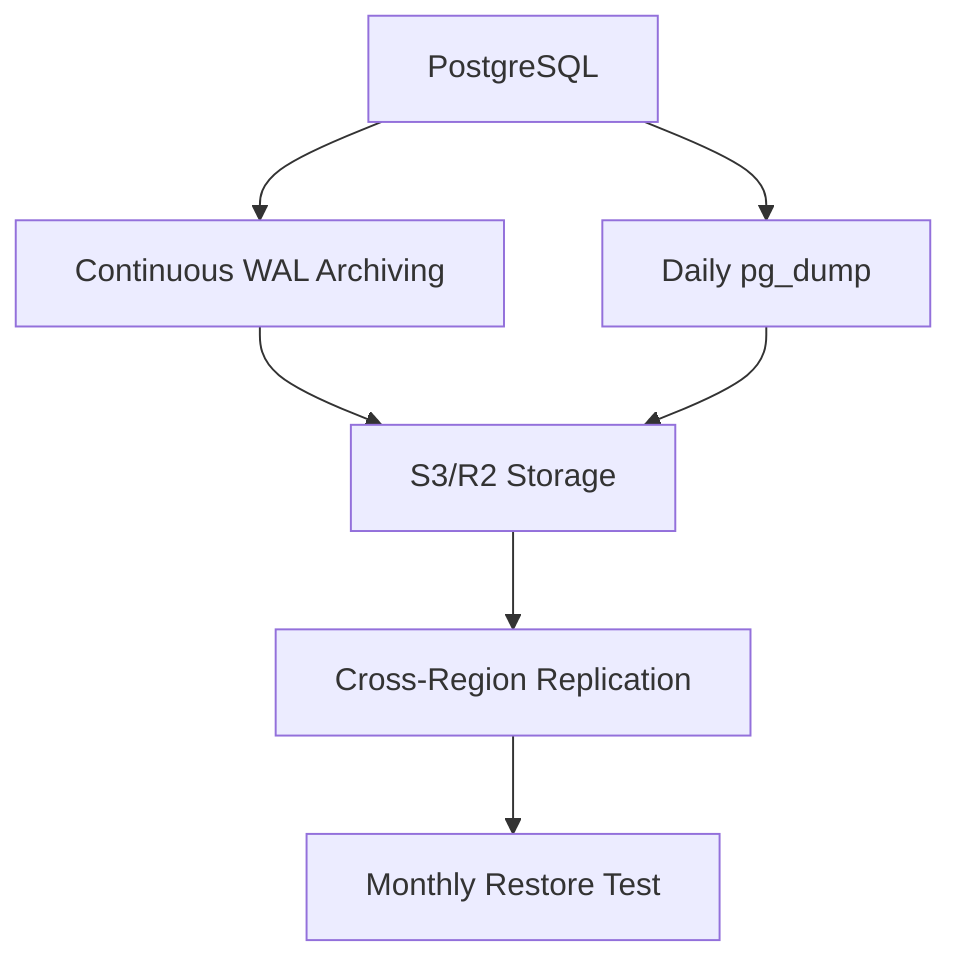
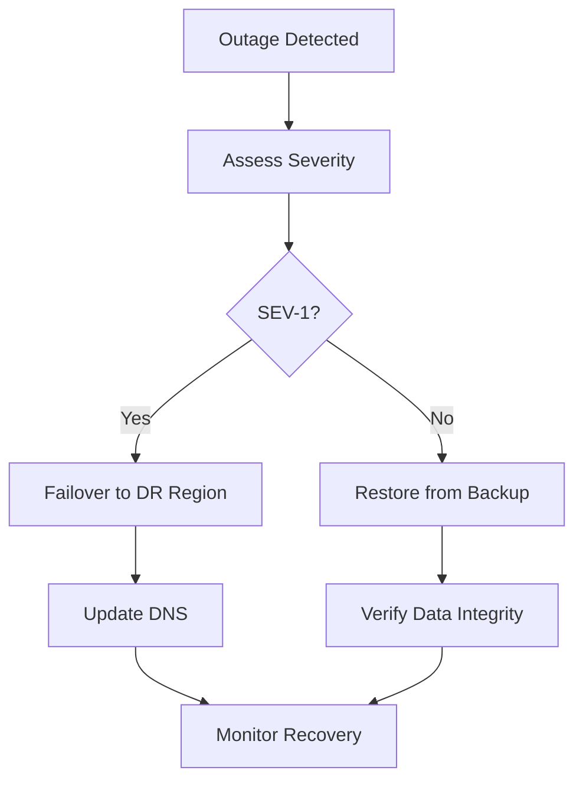

# Deployment Diagrams

## CI/CD Pipeline

## Staging Deployment

## Production Deployment

## Helm Release Flow

## Database Migration Flow

## Backup Architecture

## Disaster Recovery Flow

