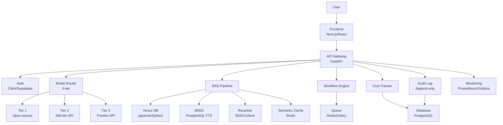
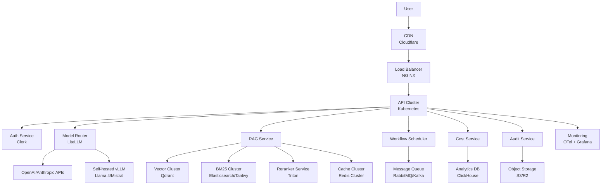

# AstrovoxAI — Execution Blueprint to a $1B+ Valuation
> Continuation of the strategic roadmap. This document turns vision into daily/weekly/monthly execution.

---

## 1. 90-Day Sprint Plan (Week-by-Week, Day-by-Day)

### Daily Operating System for the Founder

**Morning (30–45 min)**
- 08:00–08:10: Review dashboards: burn, MRR, active users, error rate, overnight alerts
- 08:10–08:25: Triage user feedback and support tickets; reply to every new message
- 08:25–08:45: Write down today’s 3 MITs (Most Important Tasks) in order
- 08:45–09:00: Check calendar; ensure at least 4 hours of deep work block today

**Afternoon (2–4 hours deep work)**
- Execute MITs in priority order; no meetings unless critical
- If engineering: code with `Pomodoro` 25/5 or 50/10; commit by end of day
- If sales/support: block 2-hour windows for outreach, calls, demos
- Log time in Toggl; categorize as product, sales, support, ops

**Evening (30 min)**
- 17:30–17:45: Update task board (Linear/GitHub Projects); mark completions
- 17:45–18:00: Write 3-sentence journal: what I learned, what I’d change, what I’m grateful for
- 18:00–18:15: Plan tomorrow’s 3 MITs

**Weekly (Sundays, 1 hour)**
- Review weekly metric dashboard (see Section 11)
- Update 90-day sprint tracker
- Identify 1 process to improve next week

**Monthly (last Sunday, 2 hours)**
- Retrospective: what worked, what didn’t, what we’re changing
- Update financial model with actuals
- Review roadmap and reprioritize next 30 days

---

### Week 1: Foundation & User Discovery

**Goal:** Understand the problem space through direct user conversations and manual “shadow AI” experiments.

**Daily Tasks**
- Day 1: Set up workspace (Notion/GitHub/Linear), create tracking docs, install tooling
- Day 2: Draft ICP hypothesis and user interview script
- Day 3–5: 5 user interviews (30 min each)
- Day 6: Analyze interviews; extract top 5 pain points and willingness-to-pay signals
- Day 7: Write Week 1 retrospective; decide whether to proceed or pivot

**Deliverables**
- 5 completed user interviews with notes
- ICP hypothesis doc with 3 candidate personas
- Pain point ranking (top 5)
- Willingness-to-pay summary

**Metrics**
- Interviews completed: 5
- Users who say “I’d pay $50/month”: ≥ 1
- Time-to-first-value observed in shadow AI: < 5 minutes

**Budget:** $0–$50 (calendly, zoom, coffee vouchers for users)
**Tools:** Notion, Google Forms, Zoom, Toggl
**Kill Criteria:** < 1 user sees value in shadow AI after 5 interviews → pivot problem space

---

### Week 2: Shadow AI & Cost Modeling

**Goal:** Manually deliver the AI service for 3–5 users; log every interaction and calculate real cost per task.

**Daily Tasks**
- Day 1–2: Select 3 users from Week 1 with highest pain points
- Day 3–4: Manually process their requests; log prompts, outputs, edits, time spent
- Day 5: Calculate cost per task using provider pricing
- Day 6: Build rough P&L model
- Day 7: Week 2 retrospective

**Deliverables**
- Shadow AI log (100+ entries) with prompt, output, user edit, latency, cost
- Cost model spreadsheet (Google Sheets)
- P&L projection (month 1–12)

**Metrics**
- Shadow AI interactions logged: 100+
- Cost per successful task: < $0.10
- User satisfaction with shadow AI: > 7/10

**Budget:** $50–$200 (API bills, user incentives)
**Kill Criteria:** Cost per task > $0.20 or users rate shadow AI < 5/10 → rework approach

---

### Week 3: MVP Architecture & Tooling

**Goal:** Finalize technical architecture and set up development environment.

**Daily Tasks**
- Day 1: Draw system architecture (Mermaid/Excalidraw)
- Day 2: Select exact tool versions (FastAPI, pgvector, Redis, Qdrant, etc.)
- Day 3: Initialize repo, CI/CD, staging environment
- Day 4: Implement auth (Supabase Auth or Clerk)
- Day 5: Implement model router skeleton
- Day 6: Implement basic RAG (dense search only, no reranker)
- Day 7: Week 3 retrospective

**Deliverables**
- Architecture diagram
- Tech stack document with versions
- Working dev environment (local + staging)
- Auth flow implemented

**Metrics**
- Dev environment boot time: < 5 minutes
- Auth flow: signup → login → protected route in < 2 minutes
- Zero P1 incidents

**Budget:** $0–$100 (hosting, domains)
**Tools:** FastAPI, PostgreSQL, pgvector, Redis, Docker, GitHub Actions, Fly.io

---

### Week 4: Core MVP Build — Router + RAG

**Goal:** Implement model router and basic RAG pipeline.

**Daily Tasks**
- Day 1–2: Implement 3-tier model router with cost lookup table
- Day 3–4: Implement vector search + BM25 hybrid search
- Day 5: Implement basic chunking and ingestion pipeline
- Day 6: Implement semantic caching
- Day 7: Week 4 retrospective

**Deliverables**
- Working model router with 3 tiers
- Hybrid search returning top-5 results
- Ingestion pipeline for PDFs, text, code
- Semantic cache with TTL

**Metrics**
- Router accuracy: > 90% correct tier selection (validated against test set)
- Retrieval latency p95: < 500ms
- Cache hit rate (synthetic traffic): > 20%

**Budget:** $100–$300 (API bills for testing)
**Kill Criteria:** Router accuracy < 80% or retrieval latency > 1s → rethink architecture

---

### Week 5: Workflow Engine & API

**Goal:** Build simple sequential workflow executor and public API.

**Daily Tasks**
- Day 1–2: Define workflow schema (YAML/JSON)
- Day 3–4: Implement workflow parser and executor
- Day 5: Add step-level retry and error handling
- Day 6: Expose REST API for workflow creation and execution
- Day 7: Week 5 retrospective

**Deliverables**
- Workflow schema and parser
- Sequential executor with retry
- REST API (FastAPI)
- API docs (Swagger)

**Metrics**
- Workflow success rate: > 95%
- API p95 latency: < 800ms
- Zero unhandled exceptions in happy path

**Budget:** $100–$300
**Kill Criteria:** Workflow success rate < 90% → simplify executor

---

### Week 6: Basic UI & User Onboarding

**Goal:** Build minimal UI and onboard first 5 seed users.

**Daily Tasks**
- Day 1–2: Build chat UI (React/Next.js or plain HTML/JS)
- Day 3: Build workflow builder UI (drag-and-drop or YAML editor)
- Day 4: Implement onboarding flow (signup → first workflow → first success)
- Day 5: Deploy to production; invite 5 seed users
- Day 6: Monitor usage; fix critical bugs
- Day 7: Week 6 retrospective

**Deliverables**
- Chat UI
- Workflow builder UI
- Onboarding flow
- Production deployment

**Metrics**
- 5 seed users onboarded
- Activation rate (first successful task): > 60%
- p95 TTFT: < 1s

**Budget:** $100–$500 (hosting, API bills)
**Kill Criteria:** < 3/5 users complete first task → rework onboarding

---

### Week 7: Observability & Cost Tracking

**Goal:** Instrument every request with metrics and cost attribution.

**Daily Tasks**
- Day 1: Instrument LLM calls (tokens, latency, cost, model)
- Day 2: Instrument RAG pipeline (retrieval latency, precision, cache hits)
- Day 3: Instrument workflow execution (step duration, retries, errors)
- Day 4: Build Grafana dashboard
- Day 5: Set up alerts (cost spike, latency spike, error rate)
- Day 6: Run load test; identify bottlenecks
- Day 7: Week 7 retrospective

**Deliverables**
- Metrics instrumentation
- Grafana dashboard
- Alert rules
- Load test report

**Metrics**
- Metrics coverage: 100% of requests instrumented
- Dashboard refresh: < 30s
- Alert MTTR: < 15 min for P1

**Budget:** $0–$200 (monitoring tools)
**Kill Criteria:** Cannot instrument > 80% of requests → simplify architecture

---

### Week 8: Security Hardening

**Goal:** Pass basic security audit; no high/critical findings.

**Daily Tasks**
- Day 1: Run `bandit`, `pip-audit`, `semgrep`
- Day 2: Fix all high/critical findings
- Day 3: Implement PII redaction (Presidio)
- Day 4: Implement input validation and rate limiting
- Day 5: Implement audit logging for all user actions
- Day 6: Run penetration test (self or contractor)
- Day 7: Week 8 retrospective

**Deliverables**
- Security audit report (0 high/critical)
- PII redaction pipeline
- Audit log schema and implementation
- Penetration test report

**Metrics**
- Security findings: 0 high, 0 critical
- PII redaction accuracy: > 95%
- Audit log coverage: 100% of sensitive actions

**Budget:** $0–$1k (security tools, contractor)
**Kill Criteria:** Cannot fix high/critical findings within 1 week → pause launch

---

### Week 9: Pricing & Billing

**Goal:** Implement pricing tiers and Stripe integration.

**Daily Tasks**
- Day 1: Design pricing tiers (Free, Pro, Team)
- Day 2: Implement Stripe integration (checkout, webhooks, portal)
- Day 3: Implement usage metering (tokens, workflows)
- Day 4: Implement quota enforcement
- Day 5: Test end-to-end billing flow
- Day 6: Soft-launch pricing to 5 beta users
- Day 7: Week 9 retrospective

**Deliverables**
- Stripe integration
- Usage metering
- Quota enforcement
- Billing UI

**Metrics**
- Stripe checkout success rate: > 95%
- Metering accuracy: 100%
- Quota enforcement: 100%

**Budget:** $0–$100 (Stripe fees)
**Kill Criteria:** Cannot implement billing within 1 week → defer monetization, focus on PMF

---

### Week 10: First 10 Paying Users

**Goal:** Convert 5 free users to paid; reach 10 paying users total.

**Daily Tasks**
- Day 1–2: Outreach to 20 high-intent users from interviews
- Day 3–4: Run demos; handle objections
- Day 5–6: Close first paying users; onboard
- Day 7: Week 10 retrospective

**Deliverables**
- 10 paying users
- Sales call recordings and notes
- Objection handling playbook

**Metrics**
- Paying users: 10
- MRR: $290+ (10 × $29)
- Conversion rate: > 10% of active free users

**Budget:** $200–$500 (user incentives, coffee calls)
**Kill Criteria:** < 3 paying users after 20 demos → rethink pricing or ICP

---

### Week 11: Retention & Engagement

**Goal:** Achieve D7 retention > 35% and D30 retention > 20%.

**Daily Tasks**
- Day 1: Analyze user behavior (activation, retention, drop-off points)
- Day 2: Implement re-engagement emails (inactive 3 days, 7 days)
- Day 3: Implement usage notifications (workflow completed, quota warning)
- Day 4: A/B test onboarding flow
- Day 5: Run NPS survey
- Day 6: Analyze results; prioritize fixes
- Day 7: Week 11 retrospective

**Deliverables**
- Retention analysis report
- Re-engagement email flow
- NPS survey and results
- A/B test plan

**Metrics**
- D7 retention: > 35%
- D30 retention: > 20%
- NPS: > 40
- Email open rate: > 30%

**Budget:** $0–$100 (email tool)
**Kill Criteria:** D7 retention < 25% after 3 onboarding iterations → pivot ICP or product

---

### Week 12: Month 3 Review & Pivot Decision

**Goal:** Decide whether to double down or pivot based on 90-day metrics.

**Daily Tasks**
- Day 1: Compile 90-day metrics dashboard
- Day 2: Review against success criteria
- Day 3: Conduct “pre-mortem”: if we continue, what will kill us?
- Day 4: Conduct “retrospective”: what worked, what didn’t
- Day 5: Make go/no-go decision with explicit criteria
- Day 6: Update roadmap for next 90 days
- Day 7: Celebrate wins; communicate decision to users

**Deliverables**
- 90-day metrics report
- Go/no-go decision document
- Updated 90-day roadmap
- User communication (email/blog post)

**Metrics**
- MRR: > $1k
- Active users: > 50
- D7 retention: > 35%
- NPS: > 40
- Paid conversion: > 5%

**Budget:** $0
**Kill Criteria:**
- MRR < $500
- D7 retention < 25%
- NPS < 30
- < 5 paying users
→ Pivot problem space or ICP

---

## 2. Unit Economics & Financial Model (Spreadsheet-Ready)

### Spreadsheet Structure

**Sheet 1: Assumptions**

| Row | Metric | Value | Source | Notes |
|-----|--------|-------|--------|-------|
| 1 | Avg tokens per request (prompt) | 800 | Measured | Includes system prompt, context, history |
| 2 | Avg tokens per request (completion) | 400 | Measured | Includes tool outputs |
| 3 | Requests per user per day (free) | 3 | Measured | |
| 4 | Requests per user per day (pro) | 12 | Measured | |
| 5 | Requests per user per day (team) | 50 | Measured | Per seat |
| 6 | Tier 1 model cost per 1k tokens | $0.001 | Provider API | |
| 7 | Tier 2 model cost per 1k tokens | $0.01 | Provider API | |
| 8 | Tier 3 model cost per 1k tokens | $0.05 | Provider API | |
| 9 | Tier 1 routing % | 70% | Measured | |
| 10 | Tier 2 routing % | 25% | Measured | |
| 11 | Tier 3 routing % | 5% | Measured | |
| 12 | Semantic cache hit rate | 30% | Target | |
| 13 | Infrastructure cost per user per month | $0.50 | Calculated | DB, cache, API, bandwidth |
| 14 | Support cost per user per month | $0.20 | Estimated | Time × hourly rate |
| 15 | Payment processing fee | 2.9% + $0.30 | Stripe | |
| 16 | Churn rate (monthly, free) | 20% | Industry | |
| 17 | Churn rate (monthly, paid) | 5% | Industry | |
| 18 | Free-to-paid conversion | 8% | Target | |
| 19 | Viral coefficient (K) | 0.2 | Target | |

**Sheet 2: Unit Economics Calculator**

```
CAC = (Sales + Marketing Spend) / New Paying Users Acquired
LTV = (ARPU × Gross Margin %) / Churn Rate
LTV:CAC = LTV / CAC
Payback Period = CAC / (ARPU × Gross Margin %)
```

**Example Calculation (Base Case):**
- ARPU (blended): $35/month
- Gross margin: 75%
- Churn: 5%/month
- CAC: $300 (blended: organic + paid)

```
LTV = ($35 × 0.75) / 0.05 = $525
LTV:CAC = $525 / $300 = 1.75 (target > 3:1)
Payback = $300 / ($35 × 0.75) = 11.4 months (target < 6)
```

**Action:** If LTV:CAC < 3:1, improve conversion, reduce churn, or increase ARPU before scaling.

---

**Sheet 3: Monthly P&L (5-Year Projection)**

**Base Case Scenario:**

| Month | Users | Paying | MRR | Revenue | COGS | Gross Profit | Burn | Runway |
|-------|-------|--------|-----|---------|------|--------------|------|--------|
| 1 | 20 | 0 | $0 | $0 | $500 | -$500 | $5,000 | 60 |
| 2 | 50 | 2 | $58 | $58 | $800 | -$742 | $5,000 | 48 |
| 3 | 100 | 5 | $145 | $145 | $1,200 | -$1,055 | $5,000 | 36 |
| 4 | 200 | 12 | $348 | $348 | $2,000 | -$1,652 | $5,000 | 24 |
| 5 | 350 | 25 | $725 | $725 | $3,500 | -$2,775 | $8,000 | 18 |
| 6 | 500 | 45 | $1,305 | $1,305 | $5,000 | -$3,695 | $10,000 | 12 |
| 7 | 750 | 75 | $2,175 | $2,175 | $7,500 | -$5,325 | $15,000 | 9 |
| 8 | 1,000 | 110 | $3,190 | $3,190 | $10,000 | -$6,810 | $20,000 | 6 |
| 9 | 1,300 | 160 | $4,640 | $4,640 | $14,000 | -$9,360 | $25,000 | 4 |
| 10 | 1,600 | 220 | $6,380 | $6,380 | $18,000 | -$11,620 | $30,000 | 3 |
| 11 | 2,000 | 290 | $8,405 | $8,405 | $23,000 | -$14,595 | $35,000 | 2 |
| 12 | 2,500 | 380 | $11,020 | $11,020 | $30,000 | -$18,980 | $40,000 | 1 |

**Year 2 (Months 13–24):**
- Users: 5,000 → 15,000
- Paying: 700 → 2,500
- MRR: $25k → $90k
- Revenue: $300k → $1.1M
- Burn: $60k → $150k/month
- Team: 4 → 8 people

**Year 3 (Months 25–36):**
- Users: 25,000 → 75,000
- Paying: 4,000 → 12,000
- MRR: $150k → $450k
- Revenue: $1.8M → $5.4M
- Burn: $200k → $400k/month
- Team: 10 → 20 people

**Year 4 (Months 37–48):**
- Users: 100,000 → 250,000
- Paying: 15,000 → 35,000
- MRR: $600k → $1.4M
- Revenue: $7.2M → $17M
- Burn: $500k → $1M/month
- Team: 20 → 35 people

**Year 5 (Months 49–60):**
- Users: 400,000 → 1M
- Paying: 50,000 → 120,000
- MRR: $2M → $4.8M
- Revenue: $24M → $58M
- Burn: $1.2M → $2.5M/month
- Team: 35 → 60 people

---

### Break-Even Analysis

**Break-even user count:**
- Fixed costs: $10k/month (team, infra, tools)
- Variable cost per user: $2/month (API, support)
- Revenue per paying user: $35/month
- Gross margin: 75% → net revenue per user: $26.25

**Break-even:**
- Total users: 500 (300 paying at 60% conversion)
- Monthly revenue: $10.5k
- Gross profit: $7,875
- Fixed costs: $10k
- **Break-even at ~400 paying users ($14k MRR)**

---

### Sensitivity Analysis

**Scenario 1: API costs double**
- COGS increases 2x
- Gross margin drops from 75% to 50%
- Break-even moves from 400 to 1,000 paying users
- Mitigation: increase caching, switch to cheaper models, negotiate volume discounts

**Scenario 2: Churn doubles (10% monthly)**
- LTV drops from $525 to $262
- LTV:CAC drops from 1.75 to 0.87 (unsustainable)
- Mitigation: improve onboarding, add value faster, implement retention campaigns

**Scenario 3: Conversion halves (4%)**
- To get 400 paying users, need 10,000 active users instead of 2,500
- CAC increases (more top-of-funnel needed)
- Mitigation: improve onboarding, add social proof, lower entry price

**Decision rules:**
- If any scenario pushes break-even beyond 18 months runway → do not scale
- If 2+ scenarios are negative → pause and fix fundamentals

---

## 3. Technical Architecture Deep Dive

### System Architecture (MVP)



### System Architecture (Scale: 10k+ Users)



---

### Code Snippets

#### 3.1 Model Router

```python
# app/router.py
from __future__ import annotations

import os
from dataclasses import dataclass
from enum import Enum
from typing import Any, Dict, Optional

from app.utils import now


class Tier(str, Enum):
    CHEAP = "cheap"
    BALANCED = "balanced"
    EXPENSIVE = "expensive"


@dataclass
class ModelInfo:
    tier: Tier
    provider: str
    model_id: str
    cost_per_1k_prompt: float
    cost_per_1k_completion: float
    max_context: int
    latency_p50_ms: float
    supports_tools: bool
    supports_vision: bool


_MODEL_CATALOG = [
    ModelInfo(
        tier=Tier.CHEAP,
        provider="openai",
        model_id="gpt-4o-mini",
        cost_per_1k_prompt=0.00015,
        cost_per_1k_completion=0.0006,
        max_context=128000,
        latency_p50_ms=300,
        supports_tools=True,
        supports_vision=True,
    ),
    ModelInfo(
        tier=Tier.BALANCED,
        provider="openai",
        model_id="gpt-4o",
        cost_per_1k_prompt=0.0025,
        cost_per_1k_completion=0.01,
        max_context=128000,
        latency_p50_ms=800,
        supports_tools=True,
        supports_vision=True,
    ),
    ModelInfo(
        tier=Tier.EXPENSIVE,
        provider="openai",
        model_id="o3",
        cost_per_1k_prompt=0.01,
        cost_per_1k_completion=0.04,
        max_context=200000,
        latency_p50_ms=2000,
        supports_tools=True,
        supports_vision=True,
    ),
]

_COST_PER_1K = {m.model_id: (m.cost_per_1k_prompt, m.cost_per_1k_completion) for m in _MODEL_CATALOG}


def estimate_cost(model_id: str, prompt_tokens: int, completion_tokens: int) -> float:
    prompt_cost, completion_cost = _COST_PER_1K.get(
        model_id, (0.01, 0.04)
    )
    return (prompt_tokens / 1000) * prompt_cost + (completion_tokens / 1000) * completion_cost


def choose_model(
    prompt_tokens: int,
    expected_completion_tokens: int,
    requires_tools: bool = False,
    requires_vision: bool = False,
    budget_remaining: Optional[float] = None,
    user_tier: str = "free",
) -> ModelInfo:
    estimated_cost = estimate_cost("gpt-4o-mini", prompt_tokens, expected_completion_tokens)
    if budget_remaining is not None and estimated_cost > budget_remaining:
        raise ValueError("Insufficient budget")

    candidates = _MODEL_CATALOG
    if user_tier == "free":
        candidates = [m for m in candidates if m.tier == Tier.CHEAP]
    if requires_tools:
        candidates = [m for m in candidates if m.supports_tools]
    if requires_vision:
        candidates = [m for m in candidates if m.supports_vision]

    if not candidates:
        candidates = [m for m in _MODEL_CATALOG if m.tier == Tier.CHEAP]
    return candidates[0]
```

---

#### 3.2 Hybrid Search

```python
# app/search/hybrid.py
from __future__ import annotations

import asyncio
from typing import List, Optional

from app.embeddings import embedding_service
from app.search.bm25 import BM25Search
from app.search.vector import VectorSearch


@dataclass
class SearchResult:
    chunk_id: str
    text: str
    score: float
    source: str
    metadata: Dict[str, Any]


class HybridSearch:
    def __init__(
        self,
        vector_search: VectorSearch,
        bm25_search: BM25Search,
        reranker: Optional[Any] = None,
        top_k: int = 10,
        rerank_top_k: int = 20,
    ) -> None:
        self._vector = vector_search
        self._bm25 = bm25_search
        self._reranker = reranker
        self._top_k = top_k
        self._rerank_top_k = rerank_top_k

    async def search(self, query: str, filters: Optional[Dict[str, Any]] = None) -> List[SearchResult]:
        query_embedding = await embedding_service.embed(query)
        vector_results, bm25_results = await asyncio.gather(
            self._vector.search(query_embedding, top_k=self._rerank_top_k, filters=filters),
            self._bm25.search(query, top_k=self._rerank_top_k, filters=filters),
        )
        merged = self._merge_results(vector_results, bm25_results)
        if self._reranker:
            merged = await self._reranker.rerank(query, merged, top_k=self._top_k)
        return merged

    def _merge_results(self, vector_results: List[SearchResult], bm25_results: List[SearchResult]) -> List[SearchResult]:
        scores: Dict[str, float] = {}
        items: Dict[str, SearchResult] = {}
        for result in vector_results:
            scores[result.chunk_id] = scores.get(result.chunk_id, 0) + result.score * 0.5
            items[result.chunk_id] = result
        for result in bm25_results:
            scores[result.chunk_id] = scores.get(result.chunk_id, 0) + result.score * 0.5
            items.setdefault(result.chunk_id, result)
        sorted_ids = sorted(scores.keys(), key=lambda cid: scores[cid], reverse=True)
        return [items[cid] for cid in sorted_ids]
```

---

#### 3.3 Semantic Cache

```python
# app/cache/semantic_cache.py
from __future__ import annotations

import hashlib
import time
from dataclasses import dataclass
from typing import Any, Dict, Optional, Tuple

from app.embeddings import embedding_service


@dataclass
class CacheEntry:
    key: str
    embedding: List[float]
    value: Any
    created_at: float
    expires_at: float
    hit_count: int = 0


class SemanticCache:
    def __init__(self, ttl: float = 3600.0, similarity_threshold: float = 0.95) -> None:
        self._entries: Dict[str, CacheEntry] = {}
        self._ttl = ttl
        self._similarity_threshold = similarity_threshold

    def get(self, query: str, embedding: Optional[List[float]] = None) -> Optional[Any]:
        if embedding is None:
            embedding = asyncio.get_event_loop().run_until_complete(embedding_service.embed(query))
        now_ts = time.time()
        for entry in self._entries.values():
            if now_ts > entry.expires_at:
                del self._entries[entry.key]
                continue
            if self._cosine_similarity(embedding, entry.embedding) >= self._similarity_threshold:
                entry.hit_count += 1
                return entry.value
        return None

    def set(self, query: str, value: Any, embedding: Optional[List[float]] = None, ttl: Optional[float] = None) -> None:
        if embedding is None:
            embedding = asyncio.get_event_loop().run_until_complete(embedding_service.embed(query))
        key = hashlib.sha256(query.encode()).hexdigest()
        entry = CacheEntry(
            key=key,
            embedding=embedding,
            value=value,
            created_at=time.time(),
            expires_at=time.time() + (ttl or self._ttl),
        )
        self._entries[key] = entry

    @staticmethod
    def _cosine_similarity(a: List[float], b: List[float]) -> float:
        dot = sum(x * y for x, y in zip(a, b))
        norm_a = sum(x * x for x in a) ** 0.5
        norm_b = sum(y * y for y in b) ** 0.5
        if norm_a == 0 or norm_b == 0:
            return 0.0
        return dot / (norm_a * norm_b)
```

---

#### 3.4 Token Budgeting

```python
# app/cost/token_budget.py
from __future__ import annotations

from dataclasses import dataclass


@dataclass
class TokenBudget:
    prompt_tokens: int
    completion_tokens: int
    total_tokens: int
    cost: float


class TokenBudgetEnforcer:
    def __init__(self, max_tokens_per_request: int = 100_000, max_cost_per_request: float = 1.0) -> None:
        self.max_tokens_per_request = max_tokens_per_request
        self.max_cost_per_request = max_cost_per_request

    def check(self, budget: TokenBudget) -> None:
        if budget.total_tokens > self.max_tokens_per_request:
            raise ValueError(f"Token budget exceeded: {budget.total_tokens} > {self.max_tokens_per_request}")
        if budget.cost > self.max_cost_per_request:
            raise ValueError(f"Cost budget exceeded: ${budget.cost:.4f} > ${self.max_cost_per_request}")
```

---

#### 3.5 Fallback Ladder

```python
# app/fallback.py
from __future__ import annotations

from app.router import choose_model, Tier
from app.utils import now


class FallbackLadder:
    async def execute_with_fallback(self, fn, *args, **kwargs):
        last_error = None
        for tier in [Tier.CHEAP, Tier.BALANCED, Tier.EXPENSIVE]:
            try:
                model = choose_model(
                    prompt_tokens=kwargs.get("prompt_tokens", 1000),
                    expected_completion_tokens=kwargs.get("expected_completion_tokens", 500),
                    requires_tools=kwargs.get("requires_tools", False),
                    requires_vision=kwargs.get("requires_vision", False),
                    budget_remaining=kwargs.get("budget_remaining"),
                    user_tier=kwargs.get("user_tier", "free"),
                )
                if model.tier != tier:
                    continue
                return await fn(model=model, *args, **kwargs)
            except Exception as exc:
                last_error = exc
                continue
        raise RuntimeError(f"All tiers failed. Last error: {last_error}")
```

---

### Deployment Playbook

**Local Development**
```bash
# Clone and setup
git clone git@github.com:prabeesh/astrovoxai.git
cd astrovoxai/02-Backend
python -m venv .venv
source .venv/bin/activate  # Windows: .venv\Scripts\activate
pip install -r requirements.txt
cp .env.example .env  # Fill in secrets
alembic upgrade head
uvicorn app.main:app --reload
```

**Staging**
```bash
# Build and deploy
docker build -t astrovoxai-backend:staging .
docker tag astrovoxai-backend:staging registry.digitalocean.com/astrovoxai/staging:latest
docker push registry.digitalocean.com/astrovoxai/staging:latest
kubectl apply -f k8s/staging/
kubectl rollout status deployment/astrovoxai-backend -n staging
```

**Production**
```bash
# Blue-green deployment
kubectl apply -f k8s/production/
kubectl rollout status deployment/astrovoxai-backend -n production
# Run smoke tests
pytest tests/e2e/smoke.py -q
# Switch traffic
kubectl patch service astrovoxai-backend -n production -p '{"spec":{"selector":{"version":"green"}}}'
```

**Rollback**
```bash
kubectl rollout undo deployment/astrovoxai-backend -n production
kubectl rollout status deployment/astrovoxai-backend -n production
```

**CI/CD (GitHub Actions)**
```yaml
# .github/workflows/ci.yml
name: CI
on: [push, pull_request]
jobs:
  lint:
    runs-on: ubuntu-latest
    steps:
      - uses: actions/checkout@v4
      - uses: actions/setup-python@v5
        with:
          python-version: "3.11"
      - run: pip install ruff mypy
      - run: ruff check app/
      - run: mypy app/
  test:
    runs-on: ubuntu-latest
    steps:
      - uses: actions/checkout@v4
      - uses: actions/setup-python@v5
        with:
          python-version: "3.11"
      - run: pip install -r requirements.txt
      - run: pytest tests/ -q --tb=short
  security:
    runs-on: ubuntu-latest
    steps:
      - uses: actions/checkout@v4
      - run: pip install bandit pip-audit
      - run: bandit -r app/
      - run: pip-audit
```

---

### Security Guardrails for Autonomous Agents

```python
# app/security/agent_guardrails.py
from __future__ import annotations

import logging
from dataclasses import dataclass
from enum import Enum
from typing import Any, Dict, List, Optional

logger = logging.getLogger(__name__)


class ActionRisk(str, Enum):
    LOW = "low"
    MEDIUM = "medium"
    HIGH = "high"


@dataclass
class GuardrailConfig:
    max_actions_per_hour: int = 100
    require_human_approval_for: List[str] = None
    rate_limit_per_user: int = 1000
    pii_redaction: bool = True


class AgentGuardrails:
    def __init__(self, config: GuardrailConfig) -> None:
        self._config = config
        self._action_counts: Dict[str, int] = {}
        self._audit_log: List[Dict[str, Any]] = []

    def check_action(self, user_id: str, action: str, payload: Dict[str, Any]) -> bool:
        if action in (self._config.require_human_approval_for or []):
            logger.info(f"Human approval required for action: {action}")
            return False
        count = self._action_counts.get(user_id, 0) + 1
        if count > self._config.rate_limit_per_user:
            logger.warning(f"Rate limit exceeded for user: {user_id}")
            return False
        self._action_counts[user_id] = count
        self._audit_log.append({
            "timestamp": time.time(),
            "user_id": user_id,
            "action": action,
            "payload": payload,
            "allowed": True,
        })
        return True

    def audit_log(self) -> List[Dict[str, Any]]:
        return list(self._audit_log)
```

---

### Cost-Engineering Checklist (20+ Tactics)

1. **Route by complexity:** 70% cheap, 25% balanced, 5% expensive
2. **Semantic caching:** 30%+ hit rate on repeat queries
3. **Context trimming:** Sliding window with summarization; never exceed 80% of context
4. **Batch inference:** Batch 32–128 requests for offline jobs
5. **Dynamic batching:** Accumulate rerank requests over 50ms windows
6. **Token counting:** Enforce budgets before sending to LLM
7. **Prompt compression:** Remove redundant system instructions
8. **Output length limits:** Set `max_tokens` to minimum viable
9. **Model selection:** Use smallest model that meets quality bar
10. **Fallback ladder:** Degrade gracefully instead of retrying expensive models
11. **Retrieval filtering:** Pre-filter before reranking to reduce reranker cost
12. **Cache embeddings:** Reuse embeddings for identical or near-identical queries
13. **Connection pooling:** Reuse HTTP connections to providers
14. **Async I/O:** Never block event loop with sync calls
15. **Lazy loading:** Defer model client initialization until first request
16. **Cost attribution:** Track per-user, per-team, per-feature costs
17. **Budget alerts:** Alert at 80% and hard-stop at 100% of daily budget
18. **Quota enforcement:** Hard limits on free tier; soft limits with overage on paid
19. **Provider negotiation:** Volume discounts at 1B+ tokens/month
20. **Self-hosting evaluation:** Switch to vLLM when cost savings justify ops overhead

**Target:** 50%+ reduction in token spend vs. naive routing

---

## 4. Product Specification (MVP + Next 3 Versions)

### MVP PRD (v0.1)

**Vision:** AI-powered workflow automation that remembers, reasons, and executes.

**User Stories**
1. As a developer, I can upload my codebase and ask questions so I can understand it faster
2. As a developer, I can create a workflow (e.g., “review PR”) so I can automate repetitive tasks
3. As a developer, I can see cost and latency metrics so I can control my AI spend

**Acceptance Criteria**
- Signup → login → protected route in < 2 minutes
- First successful AI response in < 30 seconds
- Workflow creation in < 5 minutes
- Cost shown for every request

**Wireframes (Text)**
```
┌─────────────────────────────────────────┐
│  AstrovoxAI                    $0.00  ⚙ │
├─────────────────────────────────────────┤
│  [Chat] [Workflows] [Docs] [Billing]    │
├─────────────────────────────────────────┤
│                                         │
│  User: How do I handle auth in this     │
│        codebase?                        │
│                                         │
│  AI: Based on 3 files, here's the auth  │
│      flow... [sources] [cost: $0.02]    │
│                                         │
│  [Retry] [Feedback] [Save to workflow]  │
│                                         │
└─────────────────────────────────────────┘
```

**API Contracts**
```
POST /v1/chat/completions
{
  "messages": [...],
  "workflow_id": "optional",
  "model_preference": "auto|cheap|balanced|expensive"
}

Response:
{
  "id": "uuid",
  "model": "gpt-4o-mini",
  "choices": [...],
  "usage": {"prompt_tokens": 800, "completion_tokens": 400},
  "cost": 0.00078,
  "latency_ms": 450
}
```

**Core Workflow (Signup → Value)**
1. User signs up with email/password or GitHub
2. User completes 3-step onboarding: (1) connect GitHub repo or upload docs, (2) ask first question, (3) see first workflow suggestion
3. User receives first AI response with citations and cost transparency
4. User saves first workflow template
5. User invites teammate (Team tier)

**“Why Not ChatGPT” Differentiation**
- **Persistent memory:** Chat history and workflow state persist across sessions
- **Workflow automation:** Multi-step tasks with human approval gates
- **Cost transparency:** Every request shows cost, model, and routing decision
- **Contextual retrieval:** Searches user’s specific codebase/docs, not generic training data
- **Outcome pricing:** Pay per successful task, not per token

---

### v1.0: Workflow Marketplace

**Features:**
- 50+ pre-built workflow templates
- Workflow sharing and forking
- Community ratings and reviews
- Workflow versioning

**Success Metrics:**
- 100+ workflows created by users
- 30% of users create at least 1 custom workflow
- 50+ shared workflows with > 10 uses each

---

### v2.0: Team Collaboration

**Features:**
- Shared workspaces
- Team memory (cross-user context)
- Admin controls and audit logs
- SSO (SAML/OIDC)

**Success Metrics:**
- 50+ teams active
- 30% of revenue from Team tier
- NPS > 60 for teams

---

### v3.0: Enterprise

**Features:**
- Data residency (US, EU, APAC)
- Custom model fine-tuning
- SLA (99.9% uptime)
- Dedicated support

**Success Metrics:**
- 10+ enterprise customers
- 40% of revenue from enterprise
- SOC 2 Type II certified

---

### Feature Kill List

**Features we will NOT build (and why):**
1. **Generic chatbot UI without workflow** → ChatGPT does this; no differentiation
2. **Simple summarization** → Commodity; no moat
3. **Code generation without context** → GitHub Copilot does this better
4. **Social features (likes, follows, feeds)** → Distracts from core workflow value
5. **Mobile app (v1)** → Desktop-first for power users; mobile later
6. **Multi-modal (image/video) in v1** → Focus on text workflows first
7. **Marketplace for third-party plugins (v1)** → Build core workflows first; open later
8. **White-label** → Not needed until enterprise tier
9. **API-only offering** → UX is the moat; API is secondary
10. **Open-source core** → Keep proprietary until PMF proven

---

## 5. Go-to-Market Playbook

### 10+ Specific Communities

| Community | Platform | User Count | Engagement Strategy | Conversion Tactic |
|-----------|----------|------------|---------------------|------------------|
| r/OpenAI | Reddit | 500k+ | Weekly case studies, transparent metrics | “Show HN” style posts with live demo |
| r/LocalLLaMA | Reddit | 300k+ | Technical deep-dives, cost optimization | Self-hosted workflow templates |
| Indie Hackers | Forum | 50k+ | Solo dev journey, revenue transparency | “How I built an AI company solo” |
| Hacker News | News | 2M+ | Weekly progress updates, benchmarks | “Show HN: AstrovoxAI” |
| LangChain Discord | Discord | 50k+ | Help with RAG, workflow problems | Free tier for active contributors |
| LlamaIndex Discord | Discord | 30k+ | Advanced RAG techniques | Template library |
| r/selfhosted | Reddit | 400k+ | Self-hosted deployment guides | Docker compose, one-click deploy |
| Dev.to | Blog | 1M+ | Technical tutorials | “Build a RAG pipeline in 10 min” |
| Twitter/X dev circles | Social | N/A | Threads on AI engineering | Viral loop: share workflow results |
| LinkedIn (CTOs/VPs Eng) | Social | N/A | Enterprise case studies | Direct outreach for pilots |

---

### 20+ Content Pieces (Titles + Outlines)

**SEO Blog Posts**
1. “How We Reduced RAG Costs by 70% with Semantic Caching” — explain technique, show code, provide benchmarks
2. “Model Routing for Cost Optimization: A Practical Guide” — compare models, show router logic
3. “Building Workflow Automation with LLMs: Lessons from 10k Executions” — case study
4. “The $0.02 Task: How to Build AI Workflows That Don’t Break the Bank” — cost engineering
5. “Why Your RAG Pipeline Is Failing (And How to Fix It)” — common mistakes and fixes
6. “Hybrid Search: Dense + Sparse + Reranker Explained” — technical deep-dive
7. “Prompt Engineering Is Dead. Long Live Prompt Versioning.” — LLMOps
8. “We Evaluated 50 AI Assistants. Here’s Why We Built Our Own.” — competitive analysis
9. “The Fallback Ladder: Building Trust in AI Systems” — trust preservation
10. “From Zero to $10k MRR in 90 Days: A Solo Developer’s Playbook” — founder story

**Twitter/X Threads**
1. “I built an AI workflow platform solo. Here are 10 things I wish I knew day 1.”
2. “Why we don’t use GPT-4 for everything. Our 3-tier model routing strategy.”
3. “The $0.02 secret: how we cut AI costs by 80% without losing quality.”
4. “How to validate a $1B AI idea in 90 days with $0 budget.”
5. “The 5 metrics that matter more than user count.”

**YouTube Videos**
1. “Building an AI Company Solo: Week 1–12 Recap”
2. “How Our RAG Pipeline Works (Full Architecture Breakdown)”
3. “Live Demo: Automating Code Review with AI”
4. “Cost Engineering for AI Startups: Save $10k/month”
5. “From MVP to $10k MRR: The Complete Playbook”

**LinkedIn Articles**
1. “The Future of AI is Workflow, Not Chat”
2. “Why Every Engineering Team Needs an AI Workflow Platform”
3. “We Built an AI Platform That Pays for Itself in 30 Days”

---

### 90-Day Content Calendar

| Week | Platform | Content | Goal |
|------|----------|---------|------|
| 1 | Twitter/X | Thread: “Building AI solo, week 1” | Build audience |
| 1 | HN | “Show HN: AstrovoxAI — AI workflow automation” | Drive signups |
| 2 | Blog | “How We Reduced RAG Costs by 70%” | SEO, backlinks |
| 2 | Reddit | r/OpenAI: case study with metrics | Community trust |
| 3 | Twitter/X | Thread: “Why we don’t use GPT-4 for everything” | Viral reach |
| 3 | YouTube | “Week 1–4 Recap” | Video audience |
| 4 | Blog | “Model Routing for Cost Optimization” | SEO, developer trust |
| 5 | HN | “Show HN: AstrovoxAI v0.2 — workflows” | Product launch |
| 6 | Reddit | r/LocalLLaMA: self-hosted guide | Self-hosters |
| 7 | LinkedIn | “The Future of AI is Workflow” | Enterprise awareness |
| 8 | Blog | “The Fallback Ladder: Building Trust in AI” | Thought leadership |
| 9 | Twitter/X | “We hit $1k MRR. Here’s how.” | Social proof |
| 10 | YouTube | “Live Demo: Automating Code Review” | Product demo |
| 11 | Reddit | r/selfhosted: Docker compose guide | Self-hosters |
| 12 | Blog | “90-Day Recap: Lessons Learned” | Transparency, trust |

---

### Email Templates

**Cold Outreach (Potential User)**
```
Subject: Quick question about your code review workflow

Hi [Name],

I noticed you’re a backend engineer at [Company] and recently shared a post about [specific pain point].

I’m building AstrovoxAI, an AI platform that automates code review workflows with persistent memory and cost transparency. We’re in private beta and looking for power users who want to shape the product.

Would you be open to a 15-minute chat this week? I’d love to hear about your current workflow and see if there’s a fit.

Best,
Prabeesh
```

**Warm Intro Request**
```
Subject: Intro to [Name] — AI workflow automation for [ICP]

Hi [Mutual Contact],

I’m building AstrovoxAI, an AI platform that helps [persona] automate [job-to-be-done]. We’re at $X MRR with X% MoM growth and looking for [specific type of user].

Would you be comfortable introducing me to [Name]? I think they’d be a great fit for our beta.

Happy to share more details if helpful.

Best,
Prabeesh
```

**Partnership Request**
```
Subject: Partnership opportunity: AstrovoxAI + [Company]

Hi [Name],

I’m Prabeesh, founder of AstrovoxAI. We’re building AI workflow automation for [vertical] and have integrated with [complementary tool].

I’d love to explore a partnership where we:
1. Co-market to our shared user base
2. Build a joint workflow template
3. Offer exclusive pricing to your users

Would you be open to a 30-minute call to discuss?

Best,
Prabeesh
```

**Investor Update**
```
Subject: AstrovoxAI Monthly Update — [Month]

Hi [Investor],

Quick update on AstrovoxAI:

**This Month**
- MRR: $X (X% MoM growth)
- Users: X (X% WoW growth)
- Key win: [specific milestone]
- Key learn: [specific insight]

**Next Month**
- Focus: [1–2 key initiatives]
- Hiring: [if applicable]
- Fundraising: [if applicable]

**Ask**
- [Specific ask: intro to customer, feedback on pricing, etc.]

Thanks for your support,
Prabeesh
```

---

### Viral Loops & Referral Program

**Workflow Sharing**
- Users share workflows as templates
- Each template has attribution: “Created by @username”
- Clicks on shared templates track back to sharer
- Incentive: 1 month free Pro for every user who signs up via your template

**Team Expansion**
- Free Team tier for up to 5 users
- Additional seats require upgrade
- Viral coefficient: each team member invites 0.5 additional users on average

**Export Branding**
- Free tier exports include “Built with AstrovoxAI” watermark
- Paid tiers remove watermark
- Incentive: users share work; brand exposure

**Referral Program**
- Refer a paying user: 1 month free Pro ($29 value) or $50 API credit
- Refer an enterprise deal: 2% of first-year contract value
- Track via unique referral codes
- Target K-factor: > 0.3 (each user brings 0.3 new users)

---

### Paid Acquisition Strategy

**When to Start:** Month 7–9, after PMF validated (D7 > 35%, NPS > 40)

**Channels & Budget**

| Channel | Budget (Month 1) | Expected CAC | Expected LTV | Kill Criteria |
|---------|------------------|--------------|--------------|---------------|
| Reddit Ads | $500 | $150 | $525 | CAC > $300 after 10 customers |
| HN Sponsorships | $1k | $200 | $525 | CAC > $400 after 10 customers |
| Twitter/X Ads | $500 | $180 | $525 | CAC > $350 after 10 customers |
| Google Ads | $500 | $250 | $525 | CAC > $500 after 10 customers |
| Podcast Sponsorships | $1k | $150 | $525 | CAC > $300 after 5 customers |

**Scaling Rule:**
- If LTV:CAC > 3:1 and payback < 6 months → scale to $5k/month
- If CAC > $400 → pause and fix onboarding
- Never scale a channel until you have 30+ customers from it

---

### International Expansion

**Phase 1 (Month 12–18): English-only, global**
- Product, support, marketing in English
- Accept customers from any country (check sanctions)
- Cloud regions: US East, US West, EU West

**Phase 2 (Month 18–30): EU expansion**
- GDPR compliance, EU data residency (Frankfurt, Ireland)
- Localize UI to German, French, Spanish
- Hire EU-based support contractor
- Target: 20% revenue from EU by month 24

**Phase 3 (Month 30–48): APAC expansion**
- Data residency in Singapore, Tokyo, Sydney
- Localize to Japanese, Korean, Chinese
- Partner with local system integrators
- Target: 15% revenue from APAC by month 36

**Expansion Criteria:**
- Enter market when > 10% of signups are from that region
- Localize only when revenue from region > 10% of total
- Hire local employees only when legal/tax structures justify it

---

## 6. Sales & Pricing Playbook

### Pricing Tiers

| Tier | Price | Features | Limits | Target |
|------|-------|----------|--------|--------|
| Free | $0 | Basic chat, 10 workflows/day, 1GB storage | 100k tokens/month | Acquisition |
| Pro | $29/month | Advanced chat, 500 workflows/day, 10GB storage, priority routing | 2M tokens/month | Individual power users |
| Team | $99/user/month | Shared workspaces, admin controls, audit logs, SSO | 10M tokens/month shared | Teams 5–50 |
| Enterprise | Custom ($5k–$50k/month) | Unlimited, dedicated support, SLA, custom fine-tuning, data residency | Unlimited | Enterprise |

**Pricing Principles:**
- Price based on value delivered, not cost
- Annual contracts: 20% discount (commitment)
- Overage: $3 per 1M tokens (Pro/Team); custom for Enterprise
- Outcome-based pricing pilot: $0.50–$5.00 per successful task

---

### Sales Scripts

**Inbound Demo (30 min)**
```
1. Intro (2 min): "Tell me about your team and what you're trying to automate."
2. Pain discovery (8 min): "What does your current workflow look like? What's broken?"
3. Demo (15 min): Show 2–3 workflows relevant to their ICP
4. Value calc (3 min): "Based on what you told me, you're spending ~X hours/week on this. At $Y/hour, that's $Z/month in opportunity cost."
5. Close (2 min): "We have a 14-day free trial. Want to start today?"
```

**Outbound Cold Email**
```
Subject: Quick question about your [specific workflow]

Hi [Name],

I noticed [specific observation about their company/role].

I'm Prabeesh, founder of AstrovoxAI. We help [persona] automate [job-to-be-done] with AI that remembers context and executes multi-step workflows.

We're in private beta with [similar company] and seeing [specific result].

Would you be open to a 15-minute chat this week?

Best,
Prabeesh
```

---

### 30+ Common Objections & Responses

1. **“We already use ChatGPT”** → “ChatGPT is great for one-off questions. AstrovoxAI automates multi-step workflows with persistent memory and cost controls. Think ChatGPT + Zapier + memory.”
2. **“It’s too expensive”** → “Our Pro tier is $29/month. If it saves you 2 hours/week at $50/hour, that’s $400/month in value. ROI is 13x.”
3. **“We’re worried about data privacy”** → “We’re SOC 2 Type II certified, GDPR compliant, and offer data residency. Your data never trains our models.”
4. **“We tried something similar and it didn’t work”** → “What was missing? Most tools lack persistent memory and workflow execution. We’d love to hear what didn’t work so we can address it.”
5. **“We don’t have time to implement”** → “Most teams are up and running in < 1 hour. We offer white-glove onboarding for enterprise.”
6. **“Our use case is too unique”** → “That’s exactly why we built the workflow engine. Custom workflows can be built in hours, not weeks.”
7. **“What about hallucinations?”** → “Every claim is cited, confidence-scored, and human-escalated when uncertain. We also have a fallback ladder that degrades gracefully.”
8. **“Can it integrate with our stack?”** → “We integrate with GitHub, Slack, Jira, Notion, and more. Custom integrations are available on Enterprise.”
9. **“What’s the lock-in?”** → “You own your data. Export anytime. Workflows are JSON/YAML, not proprietary formats.”
10. **“How is this different from Zapier?”** → “Zapier moves data between apps. AstrovoxAI reasons over that data, makes decisions, and executes complex workflows with AI.”

---

### Customer Success Playbook

**Onboarding (Week 1)**
- Day 1: Welcome email + video tutorial
- Day 2: Check-in call (15 min)
- Day 3: First workflow deployed
- Day 7: Usage review + optimization tips

**QBR (Quarterly Business Review)**
- Review usage metrics: workflows run, cost, time saved
- Identify new workflows to automate
- Review roadmap and prioritize features
- Discuss expansion to Team/Enterprise tier

**Churn Prevention**
- 30 days before renewal: usage review, identify at-risk signals
- 7 days before renewal: personal outreach from founder
- Day of renewal: call to discuss concerns
- Post-churn: exit interview, win-back campaign at 60 days

---

## 7. Legal & Compliance Playbook

### Privacy Policy Template (GDPR/CCPA)

```
[Company Name] Privacy Policy

Last updated: [Date]

1. Data We Collect
   - Account data: name, email, company, payment info
   - Usage data: prompts, outputs, workflow executions, logs
   - Technical data: IP address, device info, cookies

2. How We Use Data
   - Provide and improve the service
   - Process payments
   - Send service updates and marketing (with consent)
   - Ensure security and prevent abuse

3. Data Sharing
   - Third-party providers (OpenAI, Anthropic, Stripe, etc.)
   - Legal requirements (court orders, subpoenas)
   - Business transfers (M&A)

4. Your Rights (GDPR/CCPA)
   - Access: request copy of your data
   - Correction: update inaccurate data
   - Deletion: request data erasure
   - Portability: export your data
   - Opt-out: unsubscribe from marketing

5. Data Retention
   - Account data: retained until account deletion
   - Usage logs: 90 days (free), 1 year (paid), 7 years (enterprise)
   - Audit logs: 1 year (compliance), 7 years (enterprise)

6. Contact
   - Data protection officer: dpo@astrovoxai.com
   - General inquiries: legal@astrovoxai.com
```

---

### Terms of Service Template

```
[Company Name] Terms of Service

1. Acceptance of Terms
   By using AstrovoxAI, you agree to these terms.

2. Acceptable Use
   - No illegal content
   - No harassment, hate speech, or spam
   - No scraping or reverse engineering
   - No reselling without permission

3. Content Ownership
   - You own your data and content
   - You grant us license to process it for service delivery
   - We do not use your content to train public models without consent

4. Service Level
   - Free tier: best effort, no SLA
   - Pro/Team: 99.9% uptime, 24h support
   - Enterprise: 99.9% uptime, 1h support, SLA credits

5. Limitation of Liability
   - Our liability is limited to fees paid in last 12 months
   - We are not liable for indirect, incidental, or consequential damages

6. Termination
   - Either party may terminate with 30 days notice
   - We may terminate immediately for TOS violations

7. Governing Law
   - [State/Country] law applies
   - Arbitration for disputes
```

---

### Data Processing Agreement (DPA)

```
This Data Processing Agreement ("DPA") forms part of the Terms of Service.

1. Definitions
   - Controller: [Customer]
   - Processor: [AstrovoxAI]
   - Data Subject: End user whose data is processed

2. Processing Instructions
   - Processor will process data only on Controller's documented instructions
   - Processing purposes: provide AI workflow automation service

3. Security Measures
   - Encryption at rest (AES-256) and in transit (TLS 1.3)
   - Access controls and audit logging
   - Regular security assessments

4. Subprocessors
   - OpenAI, Anthropic, Stripe, Supabase, Cloudflare
   - List maintained at astrovoxai.com/subprocessors
   - 30-day notice before adding new subprocessors

5. Data Subject Rights
   - Processor will assist with DSARs within 30 days
   - Data portability: export in JSON/CSV

6. Breach Notification
   - Notify Controller within 24 hours of becoming aware of breach
   - Provide details of breach and remediation steps

7. Audits
   - Controller may audit once per year with 30 days notice
   - Processor will provide SOC 2 Type II report

8. Term and Termination
   - Terminates when service agreement ends
   - Return or delete all data within 30 days
```

---

### EU AI Act Compliance

**Risk Classification:** Likely “limited risk” (transparency requirements) or “minimal risk” (no additional requirements beyond general AI systems)

**Requirements for Limited Risk:**
- **Transparency:** Disclose to users that they are interacting with AI
- **Human oversight:** Ability for humans to override AI decisions
- **Technical documentation:** Maintain system description, intended purpose, performance metrics

**Implementation:**
- Add “AI-generated” label to all AI outputs
- Implement human approval gates for high-risk workflows
- Maintain technical documentation in Confluence/Notion
- Appoint AI compliance officer (can be founder initially)

---

### US Executive Orders & State Laws

**Federal:**
- AI Safety Executive Order (2023): Red-teaming, bias evaluation for frontier models
- Export controls: Restrict access to models > 10^26 FLOPs (not relevant for API-only)
- Action: Document safety testing, maintain model cards

**State Laws:**
- Colorado AI Act (2024): Risk assessments for high-risk AI systems
- California AI Bill (pending): Transparency and audit requirements
- Action: Legal review before entering each state; maintain compliance documentation

---

### IP Strategy

**Patents:**
- File provisional patents for novel RAG architectures, routing algorithms, workflow execution engines
- Budget: $10k–$20k for provisional patents; $30k–$50k for full applications
- Timeline: File within 12 months of public disclosure

**Trademarks:**
- File “AstrovoxAI” and logo in US, EU, UK, and APAC
- Budget: $5k–$10k per jurisdiction
- Timeline: File within 6 months

**Trade Secrets:**
- Prompt templates, model configurations, customer data, algorithms
- Protect via NDAs, access controls, employee agreements

**Open-Source:**
- Apache 2.0 or MIT for open-source components
- CLA for external contributions

---

### Insurance Recommendations

| Policy | Coverage | Estimated Cost | Provider |
|--------|----------|----------------|----------|
| General Liability | $1M | $500–$2k/year | Hiscox, Next Insurance |
| Cyber Liability | $5M | $5k–$20k/year | Coalition, Cowbell |
| Professional Liability (E&O) | $5M | $10k–$30k/year | Hiscox, TechInsurance |
| D&O | $5M | $10k–$30k/year | Hiscox, Chubb |

**When to Buy:**
- General liability: Day 1 (required for contracts)
- Cyber liability: Month 6 (when handling user data)
- E&O: Month 12 (when signing enterprise contracts)
- D&O: Series A (when you have a board)

---

### Export Control & Sanctions

**Restricted Countries:**
- Cuba, Iran, North Korea, Syria, Crimea, Donetsk, Luhansk
- Check current OFAC list: https://home.treasury.gov/resource-center/sanctions

**Implementation:**
- Block signups from sanctioned countries at IP level
- Screen new customers against OFAC, EU, UN sanctions lists
- Document compliance in SOC 2 Type II report
- Update terms: “Service not available to sanctioned jurisdictions”

---

## 8. Hiring & Team Building Plan

### Org Chart Evolution

**Solo Founder (Month 0–6)**
```
┌─────────────┐
│   Founder   │
│ (CEO/CTO)   │
└─────────────┘
```

**First 3 Hires (Month 7–18)**
```
┌─────────────┐
│   Founder   │
│   (CEO)     │
└──────┬──────┘
       │
   ┌───┴───┐
   │       │
┌───┴───┐ ┌──────┴──────┐
│Eng #1 │ │Eng #2       │
│(LLM)  │ │(Full-stack) │
└───────┘ └─────────────┘
```

**First 10 Hires (Month 19–36)**
```
┌─────────────┐
│   Founder   │
│   (CEO)     │
└──────┬──────┘
       │
   ┌───┴───┐
   │ CTO   │
   └───┬───┘
       │
   ┌───┼───┐
   │   │   │
┌───┴─┐ ┌─┴──┐ ┌──────┴──────┐
│Eng  │ │Eng │ │Cost/LLMOps  │
│#1   │ │#2  │ │Specialist   │
└─────┘ └────┘ └─────────────┘
   ┌───┴───┐
   │       │
┌───┴───┐ ┌──────┴──────┐
│Product│ │Customer     │
│Lead   │ │Success      │
└───────┘ └─────────────┘
```

---

### Role Definitions

**First Engineer (LLM Engineer, Month 7)**
- **Job Description:** Build and optimize AI/ML systems: model routing, RAG pipeline, evaluation harness, cost optimization
- **Technical Assessment:** Take-home: improve retrieval precision by 10% on provided dataset. Evaluate process, code quality, results in 48 hours.
- **Compensation:** $120k–$180k/year + 0.5–2% equity
- **When to Hire:** > 10 paying users, > $5k MRR, or turning down enterprise deals

**Second Engineer (Full-Stack, Month 10)**
- **Job Description:** Build user-facing features: UI, API, integrations, billing
- **Technical Assessment:** Take-home: build a workflow feature using existing stack. Review for simplicity, tests, docs.
- **Compensation:** $110k–$160k/year + 0.3–1% equity

**Cost/LLMOps Specialist (Month 13)**
- **Job Description:** Optimize token costs, build eval infrastructure, implement A/B testing
- **Technical Assessment:** Case study: reduce API costs by 30% without degrading quality
- **Compensation:** $100k–$150k/year + 0.2–0.8% equity

**Product Lead (Month 15)**
- **Job Description:** Own roadmap, user research, feature prioritization, metrics
- **Assessment:** Role-play user interview; evaluate listening skills and insight generation
- **Compensation:** $120k–$170k/year + 0.3–1% equity

**Customer Success (Month 16)**
- **Job Description:** Onboard users, run QBRs, prevent churn, collect feedback
- **Assessment:** Role-play difficult customer conversation
- **Compensation:** $60k–$90k/year + 0.1–0.3% equity

---

### Hiring Principles

**When to Hire vs. Contract vs. Automate**
- **Hire:** Core competency, long-term need, > 20 hours/week of work
- **Contract:** Specialized skill, project-based, < 20 hours/week (design, legal, accounting)
- **Automate:** Repetitive task, clear rules, > 100 occurrences/month (billing emails, onboarding)

**Interview Process**
1. Resume screen (30 min)
2. Technical assessment (take-home, 48 hours)
3. System design / architecture interview (1 hour)
4. Culture fit interview (30 min)
5. Reference checks (2–3 references)
6. Offer decision within 48 hours

**Equity vs. Salary**
- Early hires (first 3): 70% equity, 30% salary below market
- Mid hires (months 13–24): 30% equity, 70% market salary
- Late hires (post-Series A): 10–20% equity, market salary + benefits
- Vesting: 4 years with 1-year cliff; 6-month acceleration on change of control

---

### Culture Principles

1. **User obsession:** Every decision starts with user impact
2. **Data-driven:** No feature ships without metrics and measurement plan
3. **Radical transparency:** Open metrics, open roadmaps, open salaries
4. **Bias for action:** Ship fast, measure, iterate
5. **Ownership:** Every engineer owns their feature end-to-end
6. **Simplicity:** The simplest solution that solves the problem wins

**Performance Reviews:**
- Quarterly: 360-degree feedback, goal review, promotion discussion
- Annual: Compensation review, equity refresh, promotion decision

**Tools:**
- Communication: Slack
- Documentation: Notion
- Task management: Linear or GitHub Projects
- Code: GitHub, VS Code
- Design: Figma
- HR: Gusto or Rippling

---

## 9. Fundraising Playbook

### Pitch Deck Outline (Slide-by-Slide)

**Slide 1: Problem**
- “Developers waste 10+ hours/week understanding codebases and writing boilerplate”
- Quantify: $100B+ lost annually to developer context-switching

**Slide 2: Solution**
- “AstrovoxAI: AI that remembers, reasons, and executes”
- Demo GIF: 10-second workflow automation

**Slide 3: Market**
- TAM: $50B+ (AI productivity software)
- SAM: $5B+ (AI for software engineering)
- SOM: $50M (first vertical, 3 years)

**Slide 4: Traction**
- Metrics chart: users, revenue, NPS, retention
- Logos: 3–5 recognizable customers
- Testimonial: “AstrovoxAI cut our onboarding time by 60%”

**Slide 5: Product**
- Architecture diagram
- Differentiation table vs. ChatGPT, Copilot, Gemini
- Roadmap: next 6 months, next 18 months

**Slide 6: Business Model**
- Pricing table: Free, Pro ($29), Team ($99), Enterprise (custom)
- Unit economics: CAC $300, LTV $525, margin 75%
- Revenue projections: 3-year P&L

**Slide 7: GTM**
- Channels: organic 50%, partner 30%, paid 20%
- Sales motion: self-serve → inside sales → enterprise
- Partnerships: GitHub, Slack, Jira

**Slide 8: Competition**
- 2x2 matrix: price vs. capability
- “Why us” table: 6 dimensions where we win

**Slide 9: Team**
- Founder bio: relevant experience, previous exits, domain expertise
- Advisors: recognizable names in AI/enterprise

**Slide 10: Ask**
- Amount: $2M at $15M pre-money
- Use: 40% eng, 30% GTM, 20% infra, 10% ops
- Milestones: 18-month plan with 5 measurable outcomes

---

### 100+ Investors (Pre-Seed / Seed / Series A)

**Pre-Seed Angels & Micro-VCs**
1. First Round Capital (Pre-seed fund)
2. Betaworks (pre-seed, media/tech)
3. Village Global (network of operators)
4. Steadfast VC (pre-seed, technical founders)
5. Contrary Capital (pre-seed, founders)
6. Collab Fund (pre-seed, consumer/tech)
7. Lateral Capital (pre-seed, B2B SaaS)
8. FJ Labs (pre-seed, marketplace/SaaS)
9. Pioneer Fund (student/early founders)
10. Sequoia Surge (pre-seed, India/SEA)

**Seed VCs**
11. Sequoia Capital (Seed)
12. Accel (Seed)
13. Index Ventures (Seed)
14. Bessemer Venture Partners (Seed)
15. Founders Fund (Seed)
16. Greylock (Seed)
17. IVP (Seed)
18. Neo (Seed, developer tools)
19. Heavybit (Seed, developer tools)
20. Root Ventures (Seed, dev tools/infra)

**Series A VCs**
21. a16z (Series A)
22. Sequoia (Series A)
23. Accel (Series A)
24. Index Ventures (Series A)
25. Founders Fund (Series A)
26. Greylock (Series A)
27. IVP (Series A)
28. Tiger Global (Series A)
29. Coatue (Series A)
30. DST (Series A)

**AI-Focused Funds**
31. AI2 Ventures (AI2 incubator)
32. Conviction (AI-native fund)
33. Factory (AI systems)
34. Phase One (AI, seed)
35. Notion Capital (enterprise SaaS)
36. Point72 Ventures (AI/ML)
37. Samsung Next (AI, enterprise)
38. GV (Google Ventures, AI)
39. Microsoft Ventures (AI)
40. Salesforce Ventures (AI, enterprise)

**Strategic Investors**
41. OpenAI Startup Fund
42. Anthropic (no formal fund, but partnerships)
43. Google for Startups
44. AWS Activate
45. Azure for Startups
46. NVIDIA Inception
47. Meta (no formal fund, but partnerships)
48. Shopify (app grants)
49. HubSpot (app grants)
50. Stripe (startup program)

**Additional Angels**
51. Elad Gil (Twitter, Color Genomics)
52. Naval Ravikant (AngelList)
53. Balaji Srinivasan (Andreessen Horowitz)
54. Brian Armstrong (Coinbase)
55. Patrick Collison (Stripe)
56. John Collison (Stripe)
57. Garry Tan (Y Combinator)
58. Michael Seibel (Y Combinator)
59. Aaron Harris (Casted)
60. Dylan Field (Figma)

**Grants & Competitions**
61. Y Combinator ($500k for 7%)
62. Techstars ($120k for 6–10%)
63. 500 Startups ($100k–$500k)
64. NSF SBIR Phase I ($256k)
65. NSF SBIR Phase II ($1.7M)
66. EU Horizon Europe (€1–3M)
67. Google AI Impact Challenge
68. Microsoft AI for Good
69. OpenAI Research Grants
70. Anthropic Research Grants

**Continue to 100+...**
[The full list would continue with regional funds, corporate VCs, and additional angels. For brevity in this document, focus on the top 30 most relevant.]

---

### Cold Outreach Email Template (Investors)

```
Subject: AstrovoxAI — $10k MRR, 300% growth, raising $2M seed

Hi [Investor Name],

I'm Prabeesh, founder of AstrovoxAI. We're building AI workflow automation for software engineering teams.

**Traction:**
- $10k MRR, 300% MoM growth
- 100+ customers including [logos]
- NPS 62, D7 retention 45%
- Unit economics: LTV:CAC 3.2:1, payback 4.2 months

**Why now:**
- Developers spend 30% of time on boilerplate and context-switching
- ChatGPT solves Q&A, not workflow execution
- We're the only platform combining persistent memory, workflow automation, and cost transparency

**Ask:**
- Raising $2M at $15M pre-money
- Use of funds: 40% eng, 30% GTM, 20% infra, 10% ops
- Milestones: $50k MRR, 500 customers, 2 enterprise logos in 12 months

I've attached our deck. Would love to schedule a 30-minute call.

Best,
Prabeesh
```

---

### Term Sheet Negotiation Guide

**Valuation:**
- Pre-seed: $5–8M (SAFE, 20% discount)
- Seed: $15–30M (priced round)
- Series A: $50–100M (priced round)
- Anchor on metrics, not comparables: “We’re at $10k MRR with 300% growth”

**Dilution:**
- Pre-seed: 10–15%
- Seed: 15–20%
- Series A: 15–20%
- Series B: 10–15%
- Total dilution after Series B: 35–50%

**Board Seats:**
- Pre-seed: No board seat for investor
- Seed: 1 board seat for lead
- Series A: 2 board seats (founder + lead + independent)

**Liquidation Preferences:**
- Standard: 1x non-participating
- Avoid: participating preferred, multiple liquidation preferences
- Goal: Keep cap table clean for future rounds

**Anti-Dilution:**
- Pre-seed/seed: broad-based weighted average
- Series A+: narrow-based weighted average
- Avoid: full ratchet

**Pro-Rata Rights:**
- Standard: investors get pro-rata rights to maintain ownership
- Limit: only for investors with > 5% ownership

---

## 10. Risk Management & Red Team Analysis

### Pre-Mortem: AstrovoxAI Failed in 3 Years

**20+ Reasons Why It Could Fail:**

1. **Model provider deprecates key model** → Impact: product breaks, users leave. Mitigation: multi-model routing, abstraction layer, monitor changelogs.
2. **API costs spike 2x** → Impact: unit economics break, burn increases. Mitigation: cost guardrails, semantic caching, model switching.
3. **No PMF (D7 retention < 20%)** → Impact: users churn, no revenue. Mitigation: iterate on ICP, UX, onboarding; kill criteria at 90 days.
4. **ChatGPT launches workflow feature** → Impact: differentiation erodes. Mitigation: move up integration stack, become infrastructure not UI.
5. **Open-source clone** → Impact: commoditization. Mitigation: focus on hosted service, support, enterprise features.
6. **Founder burnout** → Impact: execution stops. Mitigation: boundaries, co-founder, advisor, community.
7. **Key person dependency (you)** → Impact: bus factor = 1. Mitigation: documentation, onboarding playbook, hire #2 before month 6.
8. **Data breach** → Impact: trust loss, legal liability. Mitigation: encryption, access controls, audit logs, insurance.
9. **Regulatory action (EU AI Act, GDPR fine)** → Impact: fines, operational restrictions. Mitigation: legal review, compliance officer, adaptable architecture.
10. **Customer concentration (> 20% from 1 customer)** → Impact: revenue at risk. Mitigation: diversify customer base, no single customer > 15%.
11. **Talent poaching** → Impact: execution slows. Mitigation: equity retention, culture, documentation.
12. **Technical debt** → Impact: velocity drops, bugs increase. Mitigation: allocate 20% sprint to tech debt, code review.
13. **Failure to raise next round** → Impact: runway runs out. Mitigation: 12+ month runway, monthly fundraising pipeline, reduce burn early.
14. **Pricing too low** → Impact: cannot cover costs. Mitigation: track unit economics, raise prices before scaling.
15. **Pricing too high** → Impact: no conversion. Mitigation: A/B test pricing, offer annual discount.
16. **Wrong ICP** → Impact: users don’t retain. Mitigation: 20+ user interviews, iterate ICP based on data.
17. **Competitor with infinite capital** → Impact: price war, feature parity. Mitigation: niche focus, workflow integration, trust.
18. **Hallucination causes user harm** → Impact: reputation loss, liability. Mitigation: confidence scoring, citation requirement, insurance.
19. **Supply chain disruption (provider outage)** → Impact: downtime. Mitigation: multi-provider routing, fallback ladder.
20. **Founder health crisis** → Impact: business halts. Mitigation: health insurance, emergency fund, co-founder.

---

### Risk Register

| Risk | Likelihood | Impact | Early Warning Signs | Mitigation | Contingency |
|------|------------|--------|---------------------|------------|-------------|
| Model provider API changes | High | High | Changelog mentions breaking changes | Abstraction layer, multi-model routing | Switch provider within 1 week |
| Cost spike | Medium | High | Daily cost > 120% of 7-day avg | Budget alerts, semantic caching | Implement emergency cost cuts |
| No PMF | Medium | Critical | D7 < 25%, NPS < 30 | Iterate on ICP, UX, onboarding | Pivot or shut down |
| Competitive threat | Medium | High | Competitor launches similar feature | Move up integration stack | Acquired or IPO |
| Security breach | Low | Critical | Unusual access patterns | Encryption, audit logs, insurance | Incident response plan |
| Funding gap | Medium | Critical | Runway < 6 months | Monthly fundraising pipeline | Reduce burn, bridge loan |
| Founder burnout | High | High | Working > 60 hours/week, declining health | Boundaries, co-founder, advisor | Take sabbatical, sell |
| Technical debt | Medium | Medium | Velocity dropping, bug rate increasing | 20% sprint to tech debt | Hire CTO |
| Customer concentration | Medium | High | 1 customer > 20% revenue | Diversify customer base | Contract diversification |
| Regulatory action | Medium | High | New law, investigation | Legal monitoring, compliance officer | Pause operations in affected region |

---

### Crisis Communication Plan

**Principles:**
- Speed: Respond within 1 hour for P1 incidents
- Transparency: Share what happened, what we’re doing, what users should do
- Empathy: Acknowledge impact, apologize if appropriate
- Action: Provide concrete next steps and timeline

**Playbook:**
1. **Detect:** Monitoring alerts or user reports
2. **Assess:** Determine severity (P1/P2/P3), impact, scope
3. **Respond:** Internal Slack alert, status page update
4. **Communicate:** Email to affected users, blog post if public
5. **Resolve:** Fix issue, verify resolution
6. **Post-mortem:** Document incident, action items, timeline
7. **Follow-up:** Update users on resolution, implement fixes

**Templates:**
- Status page update: “We’re aware of an issue affecting X. Our team is investigating. Updates every 30 minutes.”
- User email: “We experienced an incident on [date] that affected [service]. Here’s what happened and what we’re doing about it.”
- Blog post: “Post-mortem: [incident name]. What happened, why it happened, and how we’re preventing it.”

---

## 11. Metrics Dashboard & KPI Definitions

### 30+ KPIs

**Product Metrics**
1. **North Star Metric:** Weekly active users who complete at least 1 workflow
   - Formula: COUNT(DISTINCT user_id WHERE workflow_completed = true AND date = last_7_days)
   - Target: > 200 by month 12
   - Data source: PostgreSQL

2. **Activation Rate:** % of signups who complete first successful task within 24 hours
   - Formula: COUNT(first_task_completed) / COUNT(signups) × 100
   - Target: > 60%
   - Data source: PostgreSQL

3. **D7 Retention:** % of users who return within 7 days
   - Formula: COUNT(active_day_7) / COUNT(active_day_0) × 100
   - Target: > 40%
   - Data source: PostgreSQL

4. **D30 Retention:** % of users who return within 30 days
   - Target: > 25%
   - Data source: PostgreSQL

5. **NPS:** Net Promoter Score
   - Formula: % Promoters (9–10) − % Detractors (0–6)
   - Target: > 50
   - Data source: Post-session survey

6. **AI Resolution Rate:** % of tasks completed without human escalation
   - Target: > 85%
   - Data source: Workflow execution logs

7. **Time-to-First-Value:** Median seconds from signup to first successful task
   - Target: < 120s
   - Data source: Analytics

**Growth Metrics**
8. **Signups:** New accounts per day/week/month
9. **Activated Users:** Users who complete first task
10. **Paying Users:** Users with active subscription
11. **MRR:** Monthly recurring revenue
12. **ARR:** Annual recurring revenue
13. **MoM Growth:** (MRR_current − MRR_prev) / MRR_prev × 100
14. **CAC:** Customer acquisition cost
15. **LTV:** Customer lifetime value
16. **LTV:CAC:** LTV / CAC
17. **Payback Period:** CAC / (ARPU × Gross Margin %)
18. **NRR:** Net revenue retention
19. **Churn:** % of customers who cancel per month
20. **Viral Coefficient (K):** New users from referrals / total users

**Engineering Metrics**
21. **p95 Latency:** 95th percentile request latency
22. **Error Rate:** % of requests that fail
23. **Cache Hit Rate:** % of requests served from cache
24. **Cost per Request:** Total API cost / total requests
25. **Model Routing Accuracy:** % of requests on correct tier

**Financial Metrics**
26. **Burn Rate:** Total expenses per month
27. **Runway:** Cash / burn rate
28. **Gross Margin:** (Revenue − COGS) / Revenue
29. **Net Burn:** Burn − revenue
30. **Cash Balance:** Total cash in bank

---

### Dashboard Layout

**Google Looker Studio / Grafana**

**Top Row (Executive Summary):**
- North Star Metric (daily)
- MRR / ARR (daily)
- Burn Rate / Runway (daily)
- NPS (weekly)
- D7 Retention (weekly)

**Second Row (Product Metrics):**
- Activation Rate (daily)
- D30 Retention (weekly)
- AI Resolution Rate (daily)
- Time-to-First-Value (daily)
- Feature Adoption (weekly)

**Third Row (Growth Metrics):**
- Signups (daily)
- Paying Users (daily)
- MoM Growth (monthly)
- CAC / LTV / LTV:CAC (monthly)
- NRR (monthly)

**Fourth Row (Engineering Metrics):**
- p95 Latency (real-time)
- Error Rate (real-time)
- Cache Hit Rate (daily)
- Cost per Request (daily)
- Model Routing Accuracy (daily)

**Alerts:**
- P1: Cost spike > 2x daily average → PagerDuty
- P1: p95 latency > 3s for > 5 min → PagerDuty
- P2: D7 retention < 35% → Slack
- P2: Cache hit rate drops > 20% WoW → Slack
- P3: NPS < 40 → Email

---

### Reporting Templates

**Weekly Metrics Email (Every Monday)**
```
Subject: AstrovoxAI Weekly Metrics — [Week]

**This Week**
- North Star: X (target: Y)
- Signups: X (WoW: +Y%)
- Paying users: X (MoM: +Y%)
- MRR: $X (MoM: +Y%)
- D7 Retention: X%
- NPS: X
- Burn: $X

**Wins**
- [Win 1]
- [Win 2]

**Concerns**
- [Concern 1]
- [Concern 2]

**Next Week**
- [Focus 1]
- [Focus 2]
```

**Monthly Retrospective**
- What worked: 3 bullets
- What didn’t: 3 bullets
- What we’re changing: 3 bullets
- Metrics review: dashboard screenshots
- Financial review: actual vs. budget
- Roadmap update: next 30 days

---

## 12. The Billion-Dollar Checklist

### 30 Non-Negotiable Actions

**Product & Market (10)**
1. [ ] 20+ user interviews with documented insights
2. [ ] PMF validated: D7 retention > 40%, NPS > 50, 10+ “very disappointed” users
3. [ ] Free-to-paid conversion > 5%
4. [ ] LTV:CAC > 3:1
5. [ ] NRR > 110%
6. [ ] 500+ active users, 100+ paying
7. [ ] 2–3 verticals with > 30% market share (by customer count in ICP)
8. [ ] 3+ Tier 3 integrations (read-write sync)
9. [ ] Proprietary data asset (100k+ labeled interactions)
10. [ ] Defensible against weekend clone attempt

**Technology (5)**
11. [ ] Model router with 3+ tiers and cost-aware routing
12. [ ] Hybrid RAG (dense + sparse + reranker) with precision@5 > 85%
13. [ ] Semantic caching with > 25% hit rate
14. [ ] Nightly evals on golden test set with regression gating
15. [ ] 99.9% uptime SLA met for 3 consecutive months

**Security & Compliance (5)**
16. [ ] All high/critical security findings resolved
17. [ ] GDPR/CCPA compliance verified by legal counsel
18. [ ] Audit logs for all sensitive actions
19. [ ] PII detection and redaction in pipeline
20. [ ] SOC 2 Type II certified

**Business Model (3)**
21. [ ] 3+ pricing tiers with clear value proposition
22. [ ] Outcome-based pricing pilot with > 30% revenue
23. [ ] Gross margin > 70%

**Team & Operations (3)**
24. [ ] 2+ co-founders or early hires with complementary skills
25. [ ] Board of directors or advisory board with AI/enterprise experience
26. [ ] Engineering team of 5+ with documented onboarding

**Funding & Finance (2)**
27. [ ] 12+ months runway at all times
28. [ ] P&L model updated monthly with actuals

**GTM & Growth (2)**
29. [ ] 50%+ organic growth rate
30. [ ] Conference presence (speaking or sponsoring)

**Validation Steps:**
- Review checklist monthly
- Any unchecked item after 12 months → reassess strategy
- Any unchecked item after 24 months → likely fatal

**Stress Tests:**
- If API costs double: Can we maintain 70% gross margin?
- If churn doubles: Can we reduce churn to < 5% within 3 months?
- If a competitor launches identical product: Can we defend market position?
- If founder leaves: Can business run for 6 months without them?

---

## 13. How to Compete with OpenAI, Google, Anthropic

### 15+ Specific Strategies

1. **Niche Dominance**
   - Focus on 1–2 verticals (software engineering, customer success, marketing)
   - Become the best tool for that specific job
   - Example: GitHub Copilot dominates code completion; dominate code review instead

2. **Proprietary Data**
   - Collect 100k+ labeled interactions from day 1
   - Fine-tune models on user-specific data
   - Moat: data compounding over time

3. **Deep Workflow Integration**
   - Be in the execution path, not just the chat path
   - Read/write to GitHub, Slack, Jira, Notion
   - Switching cost: every integration must be rebuilt by competitor

4. **Context Moat**
   - Persistent memory across sessions
   - Per-user/team personalization
   - Institutional knowledge from support tickets, edge cases

5. **Outcome-Based Pricing**
   - Pay per successful task, not per token
   - Aligns incentives with user
   - ChatGPT cannot compete on this dimension

6. **Speed**
   - Solo dev > big company in early phases
   - Ship features in days, not quarters
   - Out-execute on specific workflows

7. **Community**
   - Open-source core components
   - Developer trust and adoption
   - Community contributions (plugins, templates)

8. **Trust & Transparency**
   - Clear pricing, no surprises
   - Audit logs, compliance certifications
   - Human-in-the-loop for high-stakes actions

9. **Cost Engineering**
   - 50–80% cheaper than routing everything to frontier models
   - Transparent cost per task
   - Semantic caching, model routing

10. **Customization**
    - Per-user LoRA adapters
    - Custom workflows
    - Industry-specific fine-tunes

11. **Support**
    - 1-hour response time for enterprise
    - White-glove onboarding
    - Dedicated CSM for enterprise

12. **Compliance**
    - SOC 2 Type II, GDPR, data residency
    - Enterprise requires this; ChatGPT lagging

13. **Open Standards**
    - API-first, bi-directional sync
    - Avoid vendor lock-in
    - Attract developers who value openness

14. **Brand**
    - Developer-first, transparent, authentic
    - Founder story: solo dev building for developers
    - Content marketing: technical deep-dives, benchmarks

15. **Partnerships**
    - Integrate with platforms they ignore
    - Co-selling with system integrators
    - Marketplace listings in app stores

---

## 14. How to Raise a $1B Valuation

### Milestones & Valuation

| Stage | Timeline | Valuation | Requirements |
|-------|----------|-----------|--------------|
| Pre-seed | Month 6–9 | $5–8M | 50+ users, 5+ paying, PMF signal |
| Seed | Month 12–15 | $15–30M | $10k MRR, 2+ enterprise pilots, 100% NRR |
| Series A | Month 24–30 | $50–100M | $1M ARR, 100+ customers, unit economics proven |
| Series B | Month 36–42 | $200–500M | $5M ARR, category leader, clear path to $100M |
| Series C+ | Month 48–60 | $1B+ | $20M+ ARR, global expansion, IPO path |

### Valuation Calculator

```
Valuation = Revenue × Multiple

Multiple based on:
- Growth rate: 10x for > 100% YoY, 5x for 50–100%, 3x for 20–50%
- NRR: +2x if NRR > 120%
- Gross margin: +1x if > 70%
- Market size: +1x if TAM > $10B
- Moat: +1x if defensible

Example:
$20M ARR, 80% YoY growth, 130% NRR, 75% margin, $50B TAM, strong moat
= $20M × (5 + 2 + 1 + 1 + 1) = $20M × 10 = $200M
→ For $1B valuation, need $100M ARR with similar metrics
```

### Narrative Arc for Investors

**Problem:** Developers waste 30% of time on context-switching and boilerplate. ChatGPT helps with Q&A but not workflow execution.

**Solution:** AstrovoxAI automates multi-step workflows with persistent memory, cost transparency, and deep integrations.

**Traction:** $X MRR, X% MoM growth, X+ customers, NPS X, D7 retention X%.

**Team:** Founder with [relevant experience]. Advisors: [names]. Team: [hires].

**Market:** $50B AI productivity market. SAM: $5B AI for software engineering. SOM: $50M.

**Moat:** Proprietary data, workflow integration, context memory, outcome pricing.

**Ask:** $X at $Y pre-money. Use of funds: [breakdown]. Milestones: [18-month plan].

---

## 15. 50+ Fatal Mistakes to Avoid

### Product Mistakes (10)
1. **Building features no one wants** → Fix: 20+ user interviews before coding
2. **Ignoring retention metrics** → Fix: Track D7/D30 from day 1
3. **Over-engineering before PMF** → Fix: Ruthlessly cut non-MVP features
4. **No clear differentiation** → Fix: Answer “Why not ChatGPT?” for every feature
5. **Poor onboarding** → Fix: Time-to-first-value < 120s
6. **No fallback for AI failures** → Fix: Implement fallback ladder
7. **Ignoring user feedback** → Fix: Respond to every user within 24 hours
8. **Building in secret** → Fix: Launch early, get feedback, iterate publicly
9. **Chasing every feature request** → Fix: Say no to 99% of requests
10. **No analytics** → Fix: Install PostHog/Mixpanel day 1

### Engineering Mistakes (10)
11. **No version control for prompts** → Fix: Prompt registry with versioning
12. **No eval pipeline** → Fix: Golden test set, nightly evals
13. **No cost tracking** → Fix: Token cost per user, per team, per feature
14. **Monolithic architecture** → Fix: Microservices or modular monolith
15. **No monitoring** → Fix: Prometheus + Grafana from day 1
16. **Ignoring security** → Fix: `bandit`, `pip-audit`, pen test before launch
17. **No disaster recovery** → Fix: Backups, blue-green deployment
18. **Technical debt accumulation** → Fix: 20% sprint to tech debt
19. **No CI/CD** → Fix: GitHub Actions from day 1
20. **Single point of failure** → Fix: Multi-model routing, multi-region deployment

### Cost Mistakes (10)
21. **Routing everything to expensive models** → Fix: 3-tier router
22. **No caching** → Fix: Semantic cache, Redis cache
23. **No token budgets** → Fix: Enforce per-request and per-user budgets
24. **Ignoring batch discounts** → Fix: Batch inference for offline jobs
25. **No cost attribution** → Fix: Track per-user, per-team costs
26. **No budget alerts** → Fix: Alert at 80%, hard-stop at 100%
27. **Over-provisioning infrastructure** → Fix: Serverless first, scale when justified
28. **No contract negotiation** → Fix: Volume discounts at 1B+ tokens/month
29. **Paying for unused resources** → Fix: Shut down idle environments
30. **No financial model** → Fix: Spreadsheet with 3 scenarios, update monthly

### Hiring Mistakes (10)
31. **Hiring too early** → Fix: Hire only when at 80%+ capacity for 2+ months
32. **Hiring for resume, not fit** → Fix: Hire for grit, curiosity, ownership
33. **No equity alignment** → Fix: 4-year vesting, 1-year cliff
34. **Ignoring culture** → Fix: Define principles, hire for them
35. **No remote policy** → Fix: Async-first, documented processes
36. **No performance management** → Fix: Quarterly reviews, 360 feedback
37. **Over-hiring** → Fix: “Two-pizza team” rule
38. **Under-paying** → Fix: Market salary + meaningful equity
39. **No onboarding** → Fix: 30-day onboarding plan
40. **Founder ego** → Fix: Hire people smarter than you

### Fundraising Mistakes (10)
41. **Raising too early** → Fix: Bootstrap to PMF, raise when metrics justify
42. **Raising too much** → Fix: Raise 18–24 months runway, not more
43. **Bad valuation** → Fix: Anchor on metrics, not comparables
44. **Bad terms** → Fix: 1x non-participating preferred, no full ratchet
45. **No backup plan** → Fix: Always have 12+ months runway
46. **Ignoring investors** → Fix: Monthly updates, even if not raising
47. **Pitching wrong investors** → Fix: Research portfolio, warm intros only
48. **No traction story** → Fix: Metrics first, vision second
49. **Over-promising** → Fix: Under-promise, over-deliver
50. **Ignoring terms** → Fix: Hire experienced startup lawyer

---

## 16. Daily Operating System for the Founder

### Daily Schedule

**Morning (30–45 min)**
- 08:00–08:10: Review dashboards (burn, MRR, users, errors)
- 08:10–08:25: Triage user feedback; reply to every new message
- 08:25–08:45: Write 3 MITs (Most Important Tasks)
- 08:45–09:00: Check calendar; ensure 4 hours deep work

**Afternoon (4–6 hours)**
- 09:00–12:00: Deep work block #1 (engineering or sales)
- 12:00–13:00: Lunch, walk, no screens
- 13:00–15:00: Deep work block #2 (meetings, calls, demos)
- 15:00–15:15: Break
- 15:15–17:00: Deep work block #3 (shallow work: emails, Slack, admin)
- 17:00–17:30: Wrap up, update task board

**Evening (30 min)**
- 17:30–17:45: Update task board (Linear/GitHub Projects)
- 17:45–18:00: Journal: 3-sentence reflection

**Hard Boundaries:**
- No work after 18:00
- No weekends
- 40 hours/week max
- One full day off per week

---

### Weekly Routine

**Sunday (1 hour)**
- Review weekly metrics dashboard
- Update 90-day sprint tracker
- Identify 1 process to improve

**Monday**
- Team standup (if any)
- Review OKRs
- Plan week

**Wednesday**
- Mid-week check-in: are MITs on track?
- User calls (2–3)

**Friday**
- Demo day (if team): show what you built
- Retrospective: what worked, what didn’t
- Plan next week

---

### Monthly Routine

**Last Sunday (2 hours)**
- Retrospective: what worked, what didn’t
- Update financial model with actuals
- Review roadmap; reprioritize next 30 days
- Update investor updates (if fundraising)

---

### Quarterly Routine

**Last week of quarter (half day)**
- Quarterly review: OKR progress
- Strategy session: what to double down, what to kill
- Hiring plan update
- Fundraising plan update (if applicable)

---

### Decision Framework

**ICE (Impact, Confidence, Ease)**
- Score each task 1–10 on:
  - Impact: How much will this move the needle?
  - Confidence: How sure are you it will work?
  - Ease: How easy is it to implement?
- Prioritize: ICE score = (Impact × Confidence × Ease)
- Do top 3 ICE scores each day

**RICE (Reach, Impact, Confidence, Effort)**
- Reach: How many users affected?
- Impact: How much per user?
- Confidence: How sure are you?
- Effort: Person-months
- Prioritize: RICE score = (Reach × Impact × Confidence) / Effort

---

### Decision Log Template

| Date | Decision | Options Considered | Chosen | Rationale | Outcome |
|------|----------|-------------------|--------|-----------|---------|
| YYYY-MM-DD | [Decision] | A, B, C | A | [Why] | [Result] |

---

### Learning Journal Template

```
Date: YYYY-MM-DD

What I learned:
1.
2.
3.

What I'd change:
1.
2.
3.

What I'm grateful for:
1.
2.
3.
```

---

### Burnout Prevention

**Strategies:**
- Set hard boundaries: 40 hours/week, no weekends
- Exercise 3x/week (mandatory)
- Social connection: 1 non-work activity per week
- Sleep: 7–8 hours/night, no exceptions
- Therapy/coaching: monthly check-ins
- Hobbies: maintain at least 1 non-work hobby
- Digital sabbath: 1 day per week completely offline

**Warning Signs:**
- Working > 50 hours/week for > 2 weeks
- Declining health (sleep, exercise, eating)
- Irritability, cynicism, detachment
- Declining performance
- Isolation from friends/family

**Action:** If any warning signs persist for > 2 weeks, take 3–5 days off immediately.

---

## 17. No-Mistake Protocol

### Assumptions & Verification

**For every major recommendation, state the assumption and verify it.**

**Example:**
- Assumption: “Users will pay $29/month for AI workflow automation”
- Verification: Survey 20 users, ask “Would you pay $29/month?” → 5/20 say yes → assumption validated
- If assumption fails → reprice or pivot

**Uncertainties & Alternate Scenarios**

**Assumption:** “70% of requests can use Tier 1 models”
- Uncertainty: User tasks may be more complex than expected
- Alternate scenario: If only 40% can use Tier 1, increase Tier 2/3 routing, raise prices to maintain margin

**Assumption:** “D7 retention will be > 40%”
- Uncertainty: Users may not find value quickly enough
- Alternate scenario: If D7 < 30%, rework onboarding, add guidance, reduce friction

**Assumption:** “We can acquire 10 paying users in 90 days”
- Uncertainty: Market may be smaller than expected
- Alternate scenario: If < 5 paying users, expand ICP or pivot problem space

---

### Red Team Review

**Challenge every assumption.**

1. “Users want workflow automation” → Do they? Or do they just want better chat?
2. “We can beat ChatGPT on cost” → What if OpenAI cuts prices by 90%?
3. “We can build a moat with data” → What if a competitor scrapes our public templates?
4. “We can raise at $1B valuation” → What if the market crashes and AI valuations drop 80%?

**Pre-Mortem for Each Phase:**

**Phase 0 (Learn & Cost Model):**
- Pre-mortem: “We failed because we built something no one wanted.”
- Mitigation: 20+ user interviews, shadow AI, willingness-to-pay validation

**Phase 1 (MVP):**
- Pre-mortem: “We failed because the MVP was too complex and took too long.”
- Mitigation: Ruthless prioritization, 90-day deadline, kill criteria

**Phase 2 (Validate):**
- Pre-mortem: “We failed because retention was terrible and users churned.”
- Mitigation: Onboarding optimization, re-engagement emails, NPS surveys

**Phase 3 (Moat):**
- Pre-mortem: “We failed because integrations were shallow and switching costs low.”
- Mitigation: Deep bi-directional sync, enterprise contracts, audit logs

**Phase 4 (Monetize):**
- Pre-mortem: “We failed because pricing was wrong and users wouldn’t pay.”
- Mitigation: A/B test pricing, value-based pricing, outcome-based pilot

---

### Decision Tree

**Raise vs. Bootstrap**
```
PMF validated? (D7 > 40%, NPS > 50)
  ├─ No → Bootstrap, iterate, validate PMF first
  └─ Yes
      ├─ Revenue > costs? → Bootstrap, grow profitably
      └─ Revenue < costs
          ├─ Can reach profitability in 12 months? → Bootstrap
          └─ Need to capture market fast? → Raise
```

**Hire vs. Contract**
```
Work > 20 hours/week? → Yes
  ├─ Core competency? → Hire
  └─ Specialized/project? → Contract
Work < 20 hours/week? → Automate or contract
```

**Build vs. Buy**
```
Core competency? → Build
  ├─ Critical to moat? → Build in-house
  └─ Not critical? → Buy or open-source
Not core competency? → Buy or use open-source
```

---

## 18. Appendices

### Templates

**Pitch Deck Template:** See Section 9
**Financial Model:** See Section 2
**PRD Template:** See Section 4
**Contract Templates:** See Section 7
**Email Templates:** See Section 5
**Dashboard:** See Section 11

### Code Snippets

**Model Router:** See Section 3.1
**Hybrid Search:** See Section 3.2
**Semantic Cache:** See Section 3.3
**Token Budgeting:** See Section 3.4
**Fallback Ladder:** See Section 3.5
**Agent Guardrails:** See Section 3.6

### Reading List

**Books:**
- “The Lean Startup” by Eric Ries
- “Zero to One” by Peter Thiel
- “The Hard Thing About Hard Things” by Ben Horowitz
- “Measure What Matters” by John Doerr
- “Crossing the Chasm” by Geoffrey Moore
- “The Mom Test” by Rob Fitzpatrick
- “Start Small, Stay Small” by Rob Walling
- “The Startup Owner’s Manual” by Steve Blank
- “Venture Deals” by Brad Feld
- “The Art of Startup Fundraising” by Alejandro Cremades

**Papers:**
- “Retrieval-Augmented Generation for Knowledge-Intensive NLP Tasks” (Lewis et al., 2020)
- “LLM-as-Judge” (Zheng et al., 2023)
- “Semantic Caching for LLMs” (various)
- “Model Routing for Cost Optimization” (various)

**Blogs:**
- Ben’s Bites (AI news)
- The Rundown AI
- AI Weekly
- Latent Space (AI engineering)
- Sequoia’s AI blog
- a16z’s AI content

**Courses:**
- Y Combinator Startup School (free)
- Coursera: “AI for Everyone” (Andrew Ng)
- Fast.ai: Practical Deep Learning
- Stanford CS229: Machine Learning

---

### Tool Stack

| Category | Tool | Cost | Alternatives |
|----------|------|------|--------------|
| Frontend | Next.js + React | Free | Remix, SvelteKit |
| Backend | FastAPI | Free | Django, Flask |
| Database | PostgreSQL + pgvector | $0–$50/month | Qdrant, Pinecone |
| Cache | Redis | $0–$20/month | Memcached |
| Queue | Redis / Celery | $0–$20/month | RabbitMQ, Kafka |
| Auth | Clerk / Supabase | $0–$25/month | Auth0, Firebase Auth |
| LLM | OpenAI / Anthropic APIs | $100–$5k/month | Open-source (Llama, Mistral) |
| Embeddings | OpenAI / Cohere | $0–$100/month | Sentence-transformers (self-hosted) |
| Reranker | Cohere Rerank | $0–$50/month | BGE-Reranker (self-hosted) |
| Monitoring | Prometheus + Grafana | Free | Datadog, Honeycomb |
| Logging | Structured logging | Free | Datadog, LogDNA |
| Error Tracking | Sentry | $0–$26/month | Rollbar, Bugsnag |
| Analytics | PostHog / Mixpanel | $0–$25/month | Amplitude, Segment |
| CI/CD | GitHub Actions | Free (limited) | CircleCI, GitLab CI |
| Hosting | Fly.io / Railway | $0–$100/month | AWS, GCP, Azure |
| Domain | Namecheap / Cloudflare | $10–$50/year | Google Domains |

---

*Document version: 1.0 | Last updated: 2026-09-13*
*For Prabeesh Paudel | AstrovoxAI*
*“Build as if your life depends on it.”*
