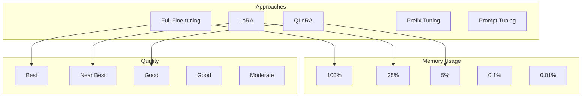

# Fine-tuning Guide

This guide covers fine-tuning AstrovoxAI models using LoRA, QLoRA, and full fine-tuning approaches.

## Fine-tuning Approaches



## LoRA (Low-Rank Adaptation)

### Configuration

```yaml
# models/llm/configs/config_finetune_lora.yaml
base_model: models/llm/configs/config_7b.yaml
lora:
  rank: 16
  alpha: 32
  dropout: 0.05
  target_modules:
    - q_proj
    - v_proj
    - k_proj
    - o_proj
    - gate_proj
    - up_proj
    - down_proj

training:
  batch_size: 8
  gradient_accumulation_steps: 4
  epochs: 3
  learning_rate: 2e-4
  warmup_ratio: 0.03
  lr_scheduler: cosine
  optimizer: adamw_8bit

  mixed_precision: bf16
  gradient_checkpointing: true

data:
  train_file: training_data/instructions_train.jsonl
  val_file: training_data/instructions_val.jsonl
  max_length: 2048
```

### Run LoRA fine-tuning

```bash
python -m models.llm.trainer.finetune \
  --config models/llm/configs/config_finetune_lora.yaml \
  --base-model model_7b.pt \
  --output model_7b_lora.pt \
  --lora-rank 16 \
  --lora-alpha 32
```

### LoRA implementation

```python
import torch
import torch.nn as nn
import math

class LoRALinear(nn.Module):
    def __init__(self, linear: nn.Linear, r: int = 8, lora_alpha: float = 16,
                 lora_dropout: float = 0.0):
        super().__init__()
        self.linear = linear
        self.r = r
        self.lora_alpha = lora_alpha
        self.lora_dropout = nn.Dropout(p=lora_dropout) if lora_dropout > 0 else nn.Identity()

        # Freeze base weights
        self.linear.weight.requires_grad = False
        if self.linear.bias is not None:
            self.linear.bias.requires_grad = False

        # LoRA parameters (trainable)
        self.lora_A = nn.Parameter(torch.zeros(r, linear.in_features))
        self.lora_B = nn.Parameter(torch.zeros(linear.out_features, r))

        # Initialize
        nn.init.kaiming_uniform_(self.lora_A, a=math.sqrt(5))
        nn.init.zeros_(self.lora_B)
        self.scaling = lora_alpha / r

    def forward(self, x: torch.Tensor) -> torch.Tensor:
        result = self.linear(x)
        if self.r > 0:
            lora = self.lora_dropout(x.float()) @ self.lora_A.T @ self.lora_B.T
            result = result + lora * self.scaling
        return result

    def merge(self):
        """Merge LoRA weights into base model."""
        if self.r > 0:
            delta = (self.lora_B @ self.lora_A) * self.scaling
            self.linear.weight.data += delta
            self.lora_A = None
            self.lora_B = None

def apply_lora(model: nn.Module, rank: int = 16, alpha: float = 32,
               target_modules: list = None, dropout: float = 0.05):
    """Apply LoRA to target modules in the model."""
    if target_modules is None:
        target_modules = ["q_proj", "v_proj", "k_proj", "o_proj"]

    for name, module in model.named_modules():
        if isinstance(module, nn.Linear) and any(t in name for t in target_modules):
            parent_name = ".".join(name.split(".")[:-1])
            parent = model.get_submodule(parent_name)
            setattr(parent, name.split(".")[-1], LoRALinear(module, r=rank, lora_alpha=alpha, lora_dropout=dropout))

    return model
```

## QLoRA (Quantized LoRA)

### Configuration

```yaml
# models/llm/configs/config_finetune_qlora.yaml
base_model: models/llm/configs/config_7b.yaml
qlora:
  bits: 4  # 4-bit or 8-bit
  quant_type: nf4  # nf4, fp4
  double_quant: true
  rank: 8
  alpha: 16
  dropout: 0.05

training:
  batch_size: 4
  gradient_accumulation_steps: 8
  epochs: 2
  learning_rate: 1e-4
```

### Run QLoRA fine-tuning

```bash
python -m models.llm.trainer.finetune \
  --config models/llm/configs/config_finetune_qlora.yaml \
  --base-model model_7b.pt \
  --output model_7b_qlora.pt \
  --bits 4 \
  --quant-type nf4
```

### QLoRA implementation

```python
class QLoRALinear(nn.Module):
    def __init__(self, linear: nn.Linear, r: int = 8, lora_alpha: float = 16,
                 lora_dropout: float = 0.0, bits: int = 4):
        super().__init__()
        self.r = r
        self.lora_alpha = lora_alpha
        self.lora_dropout = nn.Dropout(p=lora_dropout) if lora_dropout > 0 else nn.Identity()
        self.scaling = lora_alpha / r

        # 4-bit quantized base layer
        try:
            import bitsandbytes as bnb
            self.linear = bnb.nn.Linear4bit(
                linear.in_features,
                linear.out_features,
                bias=linear.bias is not None,
                quant_type="nf4",
                compute_dtype=torch.bfloat16
            )
            self.linear.weight = linear.weight
            if linear.bias is not None:
                self.linear.bias = linear.bias
            self._qlora = True
        except ImportError:
            self.linear = linear.to(dtype=torch.float16)
            self.linear.weight.requires_grad = False
            self._qlora = False

        # LoRA parameters
        self.lora_A = nn.Parameter(torch.zeros(r, linear.in_features))
        self.lora_B = nn.Parameter(torch.zeros(linear.out_features, r))
        nn.init.kaiming_uniform_(self.lora_A, a=math.sqrt(5))
        nn.init.zeros_(self.lora_B)

    def forward(self, x: torch.Tensor) -> torch.Tensor:
        result = self.linear(x)
        if self.r > 0:
            lora = self.lora_dropout(x.float()) @ self.lora_A.T @ self.lora_B.T
            result = result + lora * self.scaling
        return result
```

## Full Fine-tuning

```yaml
# models/llm/configs/config_finetune_full.yaml
base_model: models/llm/configs/config_1b.yaml

training:
  batch_size: 2
  gradient_accumulation_steps: 16
  epochs: 2
  learning_rate: 1e-5  # Lower LR for full fine-tuning
  warmup_steps: 200
  weight_decay: 0.01

  mixed_precision: bf16
  gradient_checkpointing: true
  gradient_clip_norm: 1.0
```

```bash
python -m models.llm.trainer.finetune \
  --config models/llm/configs/config_finetune_full.yaml \
  --base-model model_1b.pt \
  --output model_1b_full.pt \
  --full-finetune
```

## Training Data Format

### Instruction-Response Pairs

```jsonl
{"instruction": "Explain quantum entanglement", "input": "", "output": "Quantum entanglement is a physical phenomenon where pairs of particles..."}
{"instruction": "Write a sort function", "input": "language: python", "output": "def quicksort(arr):\n    if len(arr) <= 1:\n        return arr\n    pivot = arr[len(arr) // 2]\n    left = [x for x in arr if x < pivot]\n    middle = [x for x in arr if x == pivot]\n    right = [x for x in arr if x > pivot]\n    return quicksort(left) + middle + quicksort(right)"}
{"instruction": "Summarize", "input": "Article text here...", "output": "Summary of the article..."}
```

### Chat Format

```jsonl
{"messages": [{"role": "system", "content": "You are a helpful assistant."}, {"role": "user", "content": "Hello!"}, {"role": "assistant", "content": "Hi there!"}]}
{"messages": [{"role": "user", "content": "What is AI?"}, {"role": "assistant", "content": "AI is artificial intelligence..."}]}
```

## LoRA Adapter Management

### Save adapter

```bash
python -m models.llm.trainer.finetune \
  --config config_finetune_lora.yaml \
  --base-model model_7b.pt \
  --output adapters/my_adapter \
  --save-adapter-only
```

### Merge adapter with base model

```python
from models.llm.trainer.finetune import merge_lora_adapter

merged_model = merge_lora_adapter(
    base_model_path="model_7b.pt",
    adapter_path="adapters/my_adapter",
    output_path="model_7b_merged.pt"
)
```

### Load adapter

```python
from models.llm.trainer.finetune import load_lora_adapter

model = load_lora_adapter(
    base_model_path="model_7b.pt",
    adapter_path="adapters/my_adapter"
)
```

## Multi-Adapter Swapping

```python
class MultiAdapterModel:
    def __init__(self, base_model_path: str, adapter_dir: str):
        self.base_model = load_base_model(base_model_path)
        self.adapters = {}
        self.current_adapter = None

        # Load all adapters
        for path in Path(adapter_dir).glob("*.pt"):
            name = path.stem
            self.adapters[name] = load_adapter(path)

    def set_adapter(self, name: str):
        if self.current_adapter:
            self.unload_adapter(self.current_adapter)
        self.load_adapter(name)
        self.current_adapter = name

    def generate(self, prompt: str, adapter: str = None):
        if adapter and adapter != self.current_adapter:
            self.set_adapter(adapter)
        return self.base_model.generate(prompt)

# Usage
model = MultiAdapterModel("model_7b.pt", "adapters/")
model.generate("Explain physics", adapter="science")
model.generate("Write a poem", adapter="creative")
```

## Evaluation After Fine-tuning

```python
from models.llm.evaluation.benchmarks import BenchmarkSuite

# Evaluate fine-tuned model
benchmark = BenchmarkSuite(
    model=model,
    tokenizer=tokenizer,
    device="cuda"
)

results = benchmark.run([
    "mmlu",        # Multi-task language understanding
    "hellaswag",   # Commonsense reasoning
    "gsm8k",       # Grade school math
    "humaneval",   # Code generation
    "truthfulqa",  # Truthfulness
])

for name, result in results.items():
    print(f"{name}: {result.accuracy:.2%}")
```

## Memory-Efficient Training Tips

| Technique | Memory Saved | Speed Impact |
|-----------|-------------|--------------|
| LoRA rank 8 | ~70% | Minimal |
| LoRA rank 16 | ~50% | Minimal |
| QLoRA 4-bit | ~80% | +10% |
| Gradient checkpointing | ~50% | -20% |
| BF16 vs FP32 | 50% | Same on Ampere+ |
| Small batch + grad accum | Scales with batch | Minimal |

## Fine-tuning Checklist

- [ ] Dataset prepared and validated (quality score > 0.7)
- [ ] Base model loaded and verified
- [ ] LoRA/QLoRA configuration set
- [ ] Learning rate tuned (typically 2e-4 for LoRA, 1e-4 for QLoRA)
- [ ] Validation split created
- [ ] Experiment tracking configured
- [ ] GPU memory profiled before training
- [ ] Checkpoint directory created
- [ ] Resume from checkpoint if applicable
- [ ] Evaluate on held-out test set after training
