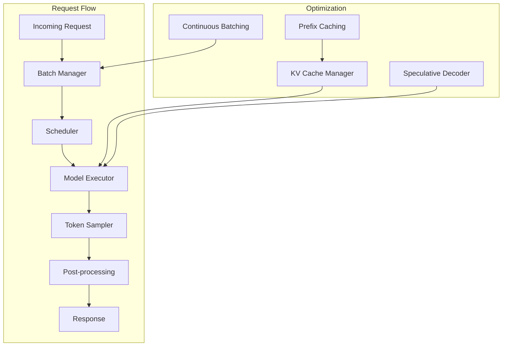

# Inference Guide

This guide covers model inference, including the inference engine, generation strategies, quantization, tensor parallelism, and production serving.

## Inference Architecture



## Core Components

### KV Cache Manager

Efficiently manages key-value caches for transformer models:

```python
from models.llm.inference.optimization import KVCacheManager

cache = KVCacheManager(
    num_layers=32,
    num_heads=32,
    head_dim=128,
    max_seq_len=8192,
    device="cuda",
    dtype=torch.float16
)

# Prefix caching - reuse cached prefixes
cache_key = hash("system: You are a helpful assistant.")
cached = cache.get(cache_key)
if cached is None:
    # Compute and cache prefix
    with torch.no_grad():
        prefix_kv = model.compute_prefix(system_prompt)
    cache.put(cache_key, prefix_kv)
else:
    prefix_kv = cached

# Cache eviction
cache.set_eviction_policy("lru")  # or "fifo", "lfu"
cache.set_max_size_gb(4.0)  # Max cache size
```

### Continuous Batching

```python
from models.llm.inference.optimization import ContinuousBatcher

batcher = ContinuousBatcher(
    max_batch_size=32,
    max_wait_time_ms=10,
    max_seq_len=4096,
    pad_token_id=0
)

# Add requests dynamically
batcher.add_request(request_id="req-1", tokens=input_ids_1)
batcher.add_request(request_id="req-2", tokens=input_ids_2)

# Process batch when ready
batch = batcher.get_batch()
outputs = model.forward(batch)
batcher.complete_requests(outputs)
```

### Speculative Decoding

```python
from models.llm.inference.optimization import SpeculativeDecoder

decoder = SpeculativeDecoder(
    target_model=target_model,
    draft_model=draft_model,
    num_draft_tokens=5,
    acceptance_threshold=0.8
)

# Generate with speculative decoding
tokens = decoder.generate(
    prompt_ids=input_ids,
    max_new_tokens=200,
    temperature=0.7,
    top_p=0.9
)
```

## Generation Strategies

### Greedy Decoding

```python
from models.llm.inference.generate import generate

output = generate(
    model=model,
    tokenizer=tokenizer,
    prompt="Once upon a time",
    max_new_tokens=100,
    temperature=0.0,  # Greedy
    top_k=0,
    top_p=0.0,
    repetition_penalty=1.0
)
```

### Sampling

```python
output = generate(
    model=model,
    tokenizer=tokenizer,
    prompt="The future of AI is",
    max_new_tokens=200,
    temperature=0.8,
    top_k=50,
    top_p=0.95,
    repetition_penalty=1.2
)
```

### Beam Search

```python
from models.llm.inference.generate import generate_beam

outputs = generate_beam(
    model=model,
    tokenizer=tokenizer,
    prompt="The capital of France is",
    max_new_tokens=20,
    num_beams=4,
    temperature=1.0
)
```

### Streaming Generation

```python
from models.llm.inference.generate import stream_generate

for token in stream_generate(
    model=model,
    tokenizer=tokenizer,
    prompt="Explain quantum computing",
    max_new_tokens=500,
    temperature=0.7,
    top_p=0.9
):
    print(token, end="", flush=True)
```

## Inference Engine

```python
from models.llm.inference.engine import InferenceEngine
import torch

engine = InferenceEngine(
    model=model,
    tokenizer=tokenizer,
    device=torch.device("cuda"),
    dtype=torch.float16,

    # Optimization flags
    enable_kv_cache=True,
    enable_prefix_caching=True,
    enable_speculative=False,
    enable_hallucination_detection=False,

    # Batch settings
    max_batch_size=32,
    max_wait_time_ms=10,
)

# Single generation
result = engine.generate(
    prompt="Hello, how are you?",
    max_new_tokens=100,
    temperature=0.7,
    top_p=0.9
)

# Streaming
for chunk in engine.stream(prompt="Tell me a story", max_new_tokens=500):
    yield chunk

# Batch generation
results = engine.batch_generate(
    prompts=["Hello", "Explain AI", "What is Python?"],
    max_new_tokens=100
)
```

## Quantization

```python
from models.llm.quantization import Quantizer, quantize_model

# INT8 quantization
quantizer = Quantizer(model, method="int8")
quantized_model = quantizer.quantize()
quantized_model.save_pretrained("model_int8/")

# GPTQ (2-4 bit)
quantizer = Quantizer(model, method="gptq", bits=4)
quantized_model = quantizer.quantize(
    calibration_data=calibration_dataset,
    group_size=128
)

# AWQ (4-bit)
quantizer = Quantizer(model, method="awq", bits=4)
quantized_model = quantizer.quantize(
    auto_scale=True,
    zero_point=True
)

# GGUF export (for llama.cpp)
from models.llm.export import export_gguf
export_gguf(
    model_path="model_7b.pt",
    output_path="model_7b.gguf",
    quantization="q4_k_m"
)
```

## Tensor Parallelism

```python
from models.llm.inference.engine import InferenceEngine

engine = InferenceEngine(
    model=model,
    tokenizer=tokenizer,
    device="cuda",

    # Tensor parallelism
    tensor_parallel_size=4,        # 4 GPUs for tensor parallelism
    pipeline_parallel_size=2,      # 2 pipeline stages

    # Or use device_map for automatic placement
    device_map="auto"              # Automatically place layers on GPUs
)
```

## Model Export

```python
from models.llm.export import export_model

# Export to HuggingFace format
export_model(
    model_path="model_7b.pt",
    config_path="configs/config_7b.yaml",
    output_dir="export/hf",
    format="huggingface"
)

# Export to ONNX
export_model(
    model_path="model_7b.pt",
    config_path="configs/config_7b.yaml",
    output_dir="export/onnx",
    format="onnx",
    opset_version=17
)

# Export to GGUF
export_model(
    model_path="model_7b.pt",
    config_path="configs/config_7b.yaml",
    output_dir="export/gguf",
    format="gguf",
    quantization="q4_k_m"
)
```

## REST API Server

```python
# examples/serve_api.py
from fastapi import FastAPI, HTTPException
from fastapi.responses import StreamingResponse
from pydantic import BaseModel
from models.llm.inference.engine import InferenceEngine
import uvicorn

app = FastAPI(title="AstrovoxAI Inference API")

engine = InferenceEngine(
    model=model,
    tokenizer=tokenizer,
    device=torch.device("cuda"),
    dtype=torch.float16
)

class GenerationRequest(BaseModel):
    prompt: str
    max_tokens: int = 100
    temperature: float = 0.7
    top_p: float = 0.9
    stream: bool = False

@app.post("/v1/chat/completions")
async def chat_completions(request: GenerationRequest):
    if request.stream:
        async def stream_gen():
            for token in engine.stream(request.prompt, max_new_tokens=request.max_tokens):
                yield f"data: {token}\n\n"
            yield "data: [DONE]\n\n"
        return StreamingResponse(stream_gen(), media_type="text/event-stream")

    output = engine.generate(
        prompt=request.prompt,
        max_new_tokens=request.max_tokens,
        temperature=request.temperature,
        top_p=request.top_p
    )
    return {"choices": [{"text": output}]}

if __name__ == "__main__":
    uvicorn.run(app, host="0.0.0.0", port=8000)
```

## Performance Tuning

| Parameter | Default | Description |
|-----------|---------|-------------|
| `max_batch_size` | 32 | Max concurrent requests |
| `max_wait_time_ms` | 10 | Batch formation timeout |
| `kv_cache_size` | 8192 | KV cache sequence length |
| `num_draft_tokens` | 5 | Draft tokens for speculative decoding |
| `temperature` | 0.7 | Sampling temperature |
| `top_p` | 0.9 | Nucleus sampling |
| `repetition_penalty` | 1.0 | Repetition penalty factor |
| `length_penalty` | 1.0 | Length penalty for beam search |

## Inference Monitoring

```python
from models.llm.inference.optimization import InferenceMonitor

monitor = InferenceMonitor()

# Track metrics
monitor.track_request(start_time, end_time, input_tokens, output_tokens)
monitor.track_batch_size(batch_size)
monitor.track_kv_cache_hit_rate(hit_rate)
monitor.track_gpu_utilization(gpu_util)

# Get stats
stats = monitor.get_stats()
print(f"Avg latency: {stats.avg_latency_ms:.1f}ms")
print(f"P95 latency: {stats.p95_latency_ms:.1f}ms")
print(f"Throughput: {stats.tokens_per_second:.1f} tok/s")
print(f"Cache hit rate: {stats.cache_hit_rate:.1%}")
```
