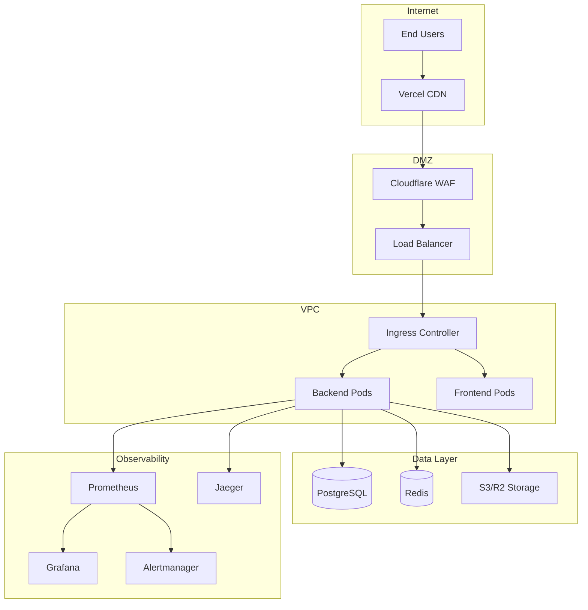
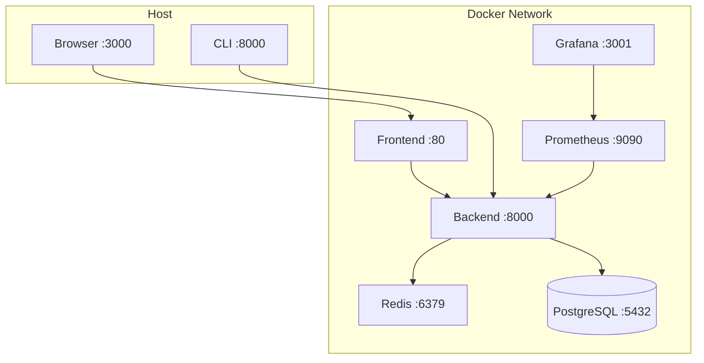
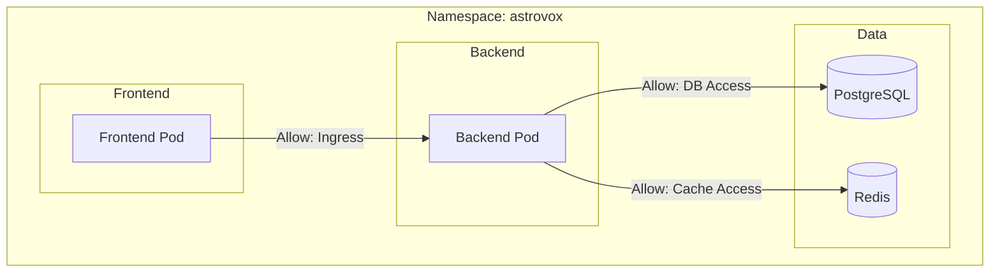
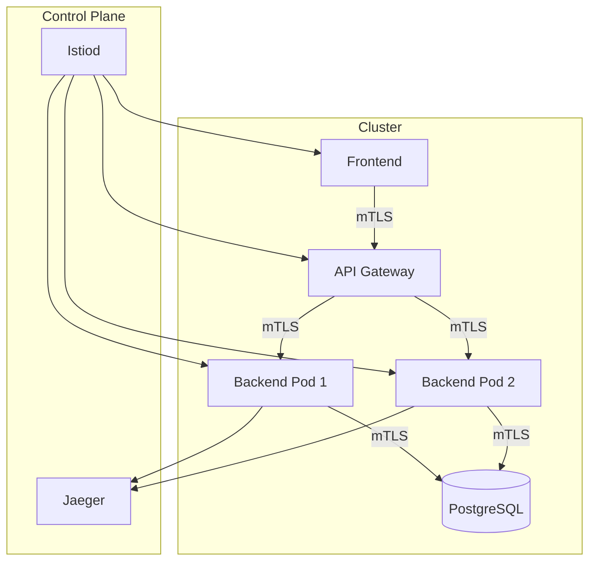
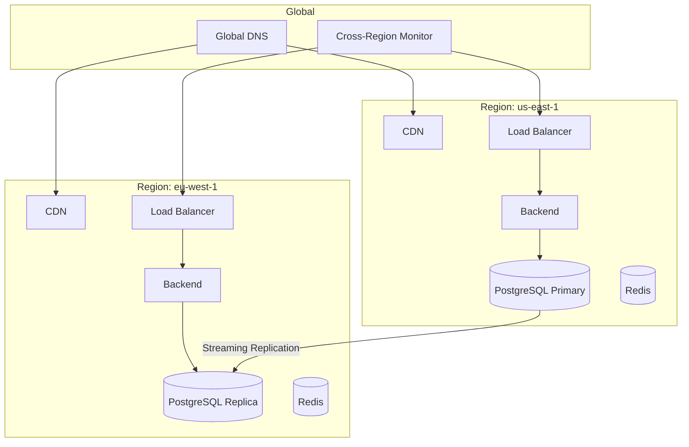
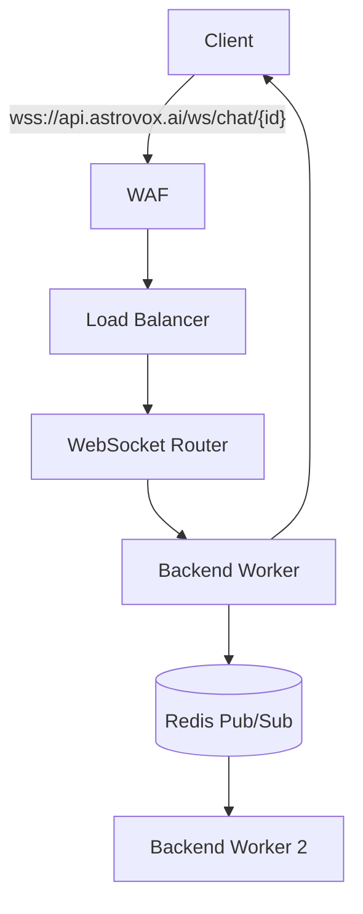
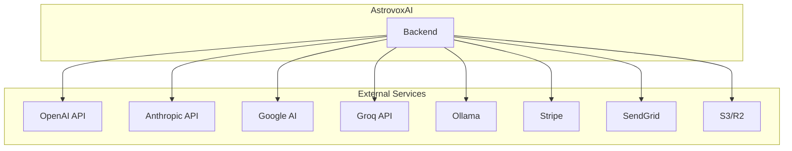

# Network Diagrams

## Production Network Topology

## Docker Compose Network (Local Dev)

## Kubernetes Network Policies

## Service Mesh (Optional)

## Multi-Region Architecture

## WebSocket Connection Flow

## External Integrations

