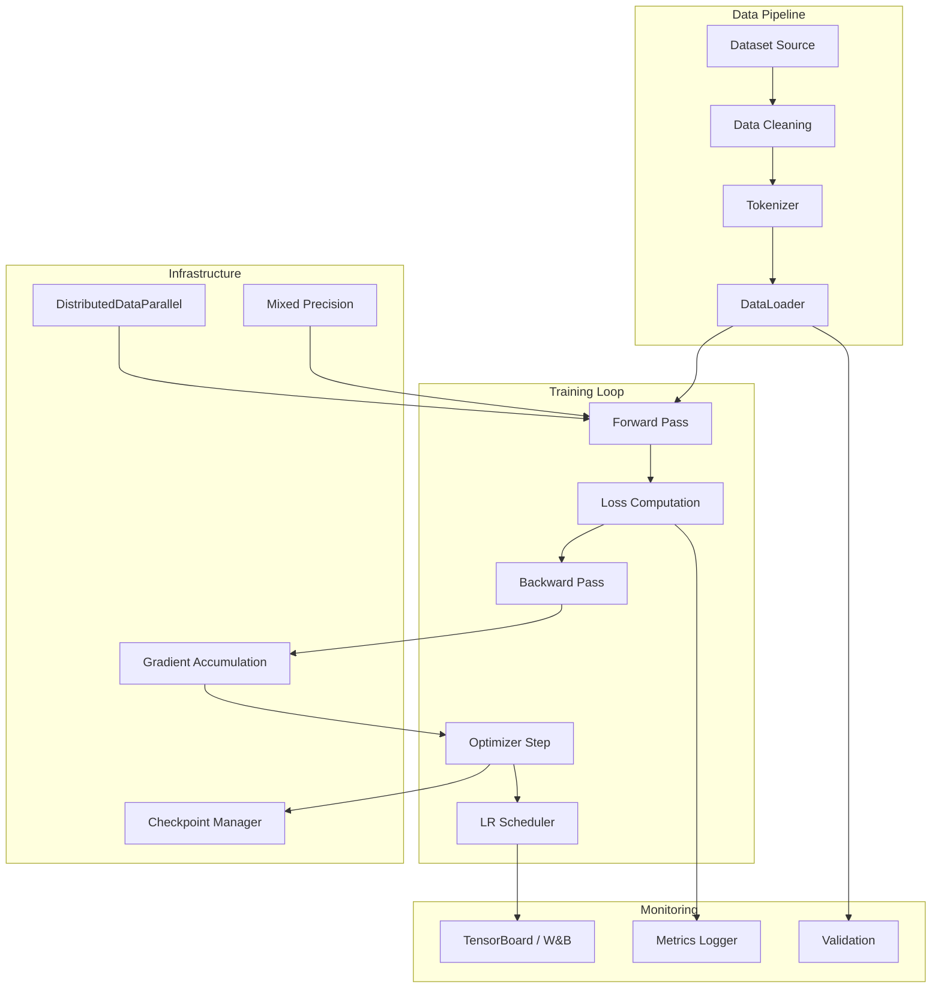

# Training Guide

AstrovoxAI includes a complete LLM training toolkit supporting pre-training, instruction tuning, fine-tuning with LoRA/QLoRA, and RLHF. This guide covers configuration, execution, and monitoring of training jobs.

## Training Architecture



## Model Sizes

| Config | Params | Hidden | Layers | Heads | Intermediate | Context | Use Case |
|--------|--------|--------|--------|-------|-------------|---------|----------|
| `config_50m` | ~50M | 512 | 8 | 8 | 2048 | 1024 | Quick prototyping |
| `config_100m` | ~100M | 768 | 12 | 12 | 3072 | 1024 | Phase 1 baseline |
| `config_300m` | ~300M | 1024 | 16 | 16 | 4096 | 2048 | Instruction tuning |
| `config_700m` | ~700M | 1536 | 24 | 16 | 4096 | 2048 | Small production |
| `config_1b` | ~1B | 2048 | 22 | 16 | 5504 | 2048 | Development |
| `config_3b` | ~3B | 3200 | 32 | 32 | 8640 | 2048 | Production |
| `config_4b` | ~4B | 2560 | 32 | 32 | 11008 | 4096 | Production |
| `config_7b` | ~7B | 4096 | 32 | 32 | 11008 | 4096 | Standard deployment |
| `config_8b` | ~8B | 4096 | 32 | 32 | 14336 | 8192 | Large context |
| `config_10b` | ~10B | 5120 | 40 | 40 | 14336 | 4096 | Research |
| `config_13b` | ~13B | 5120 | 40 | 40 | 16384 | 4096 | Research |
| `config_40b` | ~40B | 5120 | 40 | 40 | 16384 | 2048 | Large scale |

## Pre-training

### Configuration

```yaml
# models/llm/configs/config_100m.yaml
vocab_size: 32000
hidden_size: 768
num_hidden_layers: 12
num_attention_heads: 12
intermediate_size: 3072
max_position_embeddings: 1024
dropout: 0.1

# Training hyperparameters
batch_size: 4
epochs: 3
lr: 3e-4
weight_decay: 0.1
warmup_steps: 100
gradient_accumulation_steps: 8
gradient_clip_norm: 1.0

# Optimization
mixed_precision: bf16  # or fp16, none
optimizer: adamw
lr_scheduler: cosine

# Checkpointing
output_dir: model_100m.pt
checkpoint_dir: checkpoints
checkpoint_every_steps: 500
keep_last_n: 3

# Data
train_file: data/train.txt
val_file: data/val.txt
tokenizer_path: tokenizer.json
```

### Run training

```bash
# Phase 1 training (synthetic data, CPU-friendly)
python phase1_train.py --config models/llm/configs/config_100m.yaml

# With resume
python phase1_train.py --config models/llm/configs/config_1b.yaml --resume checkpoints/latest.pt

# Full trainer
python -m models.llm.trainer.train --config models/llm/configs/config_1b.yaml
```

### Training script example

```python
import torch
import torch.nn as nn
from torch.utils.data import DataLoader
from models.llm.model.model import LLM
from models.llm.tokenizer.train_tokenizer import load_tokenizer, TextDataset, collate_fn
from models.llm.utils.helpers import load_config, get_device

config = load_config("models/llm/configs/config_100m.yaml")
device = get_device()

tokenizer = load_tokenizer(config["tokenizer_path"])
dataset = TextDataset(config["train_file"], tokenizer, config["max_position_embeddings"])
dataloader = DataLoader(dataset, batch_size=config["batch_size"], collate_fn=lambda b: collate_fn(b, 0))

model = LLM(config, device=torch.device(device))
optimizer = torch.optim.AdamW(model.parameters(), lr=config["lr"], weight_decay=config["weight_decay"])
scheduler = torch.optim.lr_scheduler.CosineAnnealingLR(optimizer, T_max=len(dataloader) * config["epochs"])

model.train()
for epoch in range(config["epochs"]):
    for batch in dataloader:
        input_ids = batch["input_ids"].to(device)
        labels = batch["labels"].to(device)
        outputs = model(input_ids, labels=labels)
        loss = outputs["loss"]
        loss.backward()
        torch.nn.utils.clip_grad_norm_(model.parameters(), config["gradient_clip_norm"])
        optimizer.step()
        scheduler.step()
        optimizer.zero_grad()
        print(f"Epoch {epoch}, Loss: {loss.item():.4f}")

torch.save(model.state_dict(), config["output_dir"])
```

## Instruction Tuning

```yaml
# models/llm/configs/config_finetune.yaml
base_model: model_1b.pt
vocab_size: 32000
hidden_size: 2048
num_hidden_layers: 22
num_attention_heads: 16
intermediate_size: 5504

# Fine-tuning specific
lora_rank: 16
lora_alpha: 32
lora_dropout: 0.05
target_modules: [q_proj, v_proj, k_proj, o_proj]

# Training
batch_size: 8
epochs: 3
lr: 2e-4
warmup_ratio: 0.03

# Data (JSONL format)
train_file: training_data/instructions.jsonl
val_file: training_data/instructions_val.jsonl
```

```bash
python -m models.llm.trainer.finetune \
  --config models/llm/configs/config_finetune.yaml \
  --base-model model_1b.pt \
  --output model_1b_instruct.pt
```

### Instruction data format

```json
{"instruction": "Explain quantum computing", "input": "", "output": "Quantum computing uses..."}
{"instruction": "Translate to French", "input": "Hello world", "output": "Bonjour le monde"}
{"instruction": "Write a Python function", "input": "sort a list", "output": "def sort_list(lst):..."}
```

## Fine-tuning with LoRA

```python
from models.llm.trainer.finetune import LoRALinear, QLoRALinear

# LoRA fine-tuning
model = LLM(config, device=device)

# Replace linear layers with LoRA layers
for name, module in model.named_modules():
    if isinstance(module, nn.Linear) and any(t in name for t in ["q_proj", "v_proj"]):
        parent_name = ".".join(name.split(".")[:-1])
        parent = model.get_submodule(parent_name)
        setattr(parent, name.split(".")[-1], LoRALinear(module, r=16, lora_alpha=32))

# Only LoRA parameters are trainable
trainable_params = sum(p.numel() for p in model.parameters() if p.requires_grad)
total_params = sum(p.numel() for p in model.parameters())
print(f"Trainable: {trainable_params:,} / {total_params:,} ({100*trainable_params/total_params:.1f}%)")
```

### QLoRA (4-bit quantized LoRA)

```python
from models.llm.trainer.finetune import QLoRALinear

# Load base model in 4-bit
model = LLM(config, device=device)

# Apply QLoRA to reduce memory
for name, module in model.named_modules():
    if isinstance(module, nn.Linear) and "q_proj" in name:
        parent = model.get_submodule(".".join(name.split(".")[:-1]))
        setattr(parent, name.split(".")[-1], QLoRALinear(module, r=8, bits=4))

# Memory usage: ~70% reduction vs full fine-tuning
```

## RLHF (Reinforcement Learning from Human Feedback)

```python
from models.llm.training.alignment import RLHFTrainer, RewardModel

# Initialize RLHF trainer
rlhf = RLHFTrainer(
    model=policy_model,
    reward_model=reward_model,
    reference_model=reference_model,
    kl_coef=0.1,
    gamma=0.99
)

# Training loop
for batch in preference_data:
    # Generate responses
    responses = rlhf.generate_responses(prompts)

    # Score with reward model
    rewards = rlhf.compute_rewards(responses)

    # PPO update
    loss = rlhf.ppo_step(prompts, responses, rewards)

    # Track KL divergence
    kl_penalty = rlhf.compute_kl_penalty(policy_model, reference_model)

    rlhf.log_metrics({
        "rlhf_loss": loss.item(),
        "kl_penalty": kl_penalty.item(),
        "mean_reward": rewards.mean().item()
    })
```

## Curriculum Learning

```python
from models.llm.training.curriculum import CurriculumScheduler

scheduler = CurriculumScheduler(
    stages=[
        {"name": "simple", "epochs": 1, "max_length": 512, "difficulty": 0.3},
        {"name": "medium", "epochs": 2, "max_length": 1024, "difficulty": 0.6},
        {"name": "complex", "epochs": 3, "max_length": 2048, "difficulty": 1.0},
    ]
)

for stage in scheduler:
    print(f"Stage: {stage['name']}, Max length: {stage['max_length']}")
    dataloader = get_dataloader(max_length=stage["max_length"])
    train_epoch(model, dataloader, optimizer, ...)
```

## Experiment Tracking

```python
from models.llm.training.experiment_tracker import ExperimentTracker

tracker = ExperimentTracker(
    project="astrovox-training",
    experiment_name="llama-2-7b-finetune",
    tags=["instruction-tuning", "v2.0", "lora"]
)

# Log hyperparameters
tracker.log_params({
    "model": "llama-2-7b",
    "lr": 2e-4,
    "batch_size": 32,
    "lora_rank": 16,
    "epochs": 3
})

# Log metrics during training
for step, loss in enumerate(losses):
    tracker.log_metrics({"train_loss": loss, "val_loss": val_loss}, step=step)

# Log model
tracker.log_model(model, "model_final.pt")
tracker.log_artifacts({"config": "config.yaml", "tokenizer": "tokenizer.json"})
```

## Hyperparameter Search

```python
from models.llm.hyperparameter_search import HyperparameterSearch

search = HyperparameterSearch(
    model_class=LLM,
    train_fn=train_epoch,
    search_space={
        "lr": [1e-5, 3e-5, 1e-4, 3e-4],
        "batch_size": [4, 8, 16, 32],
        "lora_rank": [8, 16, 32, 64],
        "warmup_steps": [100, 500, 1000],
    },
    num_trials=20,
    metric="val_loss",
    direction="minimize"
)

best_params = search.run()
print(f"Best params: {best_params}")
```

## Distributed Training

### Multi-GPU with DDP

```bash
# Single node, 4 GPUs
torchrun --nproc_per_node=4 -m models.llm.trainer.train \
  --config models/llm/configs/config_7b.yaml \
  --distributed ddp
```

### Multi-node with SLURM

```bash
#!/bin/bash
#SBATCH --job-name=astrovox-train
#SBATCH --nodes=4
#SBATCH --gpus-per-node=8
#SBATCH --cpus-per-task=8
#SBATCH --mem=256GB
#SBATCH --time=24:00:00

srun torchrun \
    --nnodes=4 \
    --nproc_per_node=8 \
    --rdzv_backend=c10d \
    --rdzv_endpoint=$MASTER_ADDR:29500 \
    train.py \
    --config configs/llama-2-7b.yaml
```

### Kubernetes Training Job

```yaml
apiVersion: batch/v1
kind: Job
metadata:
  name: astrovox-training
spec:
  template:
    spec:
      containers:
        - name: trainer
          image: astrovox/trainer:latest
          command: ["python", "train.py"]
          args: ["--config", "configs/llama-2-7b.yaml"]
          resources:
            limits:
              nvidia.com/gpu: 8
          env:
            - name: WORLD_SIZE
              value: "8"
            - name: RANK
              valueFrom:
                fieldRef:
                  fieldPath: metadata.name
      restartPolicy: Never
```

## Performance Optimization

| Technique | Speedup | Memory Savings | Complexity |
|-----------|---------|----------------|------------|
| Mixed Precision (FP16) | 1.5-2x | 50% | Low |
| BF16 (Ampere+) | 1.5-2x | 50% | Low |
| Gradient Checkpointing | 1.2x | 40-60% | Low |
| LoRA Fine-tuning | 1.1x | 75% | Low |
| Flash Attention | 2-4x | 20-30% | Medium |
| FSDP (multi-node) | 2-4x | Scales with nodes | High |
| Tensor Parallelism | 2-8x | Minimal | High |
